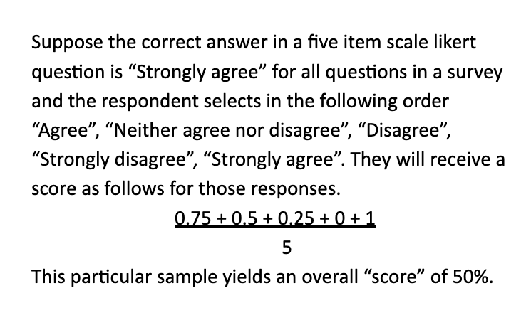

---
params:
  partner: "NY_Rochester City Schools"
  content_area: "All Content Areas"
  d11: "All Sites"
  d27: "All Sites"
  matched: "True"
title: "`r paste0('Teaching Lab End of Year Report: ', params$partner, ' ', ifelse(params$content_area != 'All Content Areas', params$content_area, ''), ifelse(params$matched == 'True', ' Matched', ''))`)`"
date: "`r format(Sys.time(), '%d %B, %Y')`"
output: 
  TeachingLab::TLDefault:
    theme: null
    mathjax: null
    css: styles.css
    fontawesome: true
    self_contained: true
    thumbnails: false
    lightbox: true
    gallery: false
    highlight: kate # Also can do tango
    number_sections: false
    includes:
      in_header: header.html
      after_body: footer.html
editor_options: 
  markdown: 
    wrap: 72
---

```{r setup, include=FALSE}
na_df <- c("N.A", "N.A.", "n/a", "N/a", "N/A", "N/A", "N/A.", "na", "Na", "NA", "na.", "NA.", "No Response", "none", "None", "NONE", "none.", "None.", "nothing", "Nothing", "NOTHING", "nothing.", "Nothing.", "response", "Response", NA)
library(ggforce)
library(ggfx)
library(ggtext)
library(glue)
library(grid)
library(gt)
library(here)
library(knitr)
library(lubridate)
library(patchwork)
library(png)
library(qualtRics)
library(rmdformats)
library(scales)
library(TeachingLab)
library(tidyverse)
update_data <- FALSE

### Student Survey Read-In ###
student_survey <- TeachingLab::get_student_survey(update = update_data, year = "22_23", write = FALSE) |>
  dplyr::filter(site != "MA_DESE") |>
  TeachingLab::neg_cond_filter(
    if_not_this = "All Sites",
    filter_this = params$partner,
    dat_filter = site
  ) |>
  TeachingLab::neg_cond_filter(
    if_not_this = "All Sites",
    filter_this = params$d11,
    dat_filter = district11
  ) |>
  mutate(race = if_else(ethnicity == "Yes", "Hispanic/Latino", race))

### IPG Forms Read-In ###
ipg_forms <- TeachingLab::get_ipg_forms(update = update_data, year = "22_23", write = FALSE) |>
  dplyr::filter(site != "MA_DESE") |>
  TeachingLab::neg_cond_filter(
    if_not_this = "All Sites",
    filter_this = params$partner,
    dat_filter = site
  ) |>
  TeachingLab::neg_cond_filter(
    if_not_this = "All Sites",
    filter_this = params$d27,
    dat_filter = district27
  ) |>
  TeachingLab::neg_cond_filter(
    if_not_this = "All Sites",
    filter_this = params$d11,
    dat_filter = district11
  ) |>
  TeachingLab::neg_cond_filter(
    if_not_this = "All Content Areas",
    filter_this = params$content_area,
    dat_filter = content_area
  ) |>
  dplyr::mutate(
    direct_to_ts_obs = as.character(direct_to_ts_obs),
    not_direct_to_ts = as.character(not_direct_to_ts)
  )

if (params$matched == "True") {
  ipg_forms <- ipg_forms |>
    dplyr::group_by(teacher) |>
    dplyr::mutate(n = dplyr::n()) |>
    dplyr::filter(n >= 2) |>
    dplyr::select(-n)
}

### Correcting for McNairy ###
ipg_forms$not_direct_to_ts <- ifelse(ipg_forms$site == "TN_McNairy County Schools",
  "First site visit",
  ipg_forms$not_direct_to_ts
)

ipg_forms_direct_to_ts <- ipg_forms |>
  dplyr::filter(site %in% c(
    "IL_Chicago Public Schools_Network 7",
    "IL_Chicago Public Schools_Network 4",
    "IL_Chicago Public Schools_Network 12",
    "CPS Aggregate",
    "NY_D9",
    "NY_D11",
    "AR_Arkansas DOE"
  ) & !is.na(direct_to_ts_obs))

ipg_forms_not_direct_to_ts <- ipg_forms |>
  dplyr::filter(!site %in% c(
    "IL_Chicago Public Schools_Network 7",
    "IL_Chicago Public Schools_Network 4",
    "IL_Chicago Public Schools_Network 12",
    "CPS Aggregate",
    "NY_D9",
    "NY_D11",
    "AR_Arkansas DOE"
  ) & !is.na(not_direct_to_ts))

section_6_eval <- nrow(ipg_forms) >= 1
ipg_count <- nrow(ipg_forms)

### Educator Survey Read-In ###
educator_survey <- TeachingLab::get_diagnostic_survey(update = update_data, year = "22_23") |>
  dplyr::filter(site != "MA_DESE") |>
  TeachingLab::neg_cond_filter(
    if_not_this = "All Sites",
    filter_this = params$partner,
    dat_filter = site
  ) |>
  TeachingLab::neg_cond_filter(
    if_not_this = "All Sites",
    filter_this = params$d11,
    dat_filter = district11
  ) |>
  TeachingLab::neg_cond_filter(
    if_not_this = "All Sites",
    filter_this = params$d27,
    dat_filter = district27
  ) |>
  TeachingLab::neg_cond_filter(
    if_not_this = "All Content Areas",
    filter_this = params$content_area,
    dat_filter = content_area
  )
if (params$partner != "NM_NM Public Education Department") {
  educator_survey <- educator_survey |>
    select(-c(`ts_crse_after_7/30_5`:`ts_crse_after_7/30_9`))
}
ed_survey_vars <- c("gender", 
                    "race_1", "race_2", "race_3", "race_4", "race_5",
                    "ethnicity",
                    "teaching_experience",
                    "content_area",
                    paste0("grade_level_", 1:17),
                    "tl_pl_participation",
                    "role",
                    "lab_leader")

### Follow-up Educator Survey Read-In ###
followup_educator <- TeachingLab::get_followup_educator(update = update_data, year = "22_23") |>
  dplyr::filter(site != "MA_DESE") |>
  TeachingLab::neg_cond_filter(
    if_not_this = "All Sites",
    filter_this = params$partner,
    dat_filter = site
  ) |>
  TeachingLab::neg_cond_filter(
    if_not_this = "All Sites",
    filter_this = params$d11,
    dat_filter = district11
  ) |>
  TeachingLab::neg_cond_filter(
    if_not_this = "All Sites",
    filter_this = params$d27,
    dat_filter = district27
  ) |>
  TeachingLab::neg_cond_filter(
    if_not_this = "All Content Areas",
    filter_this = params$content_area,
    dat_filter = content_area
  )
if (params$partner != "NM_NM Public Education Department") {
  followup_educator <- followup_educator |>
    select(-c(`ts_crse_after_7/30_5`:`ts_crse_after_7/30_9`))
}

if (params$matched == "True") {
  educator_survey$id <- paste0(tolower(educator_survey$initials), educator_survey$dob)
  followup_educator$id <- paste0(tolower(followup_educator$initials), followup_educator$dob)
  followup_educator <- followup_educator |>
    dplyr::filter(id %in% educator_survey$id)
  educator_survey <- educator_survey |>
    dplyr::filter(id %in% followup_educator$id)
}

section_1_eval <- reduce(map(ed_survey_vars, ~ sum(!is.na(educator_survey[[.x]]))), `+`) >= 1
section_4_eval <- sum(!is.na(educator_survey$mindsets_ts_1_1)) >= 1
section_5_eval <- sum(!is.na(educator_survey$non_ts_mindsets_1)) >= 1

diagnostic_count <- nrow(educator_survey)

followup_count <- nrow(followup_educator)

### Knowledge Assessments Read-In ###
knowledge_assessments <- TeachingLab::get_knowledge_assessments(update = update_data, year = "22_23") |>
  dplyr::filter(site != "MA_DESE") |>
  TeachingLab::neg_cond_filter(
    if_not_this = "All Sites",
    filter_this = params$partner,
    dat_filter = site
  )

if (params$matched == "True") {
  
  know_post_ids <- unique(knowledge_assessments$id[knowledge_assessments$prepost == "post"])
  
  knowledge_assessments <- knowledge_assessments |>
    dplyr::filter(id %in% know_post_ids)
  
}

section_3_eval <- if_else(nrow(knowledge_assessments) >= 1, TRUE, FALSE)

pre_know <- nrow(knowledge_assessments |> dplyr::filter(prepost == "pre"))
post_know <- nrow(knowledge_assessments |> dplyr::filter(prepost == "post"))

### End of Session Feedback Read In ###
session_survey <- TeachingLab::get_session_survey(update = update_data, year = "22_23") |>
  dplyr::filter(site != "MA_DESE") |>
  TeachingLab::neg_cond_filter(
    if_not_this = "All Sites",
    filter_this = params$partner,
    dat_filter = site
  ) |>
  TeachingLab::neg_cond_filter(
    if_not_this = "All Sites",
    filter_this = params$d11,
    dat_filter = district11
  ) |>
  TeachingLab::neg_cond_filter(
    if_not_this = "All Sites",
    filter_this = params$d27,
    dat_filter = district_27
  ) |>
  mutate(
    race = case_when(
      ethnicity == "Hispanic or Latino" ~ "Hispanic/Latino",
      (!is.na(race_1) & !is.na(race_2)) |
        (!is.na(race_1) & !is.na(race_3)) |
        (!is.na(race_1) & !is.na(race_4)) |
        (!is.na(race_1) & !is.na(race_5)) |
        (!is.na(race_2) & !is.na(race_3)) |
        (!is.na(race_2) & !is.na(race_4)) |
        (!is.na(race_2) & !is.na(race_5)) |
        (!is.na(race_3) & !is.na(race_4)) |
        (!is.na(race_3) & !is.na(race_5)) |
        (!is.na(race_4) & !is.na(race_5)) ~ "More than one race",
      race_1 == "Asian" ~ "Asian",
      race_2 == "Black or African American" ~ "Black or African American",
      race_3 == "Native American or Indian" ~ "Native American or Indian",
      race_5 == "White" ~ "White",
      race_6 == "Prefer not to say" ~ "Other",
      race_7 == "I prefer to self describe" ~ "Other"
    ),
    content_area = if_else(!content_area %in% c("Math", "ELA"), "Other", content_area)
  ) |>
  TeachingLab::neg_cond_filter(
    if_not_this = "All Content Areas",
    filter_this = params$content_area,
    dat_filter = content_area
  )

if (params$matched == "True") {
  
  session_survey$id <- paste0(tolower(session_survey$initials), session_survey$dob)
  
  session_survey <- session_survey |>
    dplyr::group_by(id) |>
    dplyr::mutate(n = dplyr::n()) |>
    dplyr::filter(n >= 2) |>
    dplyr::select(-n)
  
}

section_2a_eval <- nrow(session_survey) >= 1

### End of Course Feedback Read In ###
course_survey <- TeachingLab::get_course_survey(update = update_data, year = "22_23") |>
  dplyr::filter(site != "MA_DESE") |>
  TeachingLab::neg_cond_filter(
    if_not_this = "All Sites",
    filter_this = params$partner,
    dat_filter = site
  ) |>
  TeachingLab::neg_cond_filter(
    if_not_this = "All Sites",
    filter_this = params$d11,
    dat_filter = district11
  ) |>
  TeachingLab::neg_cond_filter(
    if_not_this = "All Sites",
    filter_this = params$d27,
    dat_filter = district_27
  ) |>
  TeachingLab::neg_cond_filter(
    if_not_this = "All Content Areas",
    filter_this = params$content_area,
    dat_filter = content_area
  ) |>
  dplyr::mutate(
    race = dplyr::case_when(
      ethnicity == "Hispanic or Latino" ~ "Hispanic/Latino",
      (!is.na(race_1) & !is.na(race_2)) |
        (!is.na(race_1) & !is.na(race_3)) |
        (!is.na(race_1) & !is.na(race_4)) |
        (!is.na(race_1) & !is.na(race_5)) |
        (!is.na(race_2) & !is.na(race_3)) |
        (!is.na(race_2) & !is.na(race_4)) |
        (!is.na(race_2) & !is.na(race_5)) |
        (!is.na(race_3) & !is.na(race_4)) |
        (!is.na(race_3) & !is.na(race_5)) |
        (!is.na(race_4) & !is.na(race_5)) ~ "More than one race",
      race_1 == "Asian" ~ "Asian",
      race_2 == "Black or African American" ~ "Black or African American",
      race_3 == "Native American or Indian" ~ "Native American or Indian",
      race_5 == "White" ~ "White",
      race_6 == "Prefer not to say" ~ "Other",
      race_7 == "I prefer to self describe" ~ "Other"
    ),
    content_area = dplyr::if_else(!content_area %in% c("Math", "ELA"), "Other", content_area)
  )

if (params$matched == "True") {
  
  course_survey$id <- paste0(tolower(course_survey$initials), course_survey$dob)
  
  course_survey <- course_survey |>
    dplyr::group_by(id) |>
    dplyr::mutate(n = dplyr::n()) |>
    dplyr::filter(n >= 2) |>
    dplyr::select(-n)
  
}

section_2b_eval <- nrow(course_survey) >= 1

### Ongoing Coaching Feedback Read In ###
ongoing_coaching <- TeachingLab::get_ongoing_coaching(update = update_data, year = "22_23") |>
  dplyr::filter(site != "MA_DESE") |>
  TeachingLab::neg_cond_filter(
    if_not_this = "All Sites",
    filter_this = params$partner,
    dat_filter = site
  ) |>
  TeachingLab::neg_cond_filter(
    if_not_this = "All Sites",
    filter_this = params$d11,
    dat_filter = district11
  ) |>
  TeachingLab::neg_cond_filter(
    if_not_this = "All Sites",
    filter_this = params$d27,
    dat_filter = district_27
  ) |>
  TeachingLab::neg_cond_filter(
    if_not_this = "All Content Areas",
    filter_this = params$content_area,
    dat_filter = content_area
  ) |>
  dplyr::mutate(
    race = dplyr::case_when(
      ethnicity == "Hispanic or Latino" ~ "Hispanic/Latino",
      (!is.na(race_1) & !is.na(race_2)) |
        (!is.na(race_1) & !is.na(race_3)) |
        (!is.na(race_1) & !is.na(race_4)) |
        (!is.na(race_1) & !is.na(race_5)) |
        (!is.na(race_2) & !is.na(race_3)) |
        (!is.na(race_2) & !is.na(race_4)) |
        (!is.na(race_2) & !is.na(race_5)) |
        (!is.na(race_3) & !is.na(race_4)) |
        (!is.na(race_3) & !is.na(race_5)) |
        (!is.na(race_4) & !is.na(race_5)) ~ "More than one race",
      race_1 == "Asian" ~ "Asian",
      race_2 == "Black or African American" ~ "Black or African American",
      race_3 == "Native American or Indian" ~ "Native American or Indian",
      race_5 == "White" ~ "White",
      race_6 == "Prefer not to say" ~ "Other",
      race_7 == "I prefer to self describe" ~ "Other"
    ),
    content_area = dplyr::if_else(!content_area %in% c("Math", "ELA"), "Other", content_area)
  )

if (params$matched == "True") {
  
  ongoing_coaching$id <- paste0(tolower(ongoing_coaching$initials), ongoing_coaching$dob)
  
  ongoing_coaching <- ongoing_coaching |>
    dplyr::group_by(id) |>
    dplyr::mutate(n = dplyr::n()) |>
    dplyr::filter(n >= 2) |>
    dplyr::select(-n)
  
}

section_2c_eval <- nrow(ongoing_coaching) >= 1

### End of Coaching Feedback Read In ###
end_coaching <- TeachingLab::get_end_coaching(update = update_data, year = "22_23") |>
  dplyr::filter(site != "MA_DESE") |>
  TeachingLab::neg_cond_filter(
    if_not_this = "All Sites",
    filter_this = params$partner,
    dat_filter = site
  ) |>
  TeachingLab::neg_cond_filter(
    if_not_this = "All Sites",
    filter_this = params$d11,
    dat_filter = district11
  ) |>
  TeachingLab::neg_cond_filter(
    if_not_this = "All Sites",
    filter_this = params$d27,
    dat_filter = district_27
  ) |>
  TeachingLab::neg_cond_filter(
    if_not_this = "All Content Areas",
    filter_this = params$content_area,
    dat_filter = content_area
  ) |>
  dplyr::mutate(
    race = dplyr::case_when(
      ethnicity == "Hispanic or Latino" ~ "Hispanic/Latino",
      (!is.na(race_1) & !is.na(race_2)) |
        (!is.na(race_1) & !is.na(race_3)) |
        (!is.na(race_1) & !is.na(race_4)) |
        (!is.na(race_1) & !is.na(race_5)) |
        (!is.na(race_2) & !is.na(race_3)) |
        (!is.na(race_2) & !is.na(race_4)) |
        (!is.na(race_2) & !is.na(race_5)) |
        (!is.na(race_3) & !is.na(race_4)) |
        (!is.na(race_3) & !is.na(race_5)) |
        (!is.na(race_4) & !is.na(race_5)) ~ "More than one race",
      race_1 == "Asian" ~ "Asian",
      race_2 == "Black or African American" ~ "Black or African American",
      race_3 == "Native American or Indian" ~ "Native American or Indian",
      race_5 == "White" ~ "White",
      race_6 == "Prefer not to say" ~ "Other",
      race_7 == "I prefer to self describe" ~ "Other"
    ),
    content_area = dplyr::if_else(!content_area %in% c("Math", "ELA"), "Other", content_area)
  )

if (params$matched == "True") {
  
  end_coaching$id <- paste0(tolower(end_coaching$initials), end_coaching$dob)
  
  end_coaching <- end_coaching |>
    dplyr::group_by(id) |>
    dplyr::mutate(n = dplyr::n()) |>
    dplyr::filter(n >= 2) |>
    dplyr::select(-n)
  
}

section_2d_eval <- nrow(end_coaching) >= 1

### Mid/End Year Contact Lead ###
contact_lead <- qualtRics::fetch_survey(
  surveyID = "SV_cTJGFaslXUpKVgi",
  verbose = FALSE,
  include_display_order = FALSE,
  force_request = update_data
) |>
  dplyr::filter(Finished == TRUE) |>
  TeachingLab::neg_cond_filter(
    if_not_this = "All Sites",
    filter_this = params$partner,
    dat_filter = site
  ) |>
  TeachingLab::neg_cond_filter(
    if_not_this = "All Sites",
    filter_this = params$d27,
    dat_filter = district27
  ) |>
  TeachingLab::neg_cond_filter(
    if_not_this = "All Sites",
    filter_this = params$d11,
    dat_filter = district11
  ) |>
  TeachingLab::neg_cond_filter(
    if_not_this = "All Content Areas",
    filter_this = params$content_area,
    dat_filter = content_area
  ) |>
  dplyr::mutate(content_area = dplyr::coalesce(content_area_1,
                                               content_area_2,
                                               content_area_3),
                content_area = stringr::str_remove_all(content_area, "\\/Literacy")) |>
  dplyr::mutate(dplyr::across(where(is.factor), ~ dplyr::na_if(as.character(.x), "NA")))
section_2e_eval <- nrow(contact_lead) >= 1
section_8_eval <- sum(!is.na(contact_lead$future_pl_location)) >= 1

### Student Work Grades ###
student_work_grades <- googlesheets4::read_sheet("https://docs.google.com/spreadsheets/d/15ixca0QKloZtYLcmj_9Uc20zdQ5FE6pSVj3EBamLoiI/edit?pli=1#gid=0",
sheet = "Student Work Scores"
) |>
  dplyr::mutate(`Grade Band` = stringr::str_replace_all(`Grade Band`, "Other", "K-2")) |>
  dplyr::filter(!is.na(`Submitted By`)) |>
  dplyr::filter(Site != "MA_DESE")

student_work_grades <- student_work_grades |>
  TeachingLab::neg_cond_filter(
    if_not_this = "All Sites",
    filter_this = params$partner,
    dat_filter = Site
  ) |>
  TeachingLab::neg_cond_filter(
    if_not_this = "All Sites",
    filter_this = params$d11,
    dat_filter = `District 11`
  ) |>
  TeachingLab::neg_cond_filter(
    if_not_this = "All Content Areas",
    filter_this = params$content_area,
    dat_filter = `Subject Area`
  )

if (params$matched == "True") {
  
  post_names <- student_work_grades$`Teacher Name`[student_work_grades$Prepost == "Post"]
  
  student_work_grades <- student_work_grades |>
    dplyr::filter(`Teacher Name` %in% post_names)
  
}

if (params$partner == "IL_Chicago Public Schools_Aggregate") {
  student_work_grades <- student_work_grades |>
    dplyr::filter(Site != "IL_Chicago Public Schools_Network 4")
}

section_7_eval <- nrow(student_survey) >= 1 | nrow(student_work_grades) >= 1

student_work_count <- student_work_grades |>
  dplyr::filter(!is.na(`Submitted Grade/s`) & !is.null(`Submitted Grade/s`)) |>
  dplyr::select(`Submitted Grade/s`, `Student Work File`) |>
  tidyr::drop_na(`Submitted Grade/s`) |>
  dplyr::mutate(`Submitted Grade/s` = as.character(`Submitted Grade/s`)) |>
  tidyr::separate_rows(`Submitted Grade/s`, sep = ", ") |>
  nrow()

###################################################################################################

## Global options
options(max.print = "75", width = 1000)
opts_chunk$set(
  echo = FALSE,
  cache = FALSE,
  prompt = FALSE,
  tidy = TRUE,
  comment = NA,
  message = FALSE,
  warning = FALSE,
  out.extra = 'class="plot"'
)
```

```{=html}
<script src="js/hideOutput.js"></script>
```
#### 2022-2023 End of Year Report

### Background

Teaching Lab collects a variety of data to understand the impact of its
PL for educators and students. Please see this
[resource](https://docs.google.com/presentation/d/1Vo844M0_Au8bqfeK5-hPdFh30oGRjzjCxwm6vctemQ8/edit#slide=id.g1165a219667_0_182)
for a visual overview of our evaluation framework. Additionally, the
[narrative](https://docs.google.com/document/d/19yDyFCx1KeSPHlD9SLvLfG76FRGdfChL1hnCo_dV1zQ/edit)
of our evaluation plan provides more details.

To date (`r Sys.Date() |> format("%b %d, %Y")`), Teaching Lab has
collected the following data during SY22-23:

```{r session-survey-collection, results = 'asis'}
if (nrow(session_survey) >= 1) {
  sec2_intro <- "Participant Perceptions"
  cat(paste0("- ", format(nrow(session_survey), big.mark = ","), " complete responses to the End of Session Survey section of the survey that gathers participant feedback on facilitation from session to session;"))
  cat("\n")
} 
if (nrow(course_survey) >= 1) {
  sec2_intro <- "Participant Perceptions"
  cat(paste0("- ", format(nrow(course_survey), big.mark = ","), " complete responses to the End of Course Survey section of the survey that gathers participant feedback on each PL course;"))
  cat("\n")
}
if (nrow(ongoing_coaching) >= 1) {
  sec2_intro <- "Participant Perceptions"
  cat(paste0("- ", format(nrow(ongoing_coaching), big.mark = ","), " complete responses to the Ongoing Coaching section of the survey that gathers participant feedback on each Coaching session;"))
  cat("\n")
}
if (nrow(end_coaching) >= 1) {
  sec2_intro <- "Participant Perceptions"
  cat(paste0("- ", format(nrow(end_coaching), big.mark = ","), " complete responses to the End of Coaching section of the survey that gathers participant feedback on each Coaching performance;"))
  cat("\n")
}
if (sum(nrow(session_survey), nrow(course_survey), nrow(ongoing_coaching), nrow(end_coaching)) == 0) {
  sec2_intro <- NA
}
if (pre_know >= 1) {
  sec3_intro <- "Participant Knowledge"
  cat(paste0("- ", pre_know, " complete responses to the first Knowledge or Self-Reported Practices Assessments and ", post_know, " to the second Knowledge or Self-Reported Practices Assessments;"))
  cat("\n")
} else {
  sec3_intro <- NA
}
if (diagnostic_count >= 1) {
  sec1_intro <- "Participant Background and Demographics Summary"
  sec4_intro <- "Teachers' Mindsets & School Environment"
  sec5_intro <- "School Leaders' Mindsets & Observational Practices"
  cat(paste0("- ", format(diagnostic_count, big.mark = ","), " complete responses to the Baseline Diagnostic Educator Survey that collects information on teachers' use of curricula, mindsets, self-reported practices, and school environment & ", format(followup_count, big.mark = ","), " responses to the Follow-up Educator Survey."))
  cat("\n")
} else {
  sec1_intro <- NA
  sec4_intro <- NA
  sec5_intro <- NA
}
if (ipg_count >= 1) {
  sec6_intro <- "Instructional Practice"
  cat(paste0("- ", format(ipg_count, big.mark = ","), " observations of classroom instruction."))
  cat("\n")
} else {
  sec6_intro <- NA
}
if (student_work_count >= 1) {
  sec7_intro <- "Student Outcomes"
  cat(paste0("- ", format(student_work_count, big.mark = ","), " high quality samples of student work."))
  cat("\n")
} else {
  sec7_intro <- NA
}
if (sum(!is.na(contact_lead$future_pl_location))) {
  sec8_intro <- "Partnership Opportunities Moving Forward"
} else {
  sec8_intro <- NA
}

inline_sections <- na.omit(c(sec1_intro,
                     sec2_intro,
                     sec3_intro,
                     sec4_intro,
                     sec5_intro,
                     sec6_intro,
                     sec7_intro,
                     sec8_intro))
final_sec_intro <- glue::glue_collapse(inline_sections, ", ", last = " and ")
```

Below we have compiled the results in various sections:
`r final_sec_intro`.

```{r section-1, fig.dim = c(6.5, 4.5), fig.align = 'center', results = 'asis'}
if (section_1_eval == TRUE) {
  cat("# Section 1: Participant Background and Demographics Summary", "\n")
  cat("\n")
  cat("This section provides a demographic and background summary on participants.")
  cat("\n")
  cat("\n")
}
if (sum(!is.na(educator_survey$gender)) >= 1) {

  gender_gt <- gt_percent_n(
    df = educator_survey[!str_detect(educator_survey$gender, "NA"), ],
    column = "gender",
    custom_column_name = "Gender Identity", viz_type = sample(c("waffle", "pie", "treemap"),
      size = 1
    )
  )

  cat("## Gender and Racial Identity", "\n")
  cat("\n")

  print(gender_gt)

  cat("\n")
}

race_cols <- c("race_1", "race_2", "race_3", "race_4", "race_5", "race_6", "race_7")

if (reduce(map(race_cols, ~ sum(!is.na(educator_survey[[.x]]))), `+`) >= 1) {

  race_gt <- educator_survey |>
    select(
      all_of(
        race_cols
      )
    ) |>
    pivot_longer(everything()) |>
    mutate(value = fct_lump(factor(value), 3)) |>
    rename(`Race Identity` = value) |>
    gt_percent_n(
      column = "Race Identity",
      custom_column_name = "Racial Identity",
      viz_type = sample(c("pie", "waffle", "treemap"), size = 1)
    )
  print(race_gt)

  cat("\n")

}

if (sum(!is.na(educator_survey$ethnicity)) >= 1) {

  ethnicity_gt <- gt_percent_n(
    educator_survey[!str_detect(educator_survey$ethnicity, "NA"), ],
    column = "ethnicity",
    custom_column_name = "Ethnicity", viz_type = sample(c("pie", "waffle", "treemap"),
      size = 1
    )
  )

  print(ethnicity_gt)

  cat("\n")

}

if (sum(!is.na(educator_survey$teaching_experience)) >= 1) {

  n <- sum(!is.na(educator_survey$teaching_experience[!str_detect(educator_survey$teaching_experience, "NA")]))

  teaching_experience_plot <- educator_survey |>
    drop_na(teaching_experience) |>
    dplyr::filter(!str_detect(teaching_experience, "NA")) |>
    dplyr::mutate(teaching_experience = na.omit(teaching_experience)) |>
    group_by(teaching_experience) |>
    count(sort = T) |>
    ungroup() |>
    mutate(
      percent = round(100 * n / sum(n), 1),
      color = if_else(percent < 10, "black", "white"),
      hjust = if_else(color == "white", 1.5, -0.5)
    ) |>
    ggplot(aes(teaching_experience, percent)) +
    geom_col(aes(fill = percent)) +
    geom_text(
      aes(
        label = paste0(percent, "%"),
        color = color, hjust = hjust
      ),
      fontface = "bold"
    ) +
    coord_flip() +
    labs(title = glue::glue("Years of Teaching Experience (n = {format(n, big.mark = ',')})"), x = "", y = "") +
    scale_color_manual(values = c("black", "white")) +
    scale_fill_continuous() +
    scale_y_continuous(
      labels = scales::percent_format(scale = 1),
      breaks = scales::pretty_breaks(n = 6)
    ) +
    scale_x_discrete(labels = c("Less than 1", "0-9", "10-19", "20-29", "30-39", "40-49", "50+")) +
    ggplot2::theme(
      axis.text = ggtext::element_markdown(size = 20),
      axis.title = ggtext::element_markdown(size = 24)
    ) +
    TeachingLab::theme_tl()

  cat("\n## Years of Teaching Experience", "\n")

  print(teaching_experience_plot)

  cat("\n")

}

if (sum(!is.na(educator_survey$content_area)) >= 1 & params$partner != "US_Digital Nest") {

  content_area_gt <- educator_survey |>
    select(content_area) |>
    drop_na() |>
    dplyr::filter(!str_detect(content_area, "NA")) |>
    gt_percent_n(
      column = "content_area",
      custom_column_name = "Content Area", viz_type = sample(c("waffle", "pie", "treemap"),
        size = 1
      )
    )

  cat("\n## Content Area", "\n")

  print(content_area_gt)

  cat("\n")
}

grades <- c(map_chr(1:14, ~ paste0("grade_level_", .x)))
if (reduce(map(grades, ~ sum(!is.na(educator_survey[[.x]]))), `+`) >= 1) {

  n <- educator_survey |>
    select(all_of(grades)) |>
    janitor::remove_empty("rows") |>
    nrow()

  grades_plot <- educator_survey |>
    select(all_of(grades)) |>
    mutate(across(everything(), ~ as.character(.x))) |>
    pivot_longer(everything()) |>
    tidyr::drop_na(value) |>
    group_by(value) |>
    count(sort = T) |>
    ungroup() |>
    mutate(
      percent = round(100 * n / sum(n), 1),
      value = factor(value, levels = c(
        "K", "1", "2", "3", "4", "5",
        "6", "7", "8", "9", "10", "11",
        "12", "Other"
      ))
    ) |>
    ggplot(aes(value, percent)) +
    geom_col(aes(fill = percent)) +
    geom_text(
      aes(
        label = paste0(percent, "%"),
        vjust = -0.5
      ),
      fontface = "bold"
    ) +
    labs(
      y = "", x = "Grade",
      title = glue::glue("Grades Taught (n = {format(n, big.mark = ',')})"),
      subtitle = "<i>More than one could be selected.</i>"
    ) +
    scale_color_manual(values = c("black", "white")) +
    scale_fill_continuous() +
    scale_y_continuous(
      labels = scales::percent_format(scale = 1),
      breaks = scales::pretty_breaks(n = 6)
    ) +
    theme_tl() +
    theme(
      axis.text = element_markdown(size = 20),
      axis.title = element_markdown(size = 24),
      plot.subtitle = element_markdown()
    )

  cat("\n## Grades", "\n")

  print(grades_plot)

  cat("\n")

}

if (sum(!str_detect(educator_survey$tl_pl_participation, "NA"), na.rm = T) >= 1) {

  tl_pl_gt <- gt_percent_n(
    df = educator_survey[!str_detect(educator_survey$tl_pl_participation, "NA"), ],
    column = "tl_pl_participation",
    custom_column_name = "Previous Experience with Teaching Lab", viz_type = sample(c("waffle", "pie", "treemap"),
      size = 1
    )
  )

  cat("\n## Prior Experience with Teaching Lab Professional Learning", "\n")

  print(tl_pl_gt)

  cat("\n")

}

if (sum(!str_detect(educator_survey$role, "NA"), na.rm = T) >= 1) {
  roles_gt <- gt_percent_n(
    df = educator_survey[!str_detect(educator_survey$role, "NA"), ],
    column = "role",
    custom_column_name = "Primary Role",
    viz_type = sample(c("waffle", "treemap"),
      size = 1
    )
  )

  cat("\n## Roles", "\n")

  print(roles_gt)

  cat("\n")
}

if (sum(!str_detect(educator_survey$lab_leader, "NA"), na.rm = T) >= 1) {

  lab_leader_gt <- gt_percent_n(
    df = educator_survey[!str_detect(educator_survey$lab_leader, "NA"), ],
    column = "lab_leader",
    custom_column_name = "Lab Leader",
    viz_type = sample(c("waffle", "pie", "treemap"),
      size = 1
    )
  )

  print(lab_leader_gt)

  cat("\n")
}
```

```{r section-2a, fig.dim = c(12, 7.5), fig.align = 'center', results = 'asis'}
if (section_2a_eval == TRUE) {
  section_num <- if_else(section_1_eval == FALSE, 1, 2)
  cat(paste0("# Section ", section_num, ": Participant Perceptions", "\n"))
  cat("\n")
  cat("This section summarizes participants' feedback on Teaching Lab PL.")
  cat("\n")
  cat("\n")
  cat("- The End of Session survey is collected at the end of each PL course (except the last session) and is focused on feedback for the facilitators.")
  cat("\n")
  cat("-   The End of Course survey is collected at the end of the last session of a PL course and focuses on feedback for the entire course.")
  cat("\n")
  cat("-   The Ongoing Coaching Feedback Survey is periodically administered to teachers receiving coaching support to provide feedback on coaches.")
  cat("\n")
  cat("-   The End of Coaching Feedback Survey is administered at the end of coaching support and provides feedback on the entire coaching experience.")
  cat("\n")
  cat("\n")
  cat("Results are presented in the aggregate and then by each content area.")
  cat("\n")
  cat("\n")
}

if (sum(!is.na(session_survey$fac_feedback_2_1)) >= 1) {

  cat(paste0("\n## Section ", section_num, "a: End of Session Summary", "\n"))

  cat("\n### Aggregate {.tabset}", "\n")

  purrr::walk(
    c("All Races", sort(unique(session_survey$race))),
    ~ TeachingLab::session_feedback_graph(race = .x, content_area_filter = "All")
  )

  cat("\n")

}

if (sum(!is.na(session_survey$fac_feedback_1[session_survey$content_area == "Math"])) >= 1) {

  cat("\n### Math {.tabset}", "\n")

  purrr::walk(
    c("All Races", sort(unique(session_survey$race[session_survey$content_area == "Math"]))),
    ~ TeachingLab::session_feedback_graph(race = .x, content_area = "Math")
  )

  cat("\n")

}

if (sum(!is.na(session_survey$fac_feedback_1[session_survey$content_area == "ELA"])) >= 1) {

  cat("\n### ELA {.tabset}", "\n")

  purrr::walk(
    c("All Races", sort(unique(session_survey$race[session_survey$content_area == "ELA"]))),
    ~ TeachingLab::session_feedback_graph(race = .x, content_area = "ELA")
  )

  cat("\n")

}

if (sum(!is.na(session_survey$fac_feedback_1[session_survey$content_area %!in% c("ELA", "Math")])) >= 1) {

  cat("\n### Other {.tabset}", "\n")

  purrr::walk(
    c("All Races", sort(unique(session_survey$race[!session_survey$content_area %in% c("ELA", "Math")]))),
    ~ TeachingLab::session_feedback_graph(race = .x, content_area = "Other")
  )

  cat("\n")

}

quote2 <- session_survey |>
  select_useful_text(text_col = went_well_today,
                     name = "What went well in today’s session?")
quote1 <- session_survey |>
  select_useful_text(text_col = been_better_today,
                     name = "What could have been better about today’s session?")
quote3 <- session_survey |>
  select_useful_text(text_col = take_back_class,
                     name = "What is one thing from today's learning that you plan to take back to your classroom?")
### Get Second Facilitator Feedback as well ###
second_fac <- session_survey |>
  select(`What additional feedback do you have about their facilitation skills, if any?` = fac_add_2)
quote4 <- session_survey |>
  select(`What additional feedback do you have about their facilitation skills, if any?` = fac_add1,
         nps) |>
  bind_rows(second_fac) |>
  select_useful_text(text_col = `What additional feedback do you have about their facilitation skills, if any?`,
                     name = "What additional feedback do you have about their facilitation skills, if any?")

# if (nrow(quote2) >= 1) {
#
#   cat("Finally, here are some highlights from the qualitative feedback.")
#   cat("\n")
#
#   cat("\n### Responses to \"What went well in today's session?\"", "\n")
#
#   table1 <- TeachingLab::quote_viz(
#     data = quote2,
#     viz_type = "gt",
#     print = F,
#     n = 5,
#     width = 80,
#     align = "center"
#   )
#   gt::gtsave(table1, filename = here::here("images/report_images/tab1_2.png"))
#
#   # print(knitr::include_graphics(here::here("images/report_images/tab1_2.png")))
#   cat(paste0("\n, "){width=60%}\n"))
#
#   cat("\n")
#
# }
```

```{r section-2a-quotes-1, fig.dim = c(12, 7.5), fig.align = 'center', results = 'asis'}
if (nrow(quote1) + nrow(quote2) + nrow(quote3) + nrow(quote4) >= 1) {
  cat("\n")
  cat("Finally, here are some highlights from the qualitative feedback.")
  cat("\n")
}
if (nrow(quote2) >= 1) {
  cat("\n### Responses to \"What went well in today's session?\"\n")
  cat("\n")
}
```

```{r facilitation-feedback-2, fig.dim = c(14, 5), eval = T}
if (nrow(quote2) >= 1) {
  table1 <- TeachingLab::quote_viz(
    data = quote2,
    viz_type = "gt",
    print = F,
    n = 5,
    width = 80,
    align = "center"
  )
  gt::gtsave(table1, filename = here::here("images/report_images/tab1_2.png"))

  knitr::include_graphics(here::here("images/report_images/tab1_2.png"))
}
```

```{r section-2a-quotes-2, fig.dim = c(12, 7.5), fig.align = 'center', results = 'asis'}
if (nrow(quote1) >= 1) {
  cat("\n### Responses to \"What could have been better about today's session?\"\n")
}
```

```{r facilitation-feedback-1, fig.dim = c(14, 5), eval = T}
if (nrow(quote1) >= 1) {
  table1 <- TeachingLab::quote_viz(
    data = quote1,
    viz_type = "gt",
    print = F,
    n = 5,
    width = 80,
    align = "center"
  )
  gt::gtsave(table1, filename = here::here("images/report_images/tab1_1.png"))

  knitr::include_graphics(here::here("images/report_images/tab1_1.png"))
}
```

```{r section-2a-quotes-3, fig.dim = c(12, 7.5), fig.align = 'center', results = 'asis'}
if (nrow(quote3) >= 1) {
  cat("\n### Responses to \"Responses to \"What is one thing from today's learning that you plan to take back to your classroom?\"\n")
}
```

```{r facilitation-feedback-3, fig.dim = c(14, 5), eval = T}
if (nrow(quote3) >= 1) {
  quote_viz(
    data = quote3,
    viz_type = "gt",
    print = F,
    n = 5,
    width = 80,
    align = "center"
  ) |>
    gtsave(here::here("images/report_images/tab1_3.png"))

  knitr::include_graphics(here::here("images/report_images/tab1_3.png"))
}
```

```{r section-2a-quotes-4, fig.dim = c(12, 7.5), fig.align = 'center', results = 'asis'}
if (nrow(quote4) >= 1) {
  cat("\n### Responses to \"Responses to \"What additional feedback do you have about their facilitation skills, if any?\"\n")
}
```

```{r additional-feedback, fig.dim = c(14, 5), eval = T}
if (nrow(quote4) >= 1) {
  quote_viz(
    data = quote4,
    viz_type = "gt",
    print = F,
    n = 5,
    width = 80,
    align = "center"
  ) |>
    gtsave(here::here("images/report_images/tab1_4.png"))

  knitr::include_graphics(here::here("images/report_images/tab1_4.png"))
}
```

```{r section-2b, fig.dim = c(10, 12), fig.align = 'center', results = 'asis'}
if (section_2b_eval == TRUE) {
  section_num <- if_else(section_1_eval == FALSE, 1, 2)
  section_letter <- if_else(section_2a_eval == FALSE, "a", "b")
  cat(paste0("\n## Section ", section_num, section_letter, ": End of Course Summary", "\n"))
}
if (sum(!is.na(course_survey$course_feedback_1)) >= 1) {

  cat("\n### Aggregate {.tabset}", "\n")

  purrr::walk(
    c("All Races", sort(unique(course_survey$race))),
    ~ TeachingLab::course_feedback_graph(race = .x, content_area_filter = "All")
  )

  cat("\n")

}
if (sum(!is.na(course_survey$course_feedback_1[course_survey$content_area == "Math"])) >= 1) {

  cat("\n### Math {.tabset}", "\n")

  purrr::walk(
    c("All Races", sort(unique(course_survey$race[course_survey$content_area == "Math"]))),
    ~ TeachingLab::course_feedback_graph(race = .x, content_area = "Math")
  )

  cat("\n")

}

if (sum(!is.na(course_survey$course_feedback_1[course_survey$content_area == "ELA"])) >= 1) {

  cat("\n### ELA {.tabset}", "\n")

  purrr::walk(
    c("All Races", sort(unique(course_survey$race[course_survey$content_area == "ELA"]))),
    ~ TeachingLab::course_feedback_graph(race = .x, content_area = "ELA")
  )

  cat("\n")

}

if (sum(!is.na(course_survey$course_feedback_1[course_survey$content_area %!in% c("ELA", "Math")])) >= 1) {

  cat("\n### Other {.tabset}", "\n")

  purrr::walk(
    c("All Races", sort(unique(course_survey$race[!course_survey$content_area %in% c("ELA", "Math")]))),
    ~ TeachingLab::course_feedback_graph(race = .x, content_area = "Other")
  )

  cat("\n")

}

quote1 <- course_survey |>
  select_useful_text(text_col = overall_went_well,
                     name = "Overall, what went well in this course?")
quote2 <- course_survey |>
  select_useful_text(text_col = been_better_course,
                     name = "Overall, what could have been better in this course?")
quote3 <- course_survey |>
  select_useful_text(text_col = learning_excited_try,
                     name = "What is the learning from this course that you are most excited to try out?")
quote4 <- course_survey |>
  select_useful_text(text_col = best_activities,
                     name = "Which activities best supported your learning in this course?")
quote5 <- course_survey |>
  select_useful_text(text_col = course_add_comments,
                     name = "Feel free to leave us any additional comments, concerns, or questions.")
```

```{r section-2b-quotes-1, fig.dim = c(12, 7.5), fig.align = 'center', results = 'asis'}
if (nrow(quote1) + nrow(quote2) + nrow(quote3) + nrow(quote4) + nrow(quote5) >= 1) {
  cat("\n")
  cat("Several samplings of the textual feedback from the course survey are presented below.")
  cat("\n")
}

if (nrow(quote1) >= 1) {
  cat("\n### Responses to \"Overall, what went well in this course?\"\n")
  cat("\n")
}
```

```{r course-quote-1, fig.dim = c(14, 5), eval = T}
if (nrow(quote1) >= 1) {
  quote_viz(
    data = quote1,
    viz_type = "gt",
    print = F,
    n = 5,
    width = 80,
    align = "center"
  ) |>
    gtsave(here::here("images/report_images/tab2_1.png"))

  knitr::include_graphics(here::here("images/report_images/tab2_1.png"))
}
```

```{r section-2b-quotes-2, fig.dim = c(12, 7.5), fig.align = 'center', results = 'asis'}
if (nrow(quote2) >= 1) {
  cat("\n### Responses to \"Overall, what could have been better in this course?\"\n")
}
```

```{r course-quote-2, fig.dim = c(14, 5), eval = T}
if (nrow(quote2) >= 1) {
  quote_viz(
    data = quote2,
    viz_type = "gt",
    print = F,
    n = 5,
    width = 80,
    align = "center"
  ) |>
    gtsave(here::here("images/report_images/tab2_2.png"))

  knitr::include_graphics(here::here("images/report_images/tab2_2.png"))
}
```

```{r section-2b-quotes-3, fig.dim = c(12, 7.5), fig.align = 'center', results = 'asis'}
if (nrow(quote3) >= 1) {
  cat("\n### Responses to \"What is the learning from this course that you are most excited to try out?\"\n")
}
```

```{r course-quote-3, fig.dim = c(6.5, 4.5), eval = T}
if (nrow(quote3) >= 1) {
  quote_viz(
    data = quote3,
    viz_type = "gt",
    print = F,
    n = 5,
    width = 80,
    align = "center"
  ) |>
    gtsave(here::here("images/report_images/tab2_3.png"))

  knitr::include_graphics(here::here("images/report_images/tab2_3.png"))
}
```

```{r section-2b-quotes-4, fig.dim = c(12, 7.5), fig.align = 'center', results = 'asis'}
if (nrow(quote4) >= 1) {
  cat("\n### Responses to \"Which activities best supported your learning in this course?\"\n")
}
```

```{r course-quote-4, fig.dim = c(14, 5), eval = T}
if (nrow(quote4) >= 1) {
  quote_viz(
    data = quote4,
    viz_type = "gt",
    print = F,
    n = 5,
    width = 80,
    align = "center"
  ) |>
    gtsave(here::here("images/report_images/tab2_4.png"))

  knitr::include_graphics(here::here("images/report_images/tab2_4.png"))
}
```

```{r section-2b-quotes-5, fig.dim = c(12, 7.5), fig.align = 'center', results = 'asis'}
if (nrow(quote5) >= 1) {
  cat("\n### Responses to \"Feel free to leave us any additional comments, concerns, or questions.\"\n")
}
```

```{r course-quote-5, fig.dim = c(14, 5), eval = T}
if (nrow(quote5) >= 1) {
  quote_viz(
    data = quote5,
    viz_type = "gt",
    print = F,
    n = 5,
    width = 80,
    align = "center"
  ) |>
    gtsave(here::here("images/report_images/tab2_5.png"))

  knitr::include_graphics(here::here("images/report_images/tab2_5.png"))
}
```

```{r section-2c, fig.dim = c(12, 7.5), fig.align = 'center', results = 'asis'}
if (section_2c_eval == TRUE) {
  section_num <- if_else(section_1_eval == FALSE, 1, 2)
  letter_check <- sum(section_2a_eval, section_2b_eval)
  section_letter <- if (letter_check == 2) {
    "c"
  } else if (letter_check == 1) {
    "b"
  } else if (letter_check == 0) {
    "a"
  }
  cat(paste0("\n## Section ", section_num, section_letter, ": Ongoing Coaching Feedback", "\n"))
}
if (nrow(ongoing_coaching) >= 1) {

  cat("\n### Aggregate {.tabset}", "\n")

  purrr::walk(
    c("All Races", sort(unique(ongoing_coaching$race))),
    ~ TeachingLab::ongoing_coaching_feedback_graph(race = .x, content_area_filter = "All")
  )

  cat("\n")

}
if (nrow(ongoing_coaching[ongoing_coaching$content_area == "Math", ]) >= 1) {

  cat("\n### Math {.tabset}", "\n")

  purrr::walk(
    c("All Races", sort(unique(ongoing_coaching$race[ongoing_coaching$content_area == "Math"]))),
    ~ TeachingLab::ongoing_coaching_feedback_graph(race = .x, content_area = "Math")
  )

  cat("\n")

}

if (nrow(ongoing_coaching[ongoing_coaching$content_area == "ELA", ]) >= 1) {

  cat("\n### ELA {.tabset}", "\n")

  purrr::walk(
    c("All Races", sort(unique(ongoing_coaching$race[ongoing_coaching$content_area == "ELA"]))),
    ~ TeachingLab::ongoing_coaching_feedback_graph(race = .x, content_area = "ELA")
  )

  cat("\n")

}

if (nrow(ongoing_coaching[ongoing_coaching$content_area == "Other", ]) >= 1) {

  cat("\n### Other {.tabset}", "\n")

  purrr::walk(
    c("All Races", sort(unique(ongoing_coaching$race[!ongoing_coaching$content_area %in% c("ELA", "Math")]))),
    ~ TeachingLab::ongoing_coaching_feedback_graph(race = .x, content_area = "Other")
  )

  cat("\n")

}

quote1 <- ongoing_coaching |>
  select_useful_text(text_col = coach_gone_well,
                     name = "What has gone well in your coaching sessions?")
quote2 <- ongoing_coaching |>
  select_useful_text(text_col = been_better_coach,
                     name = "What could be better about your coaching sessions?")
quote3 <- ongoing_coaching |>
  select_useful_text(text_col = coach_additonal_feed,
                     name = "What additional feedback do you have about their coaching skills, if any?")
```

```{r section-2c-quotes-1, fig.dim = c(12, 7.5), fig.align = 'center', results = 'asis'}
if (nrow(quote1) + nrow(quote2) + nrow(quote3) >= 1) {
  cat("\n")
  cat("Finally, here are some highlights from the qualitative feedback.")
  cat("\n")
}

if (nrow(quote1) >= 1) {
  cat("\n### Responses to \"What has gone well in your coaching sessions?\"\n")
  cat("\n")
}
```

```{r gone-well-ongoing-coaching, fig.dim = c(14, 5), eval = T}
if (nrow(quote1) >= 1) {
  quote_viz(
    data = quote1,
    viz_type = "gt",
    print = F,
    n = 5,
    width = 80,
    align = "center"
  ) |>
    gtsave(here::here("images/report_images/tab3_1.png"))

  knitr::include_graphics(here::here("images/report_images/tab3_1.png"))
}
```

```{r section-2c-quotes-2, fig.dim = c(12, 7.5), fig.align = 'center', results = 'asis'}
if (nrow(quote2) >= 1) {
  cat("\n### Responses to \"What could be better about your coaching sessions?\"\n")
}
```

```{r be-better-ongoing-coaching, fig.dim = c(14, 5), eval = T}
if (nrow(quote2) >= 1) {
  TeachingLab::quote_viz(
    data = quote2,
    viz_type = "gt",
    print = F,
    n = 5,
    width = 80,
    align = "center"
  ) |>
    gtsave(here::here("images/report_images/tab3_2.png"))

  knitr::include_graphics(here::here("images/report_images/tab3_2.png"))
}
```

```{r section-2c-quotes-3, fig.dim = c(12, 7.5), fig.align = 'center', results = 'asis'}
if (nrow(quote3) >= 1) {
  cat("\n### Responses to \"What additional feedback do you have about their coaching skills, if any?\"\n")
}
```

```{r additional-feedback-ongoing-coaching, fig.dim = c(14, 5), eval = T}
if (nrow(quote3) >= 1) {
  quote_viz(
    data = quote3,
    viz_type = "gt",
    print = F,
    n = 5,
    width = 80,
    align = "center"
  ) |>
    gtsave(here::here("images/report_images/tab3_3.png"))

  knitr::include_graphics(here::here("images/report_images/tab3_3.png"))
}
```

```{r section-2d, fig.dim = c(10, 12), fig.align = 'center', results = 'asis'}
if (section_2d_eval == TRUE) {
  section_num <- if_else(section_1_eval == FALSE, 1, 2)
  letter_check <- sum(section_2a_eval, section_2b_eval, section_2c_eval)
  section_letter <- if (letter_check == 3) {
    "d"
  } else if (letter_check == 2) {
    "c"
  } else if (letter_check == 1) {
    "b"
  } else if (letter_check == 0) {
    "a"
  }
  cat(paste0("\n## Section ", section_num, section_letter, ": End of Coaching Feedback", "\n"))
}
if (nrow(end_coaching) >= 1) {

  cat("\n### Aggregate {.tabset}", "\n")

  purrr::walk(
    c("All Races", sort(unique(end_coaching$race))),
    ~ TeachingLab::end_coaching_feedback_graph(race = .x, content_area_filter = "All")
  )

  cat("\n")

}
if (nrow(end_coaching[end_coaching$content_area == "Math", ]) >= 1) {

  cat("\n### Math {.tabset}", "\n")

  purrr::walk(
    c("All Races", sort(unique(end_coaching$race[end_coaching$content_area == "Math"]))),
    ~ TeachingLab::end_coaching_feedback_graph(race = .x, content_area = "Math")
  )

  cat("\n")

}

if (nrow(end_coaching[end_coaching$content_area == "ELA", ]) >= 1) {

  cat("\n### ELA {.tabset}", "\n")

  purrr::walk(
    c("All Races", sort(unique(end_coaching$race[end_coaching$content_area == "ELA"]))),
    ~ TeachingLab::end_coaching_feedback_graph(race = .x, content_area = "ELA")
  )

  cat("\n")

}

if (nrow(end_coaching[end_coaching$content_area == "Other", ]) >= 1) {

  cat("\n### Other {.tabset}", "\n")

  purrr::walk(
    c("All Races", sort(unique(end_coaching$race[!end_coaching$content_area %in% c("ELA", "Math")]))),
    ~ TeachingLab::end_coaching_feedback_graph(race = .x, content_area = "Other")
  )

  cat("\n")

}

quote1 <- end_coaching |>
  select_useful_text(text_col = coach_learn_excited,
                     name = "What is the learning that you are most excited about?")
quote2 <- end_coaching |>
  select_useful_text(text_col = coach_activities_sup,
                     name = "Which activities best supported your learning during the coaching support?")
quote3 <- end_coaching |>
  select_useful_text(text_col = coach_went_well,
                     name = "Overall, what went well during coaching?")
quote4 <- end_coaching |>
  select_useful_text(text_col = coach_been_better,
                     name = "Overall, what could have been better about the coaching?")
quote5 <- end_coaching |>
  select_useful_text(text_col = coach_add_comment,
                     name = "Feel free to leave us any additional comments, concerns, or questions.")
```

```{r section-2d-quotes-1, fig.dim = c(12, 7.5), fig.align = 'center', results = 'asis'}
if (nrow(quote1) + nrow(quote2) + nrow(quote3) + nrow(quote4) + nrow(quote5) >= 1) {
  cat("\n")
  cat("Several samplings of the textual feedback from the course survey are presented below.")
  cat("\n")
}

if (nrow(quote1) >= 1) {
  cat("\n### Responses to \"What is the learning that you are most excited about?\"\n")
  cat("\n")
}
```

```{r coach-course-quote-1, fig.dim = c(14, 5), eval = T}
if (nrow(quote1) >= 1) {
  quote_viz(
    data = quote1,
    viz_type = "gt",
    print = F,
    n = 5,
    width = 80,
    align = "center"
  ) |>
    gtsave(here::here("images/report_images/tab4_1.png"))

  knitr::include_graphics(here::here("images/report_images/tab4_1.png"))
}
```

```{r section-2d-quotes-2, fig.dim = c(12, 7.5), fig.align = 'center', results = 'asis'}
if (nrow(quote2) >= 1) {
  cat("\n### Responses to \"Which activities best supported your learning during the coaching support?\"\n")
}
```

```{r coach-course-quote-2, fig.dim = c(14, 5), eval = T}
if (nrow(quote2) >= 1) {
  quote_viz(
    data = quote2,
    viz_type = "gt",
    print = F,
    n = 5,
    width = 80,
    align = "center"
  ) |>
    gtsave(here::here("images/report_images/tab4_2.png"))

  knitr::include_graphics(here::here("images/report_images/tab4_2.png"))
}
```

```{r section-2d-quotes-3, fig.dim = c(12, 7.5), fig.align = 'center', results = 'asis'}
if (nrow(quote3) >= 1) {
  cat("\n### Responses to \"Overall, what went well during coaching?\"\n")
}
```

```{r went-well-end-coaching, fig.dim = c(14, 5), eval = T}
if (nrow(quote3) >= 1) {
  quote_viz(
    data = quote3,
    viz_type = "gt",
    print = F,
    n = 5,
    width = 80,
    align = "center"
  ) |>
    gtsave(here::here("images/report_images/tab4_3.png"))

  knitr::include_graphics(here::here("images/report_images/tab4_3.png"))
}
```

```{r section-2d-quotes-4, fig.dim = c(12, 7.5), fig.align = 'center', results = 'asis'}
if (nrow(quote4) >= 1) {
  cat("\n### Responses to \"Overall, what could have been better about the coaching?\"\n")
}
```

```{r went-better-end-coaching, fig.dim = c(14, 5), eval = T}
if (nrow(quote4) >= 1) {
  quote_viz(
    data = quote4,
    viz_type = "gt",
    print = F,
    n = 5,
    width = 80,
    align = "center"
  ) |>
    gtsave(here::here("images/report_images/tab4_4.png"))

  knitr::include_graphics(here::here("images/report_images/tab4_4.png"))
}
```

```{r section-2d-quotes-5, fig.dim = c(12, 7.5), fig.align = 'center', results = 'asis'}
if (nrow(quote4) >= 1) {
  cat("\n### Responses to \"Feel free to leave us any additional comments, concerns, or questions.\"\n")
}
```

```{r add-comment-end-coaching, fig.dim = c(14, 5), eval = T}
if (nrow(quote5) >= 1) {
  quote_viz(
    data = quote5,
    viz_type = "gt",
    print = F,
    n = 5,
    width = 80,
    align = "center"
  ) |>
    gtsave(here::here("images/report_images/tab4_5.png"))

  knitr::include_graphics(here::here("images/report_images/tab4_5.png"))
}
```

```{r section-2e, fig.dim = c(8, 9), fig.align = 'center', results = 'asis'}
if (section_2e_eval == TRUE) {
  section_num <- if_else(section_1_eval == FALSE, 1, 2)
  letter_check <- sum(section_2a_eval, section_2b_eval, section_2c_eval, section_2d_eval)
  section_letter <- if (letter_check == 4) {
    "e"
  } else if (letter_check == 3) {
    "d"
  } else if (letter_check == 2) {
    "c"
  } else if (letter_check == 1) {
    "b"
  } else if (letter_check == 0) {
    "a"
  }
  cat(paste0("\n## Section ", section_num, section_letter, ": Contact Lead Feedback", "\n"))
}
if (sum(!is.na(contact_lead$mid_year_likert_qs_1)) >= 1) {

  contact_lead_likert <- contact_lead |>
    select(
      `I am satisfied with the overall quality of Teaching Lab’s professional learning and/or coaching sessions.` = mid_year_likert_qs_1,
      `I am satisfied with the overall quality of facilitation of the professional learning and/or coaching sessions.` = mid_year_likert_qs_2,
      `Teaching Lab’s professional learning has been responsive to the needs of our educators/partnership.` = mid_year_likert_qs_3,
      `I am satisfied with the logistics and communication from Teaching Lab.` = mid_year_likert_qs_4,
      `I believe Teaching Lab’s professional learning work has improved the ability of teachers and educators in my school system to deliver high-quality instruction.` = mid_year_likert_qs_5,
      `Teaching Lab is helping us to advance our goals.` = mid_year_likert_qs_6,
      `I believe teachers in my school system better understand their curriculum because of Teaching Lab’s professional learning work.` = curriculum
    ) |>
    pivot_longer(everything(), names_to = "Question", values_to = "Response") |>
    drop_na(Response) |>
    group_by(Question, Response) |>
    count(sort = T) |>
    ungroup() |>
    group_by(Question) |>
    mutate(
      Percent = round(100 * n / sum(n), 2),
      Response = factor(Response, levels = c(
        "1- Strongly disagree",
        "2- Disagree",
        "3- Neither agree nor disagree",
        "4- Agree",
        "5- Strongly agree"
      )),
      Question = TeachingLab::html_wrap(Question, n = 50)
    )

  contact_lead_agree <- contact_lead |>
    count(sort = T)

  contact_lead_plot <- contact_lead_likert |>
    mutate(
      Percent = round(100 * n / sum(n), 2),
      Question = factor(Question)
    ) |>
    ggplot(aes(
      x = fct_reorder(Question, Percent, .desc = T),
      y = Percent,
      color = Response,
      fill = Response
    )) +
    geom_col(color = NA, position = position_stack(reverse = TRUE)) +
    geom_text(
      aes(
        label = if_else(Percent >= 10, paste0(round(Percent), "%"), ""),
        color = Response
      ),
      position = position_stack(vjust = 0.5, reverse = TRUE),
      fontface = "bold",
      size = 6.5
    ) +
    labs(
      x = "", y = "",
      title = glue::glue("Mid/End Year Contact Lead Feedback (n = {sum(contact_lead_agree$n, na.rm = T)})"),
      fill = ""
    ) +
    scale_fill_manual(values = c(
      "1- Strongly disagree" = "#040404",
      "2- Disagree" = "#032E3F",
      "3- Neither agree nor disagree" = "#02587A",
      "4- Agree" = "#0182B4",
      "5- Strongly agree" = "#00ACF0"
    )) +
    scale_color_manual(values = c(
      "1- Strongly disagree" = "white",
      "2- Disagree" = "black",
      "3- Neither agree nor disagree" = "black",
      "4- Agree" = "black",
      "5- Strongly agree" = "black"
    )) +
    guides(
      fill = guide_legend(),
      color = "none"
    ) +
    scale_y_continuous(
      labels = scales::label_percent(scale = 1),
      expand = c(0.14, 0)
    ) +
    coord_flip() +
    theme_final_report() +
    theme(
      axis.text.y = element_markdown(
        size = 13, lineheight = 1,
        margin = margin(r = 10)
      ),
      plot.title = element_text(size = 25),
      legend.margin = margin(-30, 0, 0, -40),
      legend.text = element_text(size = 13)
    )

  cat("\n### PL Provided", "\n")

  print(contact_lead_plot)

  cat("\n")

}

if (sum(!is.na(contact_lead$nps)) >= 1) {

  cat("\n### NPS", "\n")

  nps_plot <- TeachingLab::calc_nps(contact_lead$nps) |>
    as_tibble() |>
    ggplot() +
    geom_text(aes(x = 0, y = 0.5, label = "fake text"), color = "transparent") +
    geom_text(aes(x = -0.5, y = 0.5, label = "fake text"), color = "transparent") +
    with_outer_glow(
      geom_text(aes(x = 0, y = 0, label = value), size = 30),
      colour = "#04abeb",
      sigma = 5,
      expand = 5
    ) +
    geom_text(aes(x = 0, y = -0.5, label = "fake text"), color = "transparent") +
    geom_text(aes(x = 0.5, y = -0.5, label = "fake text"), color = "transparent") +
    with_outer_glow(
      geom_circle(aes(x0 = 0, y0 = 0, r = 1), linewidth = 5),
      colour = "#04abeb",
      sigma = 5,
      expand = 5
    ) +
    coord_fixed() +
    theme_void()

  print(nps_plot)

  cat("\n")

}

quote1 <- contact_lead |>
  select_useful_text(text_col = tl_service_useful,
                     name = "What Teaching Lab services have been most useful to meeting your school goals?")
quote2 <- contact_lead |>
  select_useful_text(text_col = tl_going_well,
                     name = "What is going well about your partnership with Teaching Lab this year?")
quote3 <- contact_lead |>
  select_useful_text(text_col = tl_improve,
                     name = "What could be improved about your partnership with Teaching Lab this year?")
quote4 <- contact_lead |>
  select_useful_text(text_col = additional_feedback,
                     name = "Do you have any additional feedback about Teaching Lab’s professional learning so far this year?")
```

```{r section-2e-quotes-1, fig.dim = c(12, 7.5), fig.align = 'center', results = 'asis'}
if (nrow(quote1) >= 1) {
  cat("\n### What Teaching Lab services have been most useful to meeting your school goals?\"\n")
}
```

```{r contact-lead-useful, fig.dim = c(14, 5), eval = T}
if (nrow(quote1) >= 1) {
  quote_viz(
    data = quote1,
    viz_type = "gt",
    print = F,
    n = 5,
    width = 80,
    align = "center"
  ) |>
    gtsave(here::here("images/report_images/tab6_1.png"))

  knitr::include_graphics(here::here("images/report_images/tab6_1.png"))
}
```

```{r section-2e-quotes-2, fig.dim = c(12, 7.5), fig.align = 'center', results = 'asis'}
if (nrow(quote2) >= 1) {
  cat("\n### Responses to \"What is going well about your partnership with Teaching Lab this year?\"\n")
}
```

```{r contact-lead-going-well, fig.dim = c(14, 5), eval = T}
if (nrow(quote2) >= 1) {
  quote_viz(
    data = quote2,
    viz_type = "gt",
    print = F,
    n = 5,
    width = 80,
    align = "center"
  ) |>
    gtsave(here::here("images/report_images/tab6_2.png"))

  knitr::include_graphics(here::here("images/report_images/tab6_2.png"))
}
```

```{r section-2e-quotes-3, fig.dim = c(12, 7.5), fig.align = 'center', results = 'asis'}
if (nrow(quote3) >= 1) {
  cat("\n### Responses to \"What could be improved about your partnership with Teaching Lab this year?\"\n")
}
```

```{r contact-lead-improved, fig.dim = c(14, 5), eval = T}
if (nrow(quote3) >= 1) {
  quote_viz(
    data = quote3,
    viz_type = "gt",
    print = F,
    n = 5,
    width = 80,
    align = "center"
  ) |>
    gtsave(here::here("images/report_images/tab6_3.png"))

  knitr::include_graphics(here::here("images/report_images/tab6_3.png"))
}
```

```{r section-2e-quotes-4, fig.dim = c(12, 7.5), fig.align = 'center', results = 'asis'}
if (nrow(quote4) >= 1) {
  cat("\n### Responses to \"Do you have any additional feedback about Teaching Lab’s professional learning so far this year?\"\n")
}
```

```{r contact-lead-additional-feedback, fig.dim = c(14, 5), eval = T}
if (nrow(quote4) >= 1) {
  quote_viz(
    data = quote4,
    viz_type = "gt",
    print = F,
    n = 5,
    width = 80,
    align = "center"
  ) |>
    gtsave(here::here("images/report_images/tab6_4.png"))

  knitr::include_graphics(here::here("images/report_images/tab6_4.png"))
}
```

```{r section-3, fig.dim = c(6,6), fig.align = 'center', results = 'asis'}
if (section_3_eval == TRUE) {
  section_num <- if (sum(section_1_eval, section_2a_eval, section_2b_eval,
                         section_2c_eval, section_2d_eval, section_2e_eval) > 1) {
    3
  } else if (sum(section_1_eval, section_2a_eval, section_2b_eval,
                         section_2c_eval, section_2d_eval, section_2e_eval) == 1) {
    2
  } else if (sum(section_1_eval, section_2a_eval, section_2b_eval,
                         section_2c_eval, section_2d_eval, section_2e_eval) < 1) {
    0
  }
  cat(paste0("# Section ", section_num, ": Participant Knowledge/Self-Reported Practices Assessments", "\n"))
  cat("\n")
  cat("For most PL courses, Teaching Lab administers a pre- and post- content knowledge or self-reported practice assessment. Below the pre and post averages are visualized by assessment.")
  cat("\n")
  cat("\n")
  if (!params$partner %in% c("US_Digital Nest", "All Sites")) {
    unique_tables <- sort(unique(knowledge_assessments$know_assess))
  } else {
    unique_tables <- c(
      "Digital Nest Lessons",
      "Digital Nest PLC",
      sort(unique(knowledge_assessments$know_assess))
    )
  }
  n_know_size <- knowledge_assessments |>
    # dplyr::filter(prepost == "post") |>
    dplyr::group_by(know_assess) |>
    dplyr::count() |>
    dplyr::ungroup() |>
    dplyr::summarise(n = sum(n)) |>
    dplyr::first() >= 5

  if (nrow(knowledge_assessments) == 0) {
    n_know_size <- T # True so it can recognize there are no tables to make
  }

  ### Loops over unique_tables to make images in folders, then loops over images in folder ###
if (n_know_size | params$partner == "US_Digital Nest") {
  
  cat("\n## Results {.tabset .tabset-fade}", "\n")
  
  if (length(unique_tables) > 0) {
    
    for (i in 1:length(unique_tables[!unique_tables %in% c("Digital Nest Lessons", "Digital Nest PLC")])) {
      TeachingLab::know_assess_summary(knowledge_assessments, unique_tables[!unique_tables %in% c("Digital Nest Lessons", "Digital Nest PLC")][i])
    }

    if (!params$partner %in% c("US_Digital Nest", "All Sites")) {
      for (i in 1:length(list.files(here::here("images/report_summary_images")))) {
        cat("### ", unique_tables[i], "\n")
        cat(")[i], "){width=50%}")
        cat("\n\n")
      }
    } else {
      for (i in 1:length(c(
        list.files(here::here("images/report_summary_images"), full.names = T),
        "/Users/dunk/Teaching Lab/Coding/TeachingLab/images/digital_nest_summary_images/q78_summary_1.png",
        "/Users/dunk/Teaching Lab/Coding/TeachingLab/images/digital_nest_summary_images/q77_summary_1.png"
      ))) {
        cat("### ", unique_tables[i], "\n")
        cat(", full.names = T)
        )[i], "){width=50%}")
        cat("\n\n")
      }
    }
  }
}
}
```

```{r teacher-mindsets-1-header, results = 'asis'}
if (section_4_eval == TRUE) {

  sec_2_total <- sum(section_2a_eval, section_2b_eval, section_2c_eval,
                     section_2d_eval, section_2e_eval) >= 1

  section_count <- sum(section_1_eval, sec_2_total, section_3_eval)

  section_num <- if (section_count == 3) {
    4
  } else if (section_count == 2) {
    3
  } else if (section_count == 1) {
    2
  } else if (section_count == 0) {
    1
  }

  cat("\n")
  cat(paste0("\n# Section ", section_num, ": Teachers' Mindsets & School Environment\n"))
  cat("\n")
  cat("Participants complete Teaching Lab's Educator Survey twice a year: at the beginning and end of their participation in PL. The survey collects data on teachers' mindsets, perception and use of curricula, and perceptions of school culture and climate.")
  cat("\n")
  cat(paste0("\n## Section ", section_num, "a: Teacher - Mindsets\n"))
  cat("\n")
  cat("Teachers responded to several items about mindsets, related to recognizing race and culture, the need for remediation, high expectations for all students, and growth mindsets on a 5-point Likert scale. Composite measures were created for each construct by reverse coding some items and then averaging responses across items. In this way, higher scores correspond to holding equitable mindsets.")
  cat("\n")
  cat('\n###### *The following are average scores by item calculated by the weighted quintile multiplied by a ratio on the scale of 0-1. Higher scores are better*{#sec-the-following-are-average-scores-by-construct-that-determine-shifts-in-mindset-by-construct-and-overall. style="color: #04abeb;text-align: left !important;"}\n')
  cat("\n")
  cat('<p id="explanation">See here for an example.</p>')
  cat("\n")
  cat('')
  cat("\n")
}

if (sum(!is.na(educator_survey$`mindsets_ts_1_1`)) >= 1) {
  cat("\n### Overall\n")
}
```

```{r teacher-mindsets-overall, fig.width = 12, fig.height = 12}
if (sum(!is.na(educator_survey$`mindsets_ts_1_1`)) >= 1) {
  n_size_1 <- sum(!is.na(educator_survey$`mindsets_ts_1_1`))
  n_size_2 <- sum(!is.na(followup_educator$`mindsets_ts_1_1`))

  teacher_mindsets <- educator_survey |>
    bind_rows(followup_educator) |>
    select(-contains("DO")) |>
    select(prepost, contains("mindsets_ts")) |>
    pivot_longer(!prepost, names_to = "name", values_to = "value") |>
    mutate(name = str_replace_all(name, c(
      "mindsets_ts_1_2" = "The gap in the achievement among students of different races is about poverty, not race",
      "mindsets_ts_1_3" = "I think about my own background and experiences and how those affect my instruction",
      "mindsets_ts_1_4" = "I try to keep in mind the limits of my students’ ability and give them assignments that I know they can do so that they do not become discouraged",
      "mindsets_ts_1_5" = "Before students are asked to engage in complex learning tasks, they need to have a solid grasp of basic skills",
      "mindsets_ts_1_6" = "It is not fair to ask students who are struggling with English to take on challenging academic assignments",
      "mindsets_ts_1_7" = "Teachers should provide all students the opportunity to work with grade-level texts and tasks",
      "mindsets_ts_1_8" = "Students of all ethnic or cultural backgrounds can be successful in my classroom",
      "mindsets_ts_1_9" = "Students of all ethnic or cultural backgrounds are capable of solving problems by using critical thinking in my classroom",
      "mindsets_ts_1_10" = "Students of all ethnic or cultural backgrounds are able to meet the expectations for higher order skills in my classroom",
      "mindsets_ts_1_11" = "Grouping students of different levels of achievement for instruction may benefit some students, but it can undermine the progress that could otherwise be made by higher achieving students",
      "mindsets_ts_1_12" = "Students who come into my classroom behind grade level will have a hard time succeeding",
      "mindsets_ts_1_13" = "Students have a certain amount of intelligence, and they can’t really do much to change it",
      "mindsets_ts_1_14" = "Intelligence is something about students that they can’t change very much",
      "mindsets_ts_1_15" = "Students can learn new things, but they can’t really change their basic intelligence",
      "mindsets_ts_1_1" = "I am color blind when it comes to my teaching - I don’t think of my students in terms of their race or ethnicity"
    ))) |>
    drop_na(value) |>
    group_by(name, value, prepost) |>
    count(sort = T) |>
    ungroup()

  if (sum(teacher_mindsets$prepost == "Post") >= 1) {
    teacher_mindsets |>
      mutate(
        pos_neg = case_when(
          str_detect(name, "race") ~ "negative",
          name %in% c(
            "Before students are asked to engage in complex learning tasks, they need to have a solid grasp of basic skills",
            "Grouping students of different levels of achievement for instruction may benefit some students, but it can undermine the progress that could otherwise be made by higher achieving students",
            "I try to keep in mind the limits of my students’ ability and give them assignments that I know they can do so that they do not become discouraged",
            "It is not fair to ask students who are struggling with English to take on challenging academic assignments",
            "Students who come into my classroom behind grade level will have a hard time succeeding",
            "Students can learn new things, but they can’t really change their basic intelligence",
            "Students have a certain amount of intelligence, and they can’t really do much to change it",
            "Intelligence is something about students that they can’t change very much"
          ) ~ "negative",
          TRUE ~ "positive"
        ),
        ` ` = case_when(
          str_detect(name, "race|own background") ~ "Recognition of Race & Culture",
          name %in% c(
            "Students of all ethnic or cultural backgrounds can be successful in my classroom",
            "Students of all ethnic or cultural backgrounds are capable of solving problems by using critical thinking in my classroom",
            "Students of all ethnic or cultural backgrounds are able to meet the expectations for higher order skills in my classroom",
            "Students who come into my classroom behind grade level will have a hard time succeeding"
          ) ~ "Need for Remediation",
          name %in% c(
            "Before students are asked to engage in complex learning tasks, they need to have a solid grasp of basic skills",
            "Grouping students of different levels of achievement for instruction may benefit some students, but it can undermine the progress that could otherwise be made by higher achieving students",
            "I try to keep in mind the limits of my students’ ability and give them assignments that I know they can do so that they do not become discouraged",
            "It is not fair to ask students who are struggling with English to take on challenging academic assignments",
            "Teachers should provide all students the opportunity to work with grade-level texts and tasks"
          ) ~ "High Expectations",
          name %in% c(
            "Students can learn new things, but they can’t really change their basic intelligence",
            "Students have a certain amount of intelligence, and they can’t really do much to change it",
            "Intelligence is something about students that they can’t change very much"
          ) ~ "Growth Mindsets"
        ),
        score_multiplier = case_when(
          value == "1 - Strongly disagree" & pos_neg == "negative" ~ 1,
          value == "1 - Strongly disagree" & pos_neg == "positive" ~ 0,
          value == "2 - Disagree" & pos_neg == "negative" ~ 0.75,
          value == "2 - Disagree" & pos_neg == "positive" ~ 0.25,
          value == "3 - Neither agree nor disagree" & pos_neg == "negative" ~ 0.5,
          value == "3 - Neither agree nor disagree" & pos_neg == "positive" ~ 0.5,
          value == "4 - Agree" & pos_neg == "negative" ~ 0.25,
          value == "4 - Agree" & pos_neg == "positive" ~ 0.75,
          value == "5 - Strongly agree" & pos_neg == "negative" ~ 0,
          value == "5 - Strongly agree" & pos_neg == "positive" ~ 1
        ),
        name = if_else(pos_neg == "negative", paste0("<p style='color:red;'>", name, "</p>"), name)
      ) |>
      filter(` ` != "Need for Remediation") |>
      group_by(name, prepost) |>
      mutate(score = (n * score_multiplier) / sum(n)) |>
      summarise(
        score = sum(score),
        ` ` = min(` `)
      ) |>
      ungroup() |>
      group_by(` `, prepost) |>
      summarise(score = mean(score)) |>
      ungroup() |>
      pivot_wider(names_from = prepost, values_from = score) |>
      relocate(Post, .after = Pre) |>
      (\(.) add_row(., ` ` = "<b>Overall score</b>", !!!colMeans(.[2]), !!!colMeans(.[3]), .before = 1))() |>
      gt::gt() |>
      gt::fmt_percent(c(Pre, Post),
        scale_values = TRUE
      ) |>
      gt::fmt_markdown(` `) |>
      gt::data_color(
        columns = c(Pre, Post),
        fn = scales::col_bin(
          palette = c(
            TeachingLab::tl_palette(n = 8, color = "blue") |> magrittr::extract(c(4, 6, 8))
          ),
          domain = c(0, 1),
          bins = c(0, 0.39, 0.79, 1)
        )
      ) |>
      TeachingLab::gt_theme_tl(align = "left") |>
      gt::tab_footnote(footnote = paste0("n = ", n_size_1), locations = cells_column_labels("Pre")) |>
      gt::tab_footnote(footnote = paste0("n = ", n_size_2), locations = cells_column_labels("Post")) #|>
      gtsave(here::here("images/report_images/tab_teacher_mindsets_overall.png"))

    knitr::include_graphics(here::here("images/report_images/tab_teacher_mindsets_overall.png"))
  } else {
    teacher_mindsets |>
      mutate(
        pos_neg = case_when(
          str_detect(name, "race") ~ "negative",
          name %in% c(
            "Before students are asked to engage in complex learning tasks, they need to have a solid grasp of basic skills",
            "Grouping students of different levels of achievement for instruction may benefit some students, but it can undermine the progress that could otherwise be made by higher achieving students",
            "I try to keep in mind the limits of my students’ ability and give them assignments that I know they can do so that they do not become discouraged",
            "It is not fair to ask students who are struggling with English to take on challenging academic assignments",
            "Students who come into my classroom behind grade level will have a hard time succeeding",
            "Students can learn new things, but they can’t really change their basic intelligence",
            "Students have a certain amount of intelligence, and they can’t really do much to change it",
            "Intelligence is something about students that they can’t change very much"
          ) ~ "negative",
          TRUE ~ "positive"
        ),
        ` ` = case_when(
          str_detect(name, "race|own background") ~ "Recognition of Race & Culture",
          name %in% c(
            "Students of all ethnic or cultural backgrounds can be successful in my classroom",
            "Students of all ethnic or cultural backgrounds are capable of solving problems by using critical thinking in my classroom",
            "Students of all ethnic or cultural backgrounds are able to meet the expectations for higher order skills in my classroom",
            "Students who come into my classroom behind grade level will have a hard time succeeding"
          ) ~ "Need for Remediation",
          name %in% c(
            "Teachers should provide all students the opportunity to work with grade-level texts and tasks",
            "Before students are asked to engage in complex learning tasks, they need to have a solid grasp of basic skills",
            "Grouping students of different levels of achievement for instruction may benefit some students, but it can undermine the progress that could otherwise be made by higher achieving students",
            "I try to keep in mind the limits of my students’ ability and give them assignments that I know they can do so that they do not become discouraged",
            "It is not fair to ask students who are struggling with English to take on challenging academic assignments"
          ) ~ "High Expectations",
          name %in% c(
            "Students can learn new things, but they can’t really change their basic intelligence",
            "Students have a certain amount of intelligence, and they can’t really do much to change it",
            "Intelligence is something about students that they can’t change very much"
          ) ~ "Growth Mindsets"
        ),
        score_multiplier = case_when(
          value == "1 - Strongly disagree" & pos_neg == "negative" ~ 1,
          value == "1 - Strongly disagree" & pos_neg == "positive" ~ 0,
          value == "2 - Disagree" & pos_neg == "negative" ~ 0.75,
          value == "2 - Disagree" & pos_neg == "positive" ~ 0.25,
          value == "3 - Neither agree nor disagree" & pos_neg == "negative" ~ 0.5,
          value == "3 - Neither agree nor disagree" & pos_neg == "positive" ~ 0.5,
          value == "4 - Agree" & pos_neg == "negative" ~ 0.25,
          value == "4 - Agree" & pos_neg == "positive" ~ 0.75,
          value == "5 - Strongly agree" & pos_neg == "negative" ~ 0,
          value == "5 - Strongly agree" & pos_neg == "positive" ~ 1
        ),
        name = if_else(pos_neg == "negative", paste0("<p style='color:red;'>", name, "</p>"), name)
      ) |>
      filter(` ` != "Need for Remediation") |>
      group_by(name) |>
      mutate(score = (n * score_multiplier) / sum(n)) |>
      summarise(
        score = sum(score),
        ` ` = min(` `)
      ) |>
      ungroup() |>
      group_by(` `) |>
      summarise(Score = mean(score)) |>
      ungroup() |>
      (\(.) add_row(., ` ` = "<b>Overall score</b>", !!!colMeans(.[2]), .before = 1))() |>
      gt::gt() |>
      gt::fmt_percent(c(Score),
        scale_values = TRUE
      ) |>
      gt::fmt_markdown(` `) |>
      gt::data_color(
        columns = c(Score),
        fn = scales::col_bin(
          palette = c(
            TeachingLab::tl_palette(n = 8, color = "blue") |> magrittr::extract(c(4, 6, 8))
          ),
          domain = c(0, 1),
          bins = c(0, 0.39, 0.79, 1)
        )
      ) |>
      TeachingLab::gt_theme_tl(align = "left") |>
      gt::tab_footnote(footnote = paste0("n = ", n_size_1), locations = cells_column_labels("Score")) |>
      gtsave(here::here("images/report_images/tab_teacher_mindsets_overall.png"))

    knitr::include_graphics(here::here("images/report_images/tab_teacher_mindsets_overall.png"))
  }
}
```

```{r teacher-mindsets-2-header, results = 'asis'}
if (sum(!is.na(educator_survey$`mindsets_ts_1_1`)) >= 1) {
  cat("\n### Recognition of Race & Culture\n")
}
```

```{r teacher-mindsets-2, fig.width = 12, fig.height = 12}
if (sum(!is.na(educator_survey$`mindsets_ts_1_1`)) >= 1) {
  n_size_1 <- sum(!is.na(educator_survey$`mindsets_ts_1_1`))
  n_size_2 <- sum(!is.na(followup_educator$`mindsets_ts_1_1`))

  if (sum(teacher_mindsets$prepost == "Post") >= 1) {
    teacher_mindsets |>
      filter(str_detect(name, "color blind|own background|in the achievement")) |>
      mutate(
        pos_neg = case_when(
          str_detect(name, "race") ~ "negative",
          TRUE ~ "positive"
        ),
        score_multiplier = case_when(
          value == "1 - Strongly disagree" & pos_neg == "negative" ~ 1,
          value == "1 - Strongly disagree" & pos_neg == "positive" ~ 0,
          value == "2 - Disagree" & pos_neg == "negative" ~ 0.75,
          value == "2 - Disagree" & pos_neg == "positive" ~ 0.25,
          value == "3 - Neither agree nor disagree" & pos_neg == "negative" ~ 0.5,
          value == "3 - Neither agree nor disagree" & pos_neg == "positive" ~ 0.5,
          value == "4 - Agree" & pos_neg == "negative" ~ 0.25,
          value == "4 - Agree" & pos_neg == "positive" ~ 0.75,
          value == "5 - Strongly agree" & pos_neg == "negative" ~ 0,
          value == "5 - Strongly agree" & pos_neg == "positive" ~ 1
        ),
        name = if_else(pos_neg == "negative", paste0("<p style='color:red;'>", name, "</p>"), name)
      ) |>
      group_by(name, prepost) |>
      mutate(score = (n * score_multiplier) / sum(n)) |>
      summarise(score = sum(score)) |>
      ungroup() |>
      pivot_wider(names_from = prepost, values_from = score) |>
      rename(` ` = name) |>
      relocate(Pre, .before = Post) |>
      (\(.) add_row(., ` ` = "<b>Overall score</b>", !!!colMeans(.[2]), !!!colMeans(.[3]), .before = 1))() |>
      gt::gt() |>
      gt::fmt_percent(c(Pre, Post),
        scale_values = TRUE
      ) |>
      gt::fmt_markdown(` `) |>
      gt::data_color(
        columns = c(Pre, Post),
        fn = scales::col_bin(
          palette = c(
            TeachingLab::tl_palette(n = 8, color = "blue") |> magrittr::extract(c(4, 6, 8))
          ),
          domain = c(0, 1),
          bins = c(0, 0.39, 0.79, 1)
        )
      ) |>
      TeachingLab::gt_theme_tl(align = "left") |>
      gt::tab_footnote(footnote = paste0("n = ", n_size_1), locations = cells_column_labels("Pre")) |>
      gt::tab_footnote(footnote = paste0("n = ", n_size_2), locations = cells_column_labels("Post")) |>
      gtsave(here::here("images/report_images/tab_teacher_mindsets_1.png"))

    knitr::include_graphics(here::here("images/report_images/tab_teacher_mindsets_1.png"))
  } else {
    teacher_mindsets |>
      filter(str_detect(name, "color blind|own background|in the achievement")) |>
      mutate(
        pos_neg = case_when(
          str_detect(name, "race") ~ "negative",
          TRUE ~ "positive"
        ),
        score_multiplier = case_when(
          value == "1 - Strongly disagree" & pos_neg == "negative" ~ 1,
          value == "1 - Strongly disagree" & pos_neg == "positive" ~ 0,
          value == "2 - Disagree" & pos_neg == "negative" ~ 0.75,
          value == "2 - Disagree" & pos_neg == "positive" ~ 0.25,
          value == "3 - Neither agree nor disagree" & pos_neg == "negative" ~ 0.5,
          value == "3 - Neither agree nor disagree" & pos_neg == "positive" ~ 0.5,
          value == "4 - Agree" & pos_neg == "negative" ~ 0.25,
          value == "4 - Agree" & pos_neg == "positive" ~ 0.75,
          value == "5 - Strongly agree" & pos_neg == "negative" ~ 0,
          value == "5 - Strongly agree" & pos_neg == "positive" ~ 1
        ),
        name = if_else(pos_neg == "negative", paste0("<p style='color:red;'>", name, "</p>"), name)
      ) |>
      group_by(name) |>
      mutate(score = (n * score_multiplier) / sum(n)) |>
      summarise(Score = sum(score)) |>
      ungroup() |>
      rename(` ` = name) |>
      (\(.) add_row(., ` ` = "<b>Overall score</b>", !!!colMeans(.[2]), .before = 1))() |>
      gt::gt() |>
      gt::fmt_percent(c(Score),
        scale_values = TRUE
      ) |>
      gt::fmt_markdown(` `) |>
      gt::data_color(
        columns = c(Score),
        fn = scales::col_bin(
          palette = c(
            TeachingLab::tl_palette(n = 8, color = "blue") |> magrittr::extract(c(4, 6, 8))
          ),
          domain = c(0, 1),
          bins = c(0, 0.39, 0.79, 1)
        )
      ) |>
      TeachingLab::gt_theme_tl(align = "left") |>
      gt::tab_footnote(footnote = paste0("n = ", n_size_1), locations = cells_column_labels("Score")) |>
      gtsave(here::here("images/report_images/tab_teacher_mindsets_1.png"))

    knitr::include_graphics(here::here("images/report_images/tab_teacher_mindsets_1.png"))
  }
}
```

```{r teacher-mindsets-3-header, results = 'asis'}
if (sum(!is.na(educator_survey$`mindsets_ts_1_1`)) >= 1) {
  cat("\n### High Expectations\n")
}
```

```{r teacher-mindsets-3, fig.width = 12, fig.height = 12}
if (sum(!is.na(educator_survey$`mindsets_ts_1_1`)) >= 1) {
  if (sum(teacher_mindsets$prepost == "Post") >= 1) {
    teacher_mindsets |>
      filter(name %in% c(
        "Before students are asked to engage in complex learning tasks, they need to have a solid grasp of basic skills",
        "Grouping students of different levels of achievement for instruction may benefit some students, but it can undermine the progress that could otherwise be made by higher achieving students",
        "I try to keep in mind the limits of my students’ ability and give them assignments that I know they can do so that they do not become discouraged",
        "It is not fair to ask students who are struggling with English to take on challenging academic assignments",
        "Teachers should provide all students the opportunity to work with grade-level texts and tasks"
      )) |>
      mutate(
        pos_neg = if_else(name != "Teachers should provide all students the opportunity to work with grade-level texts and tasks", "negative", "positive"),
        score_multiplier = case_when(
          value == "1 - Strongly disagree" & pos_neg == "negative" ~ 1,
          value == "1 - Strongly disagree" & pos_neg == "positive" ~ 0,
          value == "2 - Disagree" & pos_neg == "negative" ~ 0.75,
          value == "2 - Disagree" & pos_neg == "positive" ~ 0.25,
          value == "3 - Neither agree nor disagree" & pos_neg == "negative" ~ 0.5,
          value == "3 - Neither agree nor disagree" & pos_neg == "positive" ~ 0.5,
          value == "4 - Agree" & pos_neg == "negative" ~ 0.25,
          value == "4 - Agree" & pos_neg == "positive" ~ 0.75,
          value == "5 - Strongly agree" & pos_neg == "negative" ~ 0,
          value == "5 - Strongly agree" & pos_neg == "positive" ~ 1
        ),
        name = if_else(pos_neg == "negative", paste0("<p style='color:red;'>", name, "</p>"), name)
      ) |>
      group_by(name, prepost) |>
      mutate(score = (n * score_multiplier) / sum(n)) |>
      summarise(score = sum(score)) |>
      ungroup() |>
      pivot_wider(names_from = prepost, values_from = score) |>
      relocate(Pre, .before = Post) |>
      rename(` ` = name) |>
      (\(.) add_row(., ` ` = "<b>Overall score</b>", !!!colMeans(.[2]), !!!colMeans(.[3]), .before = 1))() |>
      gt::gt() |>
      gt::fmt_percent(c(Pre, Post),
        scale_values = TRUE
      ) |>
      gt::fmt_markdown(` `) |>
      gt::data_color(
        columns = c(Pre, Post),
        fn = scales::col_bin(
          palette = c(
            TeachingLab::tl_palette(n = 8, color = "blue") |> magrittr::extract(c(4, 6, 8))
          ),
          domain = c(0, 1),
          bins = c(0, 0.39, 0.79, 1)
        )
      ) |>
      TeachingLab::gt_theme_tl(align = "left") |>
      gt::tab_footnote(footnote = paste0("n = ", n_size_1), locations = cells_column_labels("Pre")) |>
      gt::tab_footnote(footnote = paste0("n = ", n_size_2), locations = cells_column_labels("Post")) |>
      gtsave(here::here("images/report_images/tab_teacher_mindsets_3.png"))

    knitr::include_graphics(here::here("images/report_images/tab_teacher_mindsets_3.png"))
  } else {
    teacher_mindsets |>
      filter(name %in% c(
        "Before students are asked to engage in complex learning tasks, they need to have a solid grasp of basic skills",
        "Grouping students of different levels of achievement for instruction may benefit some students, but it can undermine the progress that could otherwise be made by higher achieving students",
        "I try to keep in mind the limits of my students’ ability and give them assignments that I know they can do so that they do not become discouraged",
        "It is not fair to ask students who are struggling with English to take on challenging academic assignments",
        "Teachers should provide all students the opportunity to work with grade-level texts and tasks"
      )) |>
      mutate(
        pos_neg = if_else(name != "Teachers should provide all students the opportunity to work with grade-level texts and tasks", "negative", "positive"),
        score_multiplier = case_when(
          value == "1 - Strongly disagree" & pos_neg == "negative" ~ 1,
          value == "1 - Strongly disagree" & pos_neg == "positive" ~ 0,
          value == "2 - Disagree" & pos_neg == "negative" ~ 0.75,
          value == "2 - Disagree" & pos_neg == "positive" ~ 0.25,
          value == "3 - Neither agree nor disagree" & pos_neg == "negative" ~ 0.5,
          value == "3 - Neither agree nor disagree" & pos_neg == "positive" ~ 0.5,
          value == "4 - Agree" & pos_neg == "negative" ~ 0.25,
          value == "4 - Agree" & pos_neg == "positive" ~ 0.75,
          value == "5 - Strongly agree" & pos_neg == "negative" ~ 0,
          value == "5 - Strongly agree" & pos_neg == "positive" ~ 1
        ),
        name = if_else(pos_neg == "negative", paste0("<p style='color:red;'>", name, "</p>"), name)
      ) |>
      group_by(name) |>
      mutate(score = (n * score_multiplier) / sum(n)) |>
      summarise(Score = sum(score)) |>
      ungroup() |>
      rename(` ` = name) |>
      (\(.) add_row(., ` ` = "<b>Overall score</b>", !!!colMeans(.[2]), .before = 1))() |>
      gt::gt() |>
      gt::fmt_percent(c(Score),
        scale_values = TRUE
      ) |>
      gt::fmt_markdown(` `) |>
      gt::data_color(
        columns = c(Score),
        fn = scales::col_bin(
          palette = c(
            TeachingLab::tl_palette(n = 8, color = "blue") |> magrittr::extract(c(4, 6, 8))
          ),
          domain = c(0, 1),
          bins = c(0, 0.39, 0.79, 1)
        )
      ) |>
      TeachingLab::gt_theme_tl(align = "left") |>
      gt::tab_footnote(footnote = paste0("n = ", n_size_1), locations = cells_column_labels("Score")) |>
      gtsave(here::here("images/report_images/tab_teacher_mindsets_3.png"))

    knitr::include_graphics(here::here("images/report_images/tab_teacher_mindsets_3.png"))
  }
}
```

```{r teacher-mindsets-4-header, results = 'asis'}
if (sum(!is.na(educator_survey$`mindsets_ts_1_1`)) >= 1) {
  cat("\n### Growth Mindsets\n")
}
```

```{r teacher-mindsets-4, fig.width = 12, fig.height = 12}
if (sum(!is.na(educator_survey$`mindsets_ts_1_1`)) >= 1) {
  if (sum(teacher_mindsets$prepost == "Post") >= 1) {
    teacher_mindsets |>
      filter(name %in% c(
        "Students can learn new things, but they can’t really change their basic intelligence",
        "Students have a certain amount of intelligence, and they can’t really do much to change it",
        "Intelligence is something about students that they can’t change very much"
      )) |>
      mutate(
        pos_neg = "negative",
        score_multiplier = case_when(
          value == "1 - Strongly disagree" & pos_neg == "negative" ~ 1,
          value == "1 - Strongly disagree" & pos_neg == "positive" ~ 0,
          value == "2 - Disagree" & pos_neg == "negative" ~ 0.75,
          value == "2 - Disagree" & pos_neg == "positive" ~ 0.25,
          value == "3 - Neither agree nor disagree" & pos_neg == "negative" ~ 0.5,
          value == "3 - Neither agree nor disagree" & pos_neg == "positive" ~ 0.5,
          value == "4 - Agree" & pos_neg == "negative" ~ 0.25,
          value == "4 - Agree" & pos_neg == "positive" ~ 0.75,
          value == "5 - Strongly agree" & pos_neg == "negative" ~ 0,
          value == "5 - Strongly agree" & pos_neg == "positive" ~ 1
        ),
        name = if_else(pos_neg == "negative", paste0("<p style='color:red;'>", name, "</p>"), name)
      ) |>
      group_by(name, prepost) |>
      mutate(score = (n * score_multiplier) / sum(n)) |>
      summarise(score = sum(score)) |>
      ungroup() |>
      pivot_wider(names_from = prepost, values_from = score) |>
      relocate(Pre, .before = Post) |>
      rename(` ` = name) |>
      (\(.) add_row(., ` ` = "<b>Overall score</b>", !!!colMeans(.[2]), !!!colMeans(.[3]), .before = 1))() |>
      gt::gt() |>
      gt::fmt_percent(c(Pre, Post),
        scale_values = TRUE
      ) |>
      gt::fmt_markdown(` `) |>
      gt::data_color(
        columns = c(Pre, Post),
        fn = scales::col_bin(
          palette = c(
            TeachingLab::tl_palette(n = 8, color = "blue") |> magrittr::extract(c(4, 6, 8))
          ),
          domain = c(0, 1),
          bins = c(0, 0.39, 0.79, 1)
        )
      ) |>
      TeachingLab::gt_theme_tl(align = "left") |>
      gt::tab_footnote(footnote = paste0("n = ", n_size_1), locations = cells_column_labels("Pre")) |>
      gt::tab_footnote(footnote = paste0("n = ", n_size_2), locations = cells_column_labels("Post")) |>
      gtsave(here::here("images/report_images/tab_teacher_mindsets_4.png"))

    knitr::include_graphics(here::here("images/report_images/tab_teacher_mindsets_4.png"))
  } else {
    teacher_mindsets |>
      filter(name %in% c(
        "Students can learn new things, but they can’t really change their basic intelligence",
        "Students have a certain amount of intelligence, and they can’t really do much to change it",
        "Intelligence is something about students that they can’t change very much"
      )) |>
      mutate(
        pos_neg = "negative",
        score_multiplier = case_when(
          value == "1 - Strongly disagree" & pos_neg == "negative" ~ 1,
          value == "1 - Strongly disagree" & pos_neg == "positive" ~ 0,
          value == "2 - Disagree" & pos_neg == "negative" ~ 0.75,
          value == "2 - Disagree" & pos_neg == "positive" ~ 0.25,
          value == "3 - Neither agree nor disagree" & pos_neg == "negative" ~ 0.5,
          value == "3 - Neither agree nor disagree" & pos_neg == "positive" ~ 0.5,
          value == "4 - Agree" & pos_neg == "negative" ~ 0.25,
          value == "4 - Agree" & pos_neg == "positive" ~ 0.75,
          value == "5 - Strongly agree" & pos_neg == "negative" ~ 0,
          value == "5 - Strongly agree" & pos_neg == "positive" ~ 1
        ),
        name = if_else(pos_neg == "negative", paste0("<p style='color:red;'>", name, "</p>"), name)
      ) |>
      group_by(name) |>
      mutate(score = (n * score_multiplier) / sum(n)) |>
      summarise(Score = sum(score)) |>
      ungroup() |>
      rename(` ` = name) |>
      (\(.) add_row(., ` ` = "<b>Overall score</b>", !!!colMeans(.[2]), .before = 1))() |>
      gt::gt() |>
      gt::fmt_percent(c(Score),
        scale_values = TRUE
      ) |>
      gt::fmt_markdown(` `) |>
      gt::data_color(
        columns = c(Score),
        fn = scales::col_bin(
          palette = c(
            TeachingLab::tl_palette(n = 8, color = "blue") |> magrittr::extract(c(4, 6, 8))
          ),
          domain = c(0, 1),
          bins = c(0, 0.39, 0.79, 1)
        )
      ) |>
      TeachingLab::gt_theme_tl(align = "left") |>
      gt::tab_footnote(footnote = paste0("n = ", n_size_1), locations = cells_column_labels("Score")) |>
      gtsave(here::here("images/report_images/tab_teacher_mindsets_4.png"))

    knitr::include_graphics(here::here("images/report_images/tab_teacher_mindsets_4.png"))
  }
}
```

```{r perceptions-curricula-1, fig.width = 8, fig.height = 6.5, results = 'asis'}
if (sum(!is.na(educator_survey$materials_1[!str_detect(educator_survey$materials_1, "NA")])) >= 1) {
  n_size_1 <- sum(!is.na(educator_survey$materials_1[!str_detect(educator_survey$materials_1, "NA")]))
  n_size_2 <- sum(!is.na(followup_educator$materials_1[!str_detect(followup_educator$materials_1, "NA")]))

  overall_curricula_plot <- educator_survey |>
    bind_rows(followup_educator) |>
    select(prepost, contains("materials")) |>
    pivot_longer(!prepost, names_to = "name", values_to = "value") |>
    drop_na(value) |>
    mutate(name = str_replace_all(name, c(
      "materials_1" = "curriculum materials adopted by your district",
      "materials_2" = "materials developed by your school or district",
      "materials_3" = "materials you found on the internet",
      "materials_4" = "materials developed by yourself or with colleagues"
    ))) |>
    group_by(name, value, prepost) |>
    count(sort = T) |>
    ungroup() |>
    drop_na(value) |>
    mutate(
      name = html_wrap(name, 25),
      value = str_wrap(value, 20)
    ) |>
    group_by(name, prepost) |>
    mutate(
      Percent = round(100 * n / sum(n), 2),
      value = factor(value, levels = c(
        "Never use",
        "Sometimes (once a\nmonth)",
        "Use often (once or\ntwice weekly)",
        "Use everyday"
      ))
    ) |>
    filter(value %in% c("Use often (once or\ntwice weekly)", "Use everyday")) |>
    summarise(
      Percent = sum(Percent),
      n = sum(n)
    ) |>
    ggplot(aes(
      x = fct_reorder(name, Percent, .desc = T),
      y = Percent
    )) +
    geom_col(aes(fill = prepost),
      color = NA, position = position_dodge2(width = 1, reverse = TRUE)
    ) +
    geom_text(
      aes(
        color = prepost,
        label = if_else(Percent >= 10, paste0(round(Percent), "%"), "")
      ),
      position = position_dodge2(reverse = TRUE, width = 1),
      hjust = -0.25,
      fontface = "bold",
      size = 6
    ) +
    labs(
      x = "Please indicate the extent to which you use...", y = "",
      title = glue::glue("Teacher Curriculum Usage\n% selected use everyday or use often"),
      fill = ""
    ) +
    scale_fill_manual(values = c(
      "Pre" = "black",
      "Post" = "#00ACF0"
    ), labels = c(glue::glue("Pre (n = {n_size_1})"), glue::glue("Post (n = {n_size_2})"))) +
    scale_color_manual(values = c(
      "Pre" = "black",
      "Post" = "#00ACF0"
    )) +
    guides(
      fill = guide_legend()
    ) +
    scale_y_continuous(
      labels = scales::label_percent(scale = 1),
      expand = c(0.14, 0)
    ) +
    coord_flip() +
    guides(color = "none") +
    theme_tl(legend = F) +
    theme(
      axis.text.y = element_markdown(
        margin = margin(t = 0, l = 0, r = -40, b = 0),
        size = 16
      ),
      axis.text.x = element_blank(),
      plot.title = element_text(size = 25, face = "bold"),
      legend.position = "bottom",
      legend.key.height = unit(1.3, "cm"),
      legend.key.width = unit(1.3, "cm"),
      legend.key.size = unit(0.75, "cm"),
      legend.text = element_text(size = 13),
      legend.margin = margin(-25, 0, 0, -150)
    )

  letter_check <- sum(!is.na(educator_survey$mindsets_ts_1_1)) >= 1
  section_letter <- if (letter_check) {
    "b"
  } else if (letter_check) {
    "a"
  }

  cat(paste0("\n## Section ", section_num, section_letter, ": Teachers - Perceptions and Use of Curricula\n"))

  cat("Teachers responded about the different curricula they use regularly and the most often. Overall we see the following results.")
  cat("\n")

  cat("\n### Aggregate\n")

  print(overall_curricula_plot)

  cat("\n")
}
```

```{r perceptions-curricula-2, fig.width = 8.75, fig.height = 5}
if (sum(!is.na(educator_survey$lesson_modifications[!str_detect(educator_survey$lesson_modifications, "NA")])) >= 1) {
  n_size_1 <- sum(!is.na(educator_survey$lesson_modifications[!str_detect(educator_survey$lesson_modifications, "NA")]))
  n_size_2 <- sum(!is.na(followup_educator$lesson_modifications[!str_detect(followup_educator$lesson_modifications, "NA")]))

  p1 <- educator_survey |>
    select(lesson_modifications) |>
    drop_na() |>
    filter(!str_detect(lesson_modifications, "NA")) |>
    group_by(lesson_modifications) |>
    count(sort = T) |>
    ungroup() |>
    mutate(
      lesson_modifications = str_wrap(lesson_modifications, 20),
      Percent = round(100 * n / sum(n), 2),
      lesson_modifications = factor(lesson_modifications, levels = c(
        "with no or few\nmodifications",
        "with modifications\nto less than half of\na lesson plan",
        "with modifications\nto more than half of\na lesson plan",
        "my main materials do\nnot include lesson\nplans or I typically\ncreate my own lesson\nplans"
      ))
    ) |>
    ggplot(aes(
      x = 0,
      y = Percent,
      fill = lesson_modifications
    )) +
    geom_col(color = NA, position = position_stack(reverse = TRUE), width = 1) +
    geom_text(
      aes(
        color = lesson_modifications,
        label = if_else(Percent >= 10, paste0(round(Percent), "%"), "")
      ),
      position = position_stack(vjust = 0.5, reverse = TRUE),
      fontface = "bold",
      size = 6
    ) +
    labs(
      x = "I typically use lessons with...", y = "",
      title = glue::glue("Teachers' use of lessons from district or\nschool-adopted materials (n = {n_size_1})"),
      fill = ""
    ) +
    scale_fill_manual(values = c(
      "with no or few\nmodifications" = "#032E3F",
      "with modifications\nto less than half of\na lesson plan" = "#02587A",
      "with modifications\nto more than half of\na lesson plan" = "#0182B4",
      "my main materials do\nnot include lesson\nplans or I typically\ncreate my own lesson\nplans" = "#00ACF0"
    )) +
    scale_color_manual(values = c(
      "with no or few\nmodifications" = "white",
      "with modifications\nto less than half of\na lesson plan" = "white",
      "with modifications\nto more than half of\na lesson plan" = "black",
      "my main materials do\nnot include lesson\nplans or I typically\ncreate my own lesson\nplans" = "black"
    )) +
    guides(
      fill = guide_legend(),
      color = "none"
    ) +
    scale_y_continuous(
      labels = scales::label_percent(scale = 1),
      expand = c(0.14, 0)
    ) +
    coord_flip() +
    theme_tl(legend = F) +
    theme(
      axis.text.y = element_blank(),
      axis.title.y = element_blank(),
      axis.text.x = element_blank(),
      plot.title = element_text(size = 25, face = "bold"),
      panel.grid.major = element_blank(),
      panel.grid.minor = element_blank()
    )

  p2 <- followup_educator |>
    select(lesson_modifications) |>
    drop_na() |>
    filter(!str_detect(lesson_modifications, "NA")) |>
    group_by(lesson_modifications) |>
    count(sort = T) |>
    ungroup() |>
    mutate(
      lesson_modifications = str_wrap(lesson_modifications, 20),
      Percent = round(100 * n / sum(n), 2),
      lesson_modifications = factor(lesson_modifications, levels = c(
        "with no or few\nmodifications",
        "with modifications\nto less than half of\na lesson plan",
        "with modifications\nto more than half of\na lesson plan",
        "my main materials do\nnot include lesson\nplans or I typically\ncreate my own lesson\nplans"
      ))
    ) |>
    ggplot(aes(
      x = 0,
      y = Percent,
      fill = lesson_modifications
    )) +
    geom_col(color = NA, position = position_stack(reverse = TRUE), width = 1) +
    geom_text(
      aes(
        color = lesson_modifications,
        label = if_else(Percent >= 10, paste0(round(Percent), "%"), "")
      ),
      position = position_stack(vjust = 0.5, reverse = TRUE),
      fontface = "bold",
      size = 6
    ) +
    labs(
      x = "I typically use lessons with...", y = "",
      title = glue::glue("Follow up (n = {n_size_2})"),
      fill = ""
    ) +
    scale_fill_manual(
      values = c(
        "with no or few\nmodifications" = "#032E3F",
        "with modifications\nto less than half of\na lesson plan" = "#02587A",
        "with modifications\nto more than half of\na lesson plan" = "#0182B4",
        "my main materials do\nnot include lesson\nplans or I typically\ncreate my own lesson\nplans" = "#00ACF0"
      ),
      drop = FALSE
    ) +
    scale_color_manual(values = c(
      "with no or few\nmodifications" = "white",
      "with modifications\nto less than half of\na lesson plan" = "white",
      "with modifications\nto more than half of\na lesson plan" = "black",
      "my main materials do\nnot include lesson\nplans or I typically\ncreate my own lesson\nplans" = "black"
    )) +
    guides(
      fill = guide_legend(),
      color = "none"
    ) +
    scale_y_continuous(
      labels = scales::label_percent(scale = 1),
      expand = c(0.14, 0)
    ) +
    coord_flip() +
    theme_tl(legend = T) +
    theme(
      axis.text.y = element_blank(),
      axis.text.x = element_blank(),
      plot.title = element_text(size = 25, face = "bold"),
      panel.grid.major = element_blank(),
      panel.grid.minor = element_blank(),
      legend.position = "bottom",
      legend.key.height = unit(1.3, "cm"),
      legend.key.width = unit(1.3, "cm"),
      legend.key.size = unit(0.75, "cm"),
      legend.text = element_text(size = 11),
      legend.margin = margin(-25, 0, 0, 0)
    )

  p1 / p2
}
```

```{r perceptions-curricula-3, fig.width = 10, fig.height = 8}
if (sum(!is.na(educator_survey$curriculum_sch_dist_1[!str_detect(educator_survey$curriculum_sch_dist_1, "NA")])) >= 1) {
  n_size_1 <- sum(!is.na(educator_survey$curriculum_sch_dist_1[!str_detect(educator_survey$curriculum_sch_dist_1, "NA")]))
  n_size_2 <- sum(!is.na(followup_educator$curriculum_sch_dist_1[!str_detect(followup_educator$curriculum_sch_dist_1, "NA")]))

  educator_survey |>
    bind_rows(followup_educator) |>
    select(prepost, contains("curriculum_sch_dist")) |>
    pivot_longer(!prepost, names_to = "name", values_to = "value") |>
    mutate(name = str_replace_all(name, c(
      "curriculum_sch_dist_1" = "The curriculum materials adopted by my school or district are well-suited to the needs of my students",
      "curriculum_sch_dist_2" = "The  curriculum materials adopted by my school or district offer students high-quality opportunities to learn.",
      "curriculum_sch_dist_3" = "The  curriculum materials adopted by my school or district are well-organized and easy to use.",
      "curriculum_sch_dist_4" = "I like the  curriculum materials adopted by my school or district.",
      "curriculum_sch_dist_5" = "The  curriculum materials adopted by my school or district will help my students learn.",
      "curriculum_sch_dist_6" = "The  curriculum materials adopted by my school are too scripted and don't provide me with enough autonomy."
    ))) |>
    group_by(name, value, prepost) |>
    count(sort = T) |>
    ungroup() |>
    drop_na(value) |>
    mutate(name = html_wrap(name, 25)) |>
    group_by(name, prepost) |>
    mutate(
      Percent = round(100 * n / sum(n), 2),
      value = factor(value, levels = c(
        "Strongly disagree",
        "Disagree",
        "Neither agree nor disagree",
        "Agree",
        "Strongly agree"
      )),
      prepost = factor(prepost, levels = c("Pre", "Post"))
    ) |>
    filter(value %in% c("Agree", "Strongly agree")) |>
    ungroup() |>
    group_by(name, prepost) |>
    summarise(
      Percent = sum(Percent),
      n = sum(n)
    ) |>
    ggplot(aes(
      x = fct_reorder(name, Percent, .desc = T),
      y = Percent
    )) +
    geom_col(aes(fill = prepost),
      color = NA, position = position_dodge2(width = 1, reverse = TRUE)
    ) +
    geom_text(
      aes(
        color = prepost,
        label = if_else(Percent >= 10, paste0(round(Percent), "%"), "")
      ),
      position = position_dodge2(reverse = TRUE, width = 1),
      hjust = -0.25,
      fontface = "bold",
      size = 8
    ) +
    labs(
      x = "", y = "",
      title = glue::glue("Teacher perceptions of curriculum % that agree\nor strongly agree"),
      fill = ""
    ) +
    scale_fill_manual(values = c(
      "Pre" = "black",
      "Post" = "#00ACF0"
    ), labels = c(glue::glue("Pre (n = {n_size_1})"), glue::glue("Post (n = {n_size_2})"))) +
    scale_color_manual(values = c(
      "Pre" = "black",
      "Post" = "#00ACF0"
    )) +
    guides(
      fill = guide_legend(),
      color = "none"
    ) +
    scale_y_continuous(
      labels = scales::label_percent(scale = 1),
      expand = c(0.14, 0)
    ) +
    coord_flip() +
    theme_tl(legend = T) +
    theme(
      axis.text.y = element_markdown(
        margin = margin(t = 0, l = 0, r = -40, b = 0),
        size = 13.5
      ),
      axis.text.x = element_blank(),
      plot.title = element_text(size = 25, face = "bold"),
      legend.position = "bottom",
      legend.key.height = unit(1.3, "cm"),
      legend.key.width = unit(1.3, "cm"),
      legend.key.size = unit(0.75, "cm"),
      legend.text = element_text(size = 13),
      legend.margin = margin(-25, 0, 0, -80)
    )
}
```

```{r math-perceptions-curricula-1, fig.width = 8, fig.height = 6.5, results = 'asis'}
if (sum(!is.na(educator_survey$materials_1[educator_survey$content_area == "Mathematics"])) >= 1) {
  n_size_1 <- sum(!is.na(educator_survey$materials_1[educator_survey$content_area == "Mathematics" & !str_detect(educator_survey$materials_1, "NA")]))
  n_size_2 <- sum(!is.na(followup_educator$materials_1[followup_educator$content_area == "Mathematics" & !str_detect(followup_educator$materials_1, "NA")]))

  math_curricula_plot <- educator_survey |>
    filter(content_area == "Mathematics") |>
    bind_rows(followup_educator |> filter(content_area == "Mathematics")) |>
    select(prepost, contains("materials")) |>
    pivot_longer(!prepost, names_to = "name", values_to = "value") |>
    mutate(name = str_replace_all(name, c(
      "materials_1" = "curriculum materials adopted by your district",
      "materials_2" = "materials developed by your school or district",
      "materials_3" = "materials you found on the internet",
      "materials_4" = "materials developed by yourself or with colleagues"
    ))) |>
    group_by(name, value, prepost) |>
    count(sort = T) |>
    ungroup() |>
    drop_na(value) |>
    mutate(
      name = html_wrap(name, 25),
      value = str_wrap(value, 20)
    ) |>
    group_by(name, prepost) |>
    mutate(
      Percent = round(100 * n / sum(n), 2),
      value = factor(value, levels = c(
        "Never use",
        "Sometimes (once a\nmonth)",
        "Use often (once or\ntwice weekly)",
        "Use everyday"
      ))
    ) |>
    filter(value %in% c("Use often (once or\ntwice weekly)", "Use everyday")) |>
    ungroup() |>
    group_by(name, prepost) |>
    summarise(
      Percent = sum(Percent),
      n = sum(n)
    ) |>
    ggplot(aes(
      x = fct_reorder(name, Percent, .desc = T),
      y = Percent
    )) +
    geom_col(aes(fill = prepost),
      color = NA, position = position_dodge2(width = 1, reverse = TRUE)
    ) +
    geom_text(
      aes(
        color = prepost,
        label = if_else(Percent >= 10, paste0(round(Percent), "%"), "")
      ),
      position = position_dodge2(reverse = TRUE, width = 1),
      hjust = -0.25,
      fontface = "bold",
      size = 8
    ) +
    labs(
      x = "Please indicate the extent to which you use...", y = "",
      title = glue::glue("Teacher Curriculum Usage\n% selected use everyday or use often"),
      fill = ""
    ) +
    scale_fill_manual(values = c(
      "Pre" = "black",
      "Post" = "#00ACF0"
    ), labels = c(glue::glue("Pre (n = {n_size_1})"), glue::glue("Post (n = {n_size_2})"))) +
    scale_color_manual(values = c(
      "Pre" = "black",
      "Post" = "#00ACF0"
    )) +
    guides(
      fill = guide_legend()
    ) +
    scale_y_continuous(
      labels = scales::label_percent(scale = 1),
      expand = c(0.14, 0)
    ) +
    coord_flip() +
    guides(color = "none") +
    theme_tl(legend = T) +
    theme(
      axis.text.y = element_markdown(
        margin = margin(t = 0, l = 0, r = -40, b = 0),
        size = 16
      ),
      axis.text.x = element_blank(),
      plot.title = element_text(size = 25, face = "bold"),
      legend.position = "bottom",
      legend.key.height = unit(1.3, "cm"),
      legend.key.width = unit(1.3, "cm"),
      legend.key.size = unit(0.75, "cm"),
      legend.text = element_text(size = 13),
      legend.margin = margin(-25, 0, 0, -150)
    )

  cat("\n### Math\n")
  cat("Teachers responded about the different curricula they use regularly and the most often. For math we see the following results.")
  cat("\n")
  cat("\n")
  print(math_curricula_plot)
  cat("\n")

}
```

```{r math-perceptions-curricula-2, fig.width = 8.75, fig.height = 3}
if (sum(!is.na(educator_survey$lesson_modifications[educator_survey$content_area == "Mathematics"])) >= 1 & nrow(educator_survey) >= 1 & params$partner != "NY_Channel View School for Research") {
  n_size_1 <- sum(!is.na(educator_survey$lesson_modifications[educator_survey$content_area == "Mathematics" & !str_detect(educator_survey$lesson_modifications, "NA")]))
  n_size_2 <- sum(!is.na(followup_educator$lesson_modifications[followup_educator$content_area == "Mathematics" & !str_detect(followup_educator$lesson_modifications, "NA")]))

  educator_survey |>
    filter(content_area == "Mathematics") |>
    bind_rows(followup_educator |> filter(content_area == "Mathematics")) |>
    select(prepost, lesson_modifications) |>
    drop_na(lesson_modifications) |>
    filter(!str_detect(lesson_modifications, "NA")) |>
    group_by(prepost, lesson_modifications) |>
    count(sort = T) |>
    ungroup() |>
    group_by(prepost) |>
    mutate(
      lesson_modifications = str_wrap(lesson_modifications, 20),
      Percent = round(100 * n / sum(n), 2),
      lesson_modifications = factor(lesson_modifications, levels = c(
        "with no or few\nmodifications",
        "with modifications\nto less than half of\na lesson plan",
        "with modifications\nto more than half of\na lesson plan",
        "my main materials do\nnot include lesson\nplans or I typically\ncreate my own lesson\nplans"
      ))
    ) |>
    ggplot(aes(
      x = prepost,
      y = Percent,
      fill = lesson_modifications
    )) +
    geom_col(color = NA, position = position_stack(reverse = TRUE), width = 0.75) +
    geom_text(
      aes(
        color = lesson_modifications,
        label = if_else(Percent >= 10, paste0(round(Percent), "%"), "")
      ),
      position = position_stack(vjust = 0.5, reverse = TRUE),
      fontface = "bold",
      size = 6
    ) +
    labs(
      x = "I typically use lessons with...", y = "",
      title = glue::glue("Teachers' use of lessons from district or\nschool-adopted materials (Pre n = {n_size_1}, Post n = {n_size_2})"),
      fill = ""
    ) +
    scale_fill_manual(values = c(
      "with no or few\nmodifications" = "#032E3F",
      "with modifications\nto less than half of\na lesson plan" = "#02587A",
      "with modifications\nto more than half of\na lesson plan" = "#0182B4",
      "my main materials do\nnot include lesson\nplans or I typically\ncreate my own lesson\nplans" = "#00ACF0"
    )) +
    scale_color_manual(values = c(
      "with no or few\nmodifications" = "white",
      "with modifications\nto less than half of\na lesson plan" = "white",
      "with modifications\nto more than half of\na lesson plan" = "black",
      "my main materials do\nnot include lesson\nplans or I typically\ncreate my own lesson\nplans" = "black"
    )) +
    guides(
      fill = guide_legend(),
      color = "none"
    ) +
    scale_y_continuous(
      labels = scales::label_percent(scale = 1),
      expand = c(0.14, 0)
    ) +
    scale_x_discrete(limits = rev(levels(educator_survey$prepost))) +
    coord_flip() +
    theme_tl(legend = T) +
    theme(
      axis.text.y = element_text(hjust = 4),
      axis.text.x = element_blank(),
      plot.title = element_text(size = 25, face = "bold"),
      panel.grid.major = element_blank(),
      panel.grid.minor = element_blank(),
      legend.position = "bottom",
      legend.key.height = unit(1.3, "cm"),
      legend.key.width = unit(1.3, "cm"),
      legend.key.size = unit(0.75, "cm"),
      legend.text = element_text(size = 11),
      legend.margin = margin(-25, 0, 0, 0)
    )
}
```

```{r math-perceptions-curricula-3, fig.width = 10, fig.height = 7}
if (sum(!is.na(educator_survey$curriculum_sch_dist_1[educator_survey$content_area == "Mathematics"])) >= 1) {
  n_size_1 <- sum(!is.na(educator_survey$curriculum_sch_dist_1[educator_survey$content_area == "Mathematics" & !str_detect(educator_survey$curriculum_sch_dist_1, "NA")]))
  n_size_2 <- sum(!is.na(followup_educator$curriculum_sch_dist_1[followup_educator$content_area == "Mathematics" & !str_detect(followup_educator$curriculum_sch_dist_1, "NA")]))

  educator_survey |>
    filter(content_area == "Mathematics") |>
    bind_rows(followup_educator |> filter(content_area == "Mathematics")) |>
    select(prepost, contains("curriculum_sch_dist")) |>
    pivot_longer(!prepost, names_to = "name", values_to = "value") |>
    mutate(name = str_replace_all(name, c(
      "curriculum_sch_dist_1" = "The curriculum materials adopted by my school or district are well-suited to the needs of my students",
      "curriculum_sch_dist_2" = "The  curriculum materials adopted by my school or district offer students high-quality opportunities to learn.",
      "curriculum_sch_dist_3" = "The  curriculum materials adopted by my school or district are well-organized and easy to use.",
      "curriculum_sch_dist_4" = "I like the  curriculum materials adopted by my school or district.",
      "curriculum_sch_dist_5" = "The  curriculum materials adopted by my school or district will help my students learn.",
      "curriculum_sch_dist_6" = "The  curriculum materials adopted by my school are too scripted and don't provide me with enough autonomy."
    ))) |>
    group_by(name, value, prepost) |>
    count(sort = T) |>
    ungroup() |>
    drop_na(value) |>
    mutate(name = html_wrap(name, 25)) |>
    group_by(name, prepost) |>
    mutate(
      Percent = round(100 * n / sum(n), 2),
      value = factor(value, levels = c(
        "Strongly disagree",
        "Disagree",
        "Neither agree nor disagree",
        "Agree",
        "Strongly agree"
      ))
    ) |>
    filter(value %in% c("Agree", "Strongly agree")) |>
    ungroup() |>
    group_by(name, prepost) |>
    summarise(
      Percent = sum(Percent),
      n = sum(n)
    ) |>
    ggplot(aes(
      x = fct_reorder(name, Percent, .desc = T),
      y = Percent
    )) +
    geom_col(aes(fill = prepost),
      color = NA, position = position_dodge2(width = 1, reverse = TRUE)
    ) +
    geom_text(
      aes(
        color = prepost,
        label = if_else(Percent >= 10, paste0(round(Percent), "%"), "")
      ),
      position = position_dodge2(reverse = TRUE, width = 1),
      hjust = -0.25,
      fontface = "bold",
      size = 8
    ) +
    labs(
      x = "", y = "",
      title = glue::glue("Teacher perceptions of curriculum % that agree\nor strongly agree"),
      fill = ""
    ) +
    scale_fill_manual(values = c(
      "Pre" = "black",
      "Post" = "#00ACF0"
    ), labels = c(glue::glue("Pre (n = {n_size_1})"), glue::glue("Post (n = {n_size_2})"))) +
    scale_color_manual(values = c(
      "Pre" = "black",
      "Post" = "#00ACF0"
    )) +
    guides(
      fill = guide_legend(),
      color = "none"
    ) +
    scale_y_continuous(
      labels = scales::label_percent(scale = 1),
      expand = c(0.14, 0)
    ) +
    coord_flip() +
    theme_tl(legend = T) +
    theme(
      axis.text.y = element_markdown(
        margin = margin(t = 0, l = 0, r = -40, b = 0),
        size = 13.5
      ),
      axis.text.x = element_blank(),
      plot.title = element_text(size = 25, face = "bold"),
      legend.position = "bottom",
      legend.key.height = unit(1.3, "cm"),
      legend.key.width = unit(1.3, "cm"),
      legend.key.size = unit(0.75, "cm"),
      legend.text = element_text(size = 13),
      legend.margin = margin(-25, 0, 0, -80)
    )
}
```

```{r ela-perceptions-curricula-1, fig.width = 8, fig.height = 6.5, results = 'asis'}
if (sum(!is.na(educator_survey$materials_1[educator_survey$content_area == "ELA/Literacy"])) >= 1) {
  n_size_1 <- sum(!is.na(educator_survey$materials_1[educator_survey$content_area == "ELA/Literacy" & !str_detect(educator_survey$materials_1, "NA")]))
  n_size_2 <- sum(!is.na(followup_educator$materials_1[followup_educator$content_area == "ELA/Literacy" & !str_detect(followup_educator$materials_1, "NA")]))

  ela_curricula_plot <- educator_survey |>
    filter(content_area == "ELA/Literacy") |>
    bind_rows(followup_educator |> filter(content_area == "ELA/Literacy")) |>
    select(prepost, contains("materials")) |>
    pivot_longer(!prepost, names_to = "name", values_to = "value") |>
    mutate(name = str_replace_all(name, c(
      "materials_1" = "curriculum materials adopted by your district",
      "materials_2" = "materials developed by your school or district",
      "materials_3" = "materials you found on the internet",
      "materials_4" = "materials developed by yourself or with colleagues"
    ))) |>
    group_by(name, value, prepost) |>
    count(sort = T) |>
    ungroup() |>
    drop_na(value) |>
    mutate(
      name = html_wrap(name, 25),
      value = str_wrap(value, 20)
    ) |>
    group_by(name, prepost) |>
    mutate(
      Percent = round(100 * n / sum(n), 2),
      value = factor(value, levels = c(
        "Never use",
        "Sometimes (once a\nmonth)",
        "Use often (once or\ntwice weekly)",
        "Use everyday"
      ))
    ) |>
    filter(value %in% c("Use often (once or\ntwice weekly)", "Use everyday")) |>
    ungroup() |>
    group_by(name, prepost) |>
    summarise(
      Percent = sum(Percent),
      n = sum(n)
    ) |>
    ggplot(aes(
      x = fct_reorder(name, Percent, .desc = T),
      y = Percent
    )) +
    geom_col(aes(fill = prepost),
      color = NA, position = position_dodge2(width = 1, reverse = TRUE)
    ) +
    geom_text(
      aes(
        color = prepost,
        label = if_else(Percent >= 10, paste0(round(Percent), "%"), "")
      ),
      position = position_dodge2(reverse = TRUE, width = 1),
      hjust = -0.25,
      fontface = "bold",
      size = 8
    ) +
    labs(
      x = "Please indicate the extent to which you use...", y = "",
      title = glue::glue("Teacher Curriculum Usage\n% selected use everyday or use often"),
      fill = ""
    ) +
    scale_fill_manual(values = c(
      "Pre" = "black",
      "Post" = "#00ACF0"
    ), labels = c(glue::glue("Pre (n = {n_size_1})"), glue::glue("Post (n = {n_size_2})"))) +
    scale_color_manual(values = c(
      "Pre" = "black",
      "Post" = "#00ACF0"
    )) +
    guides(
      fill = guide_legend()
    ) +
    scale_y_continuous(
      labels = scales::label_percent(scale = 1),
      expand = c(0.14, 0)
    ) +
    coord_flip() +
    guides(color = "none") +
    theme_tl(legend = T) +
    theme(
      axis.text.y = element_markdown(
        margin = margin(t = 0, l = 0, r = -40, b = 0),
        size = 16
      ),
      axis.text.x = element_blank(),
      plot.title = element_text(size = 25, face = "bold"),
      legend.position = "bottom",
      legend.key.height = unit(1.3, "cm"),
      legend.key.width = unit(1.3, "cm"),
      legend.key.size = unit(0.75, "cm"),
      legend.text = element_text(size = 13),
      legend.margin = margin(-25, 0, 0, -150)
    )

  cat("\n### ELA\n")
  cat("Teachers responded about the different curricula they use regularly and the most often. For ELA we see the following results.")
  cat("\n")
  cat("\n")
  print(ela_curricula_plot)
  cat("\n")
}
```

```{r ela-perceptions-curricula-2, fig.width = 8.75, fig.height = 3}
if (sum(!is.na(educator_survey$lesson_modifications[educator_survey$content_area == "ELA/Literacy"])) >= 1 & nrow(educator_survey) >= 1 & params$partner != "US_City Year") {
  n_size_1 <- sum(!is.na(educator_survey$lesson_modifications[educator_survey$content_area == "ELA/Literacy" & !str_detect(educator_survey$lesson_modifications, "NA")]))
  n_size_2 <- sum(!is.na(followup_educator$lesson_modifications[followup_educator$content_area == "ELA/Literacy" & !str_detect(followup_educator$lesson_modifications, "NA")]))

  educator_survey |>
    filter(content_area == "ELA/Literacy") |>
    bind_rows(followup_educator |> filter(content_area == "ELA/Literacy")) |>
    select(prepost, lesson_modifications) |>
    drop_na(lesson_modifications) |>
    filter(!str_detect(lesson_modifications, "NA")) |>
    group_by(prepost, lesson_modifications) |>
    count(sort = T) |>
    ungroup() |>
    group_by(prepost) |>
    mutate(
      lesson_modifications = str_wrap(lesson_modifications, 20),
      Percent = round(100 * n / sum(n), 2),
      lesson_modifications = factor(lesson_modifications, levels = c(
        "with no or few\nmodifications",
        "with modifications\nto less than half of\na lesson plan",
        "with modifications\nto more than half of\na lesson plan",
        "my main materials do\nnot include lesson\nplans or I typically\ncreate my own lesson\nplans"
      ))
    ) |>
    ggplot(aes(
      x = prepost,
      y = Percent,
      fill = lesson_modifications
    )) +
    geom_col(color = NA, position = position_stack(reverse = TRUE), width = 0.75) +
    geom_text(
      aes(
        color = lesson_modifications,
        label = if_else(Percent >= 10, paste0(round(Percent), "%"), "")
      ),
      position = position_stack(vjust = 0.5, reverse = TRUE),
      fontface = "bold",
      size = 6
    ) +
    labs(
      x = "I typically use lessons with...", y = "",
      title = glue::glue("Teachers' use of lessons from district or\nschool-adopted materials (Pre n = {n_size_1}, Post n = {n_size_2})"),
      fill = ""
    ) +
    scale_fill_manual(values = c(
      "with no or few\nmodifications" = "#032E3F",
      "with modifications\nto less than half of\na lesson plan" = "#02587A",
      "with modifications\nto more than half of\na lesson plan" = "#0182B4",
      "my main materials do\nnot include lesson\nplans or I typically\ncreate my own lesson\nplans" = "#00ACF0"
    )) +
    scale_color_manual(values = c(
      "with no or few\nmodifications" = "white",
      "with modifications\nto less than half of\na lesson plan" = "white",
      "with modifications\nto more than half of\na lesson plan" = "black",
      "my main materials do\nnot include lesson\nplans or I typically\ncreate my own lesson\nplans" = "black"
    )) +
    guides(
      fill = guide_legend(),
      color = "none"
    ) +
    scale_y_continuous(
      labels = scales::label_percent(scale = 1),
      expand = c(0.14, 0)
    ) +
    scale_x_discrete(limits = rev(levels(educator_survey$prepost))) +
    coord_flip() +
    theme_tl(legend = T) +
    theme(
      axis.text.y = element_text(hjust = 4),
      axis.text.x = element_blank(),
      plot.title = element_text(size = 25, face = "bold"),
      panel.grid.major = element_blank(),
      panel.grid.minor = element_blank(),
      legend.position = "bottom",
      legend.key.height = unit(1.3, "cm"),
      legend.key.width = unit(1.3, "cm"),
      legend.key.size = unit(0.75, "cm"),
      legend.text = element_text(size = 11),
      legend.margin = margin(-25, 0, 0, 0)
    )
}
```

```{r ela-perceptions-curricula-3, fig.width = 10, fig.height = 7}
if (sum(!is.na(educator_survey$curriculum_sch_dist_1[educator_survey$content_area == "ELA/Literacy"])) >= 1) {
  n_size_1 <- sum(!is.na(educator_survey$curriculum_sch_dist_1[educator_survey$content_area == "ELA/Literacy" & !str_detect(educator_survey$curriculum_sch_dist_1, "NA")]))
  n_size_2 <- sum(!is.na(followup_educator$curriculum_sch_dist_1[followup_educator$content_area == "ELA/Literacy" & !str_detect(followup_educator$curriculum_sch_dist_1, "NA")]))

  educator_survey |>
    filter(content_area == "ELA/Literacy") |>
    bind_rows(followup_educator |> filter(content_area == "ELA/Literacy")) |>
    select(prepost, contains("curriculum_sch_dist")) |>
    pivot_longer(!prepost, names_to = "name", values_to = "value") |>
    mutate(name = str_replace_all(name, c(
      "curriculum_sch_dist_1" = "The curriculum materials adopted by my school or district are well-suited to the needs of my students",
      "curriculum_sch_dist_2" = "The  curriculum materials adopted by my school or district offer students high-quality opportunities to learn.",
      "curriculum_sch_dist_3" = "The  curriculum materials adopted by my school or district are well-organized and easy to use.",
      "curriculum_sch_dist_4" = "I like the  curriculum materials adopted by my school or district.",
      "curriculum_sch_dist_5" = "The  curriculum materials adopted by my school or district will help my students learn.",
      "curriculum_sch_dist_6" = "The  curriculum materials adopted by my school are too scripted and don't provide me with enough autonomy."
    ))) |>
    group_by(name, value, prepost) |>
    count(sort = T) |>
    ungroup() |>
    drop_na(value) |>
    mutate(name = html_wrap(name, 25)) |>
    group_by(name, prepost) |>
    mutate(
      Percent = round(100 * n / sum(n), 2),
      value = factor(value, levels = c(
        "Strongly disagree",
        "Disagree",
        "Neither agree nor disagree",
        "Agree",
        "Strongly agree"
      ))
    ) |>
    filter(value %in% c("Agree", "Strongly agree")) |>
    ungroup() |>
    group_by(name, prepost) |>
    summarise(
      Percent = sum(Percent),
      n = sum(n)
    ) |>
    ggplot(aes(
      x = fct_reorder(name, Percent, .desc = T),
      y = Percent
    )) +
    geom_col(aes(fill = prepost),
      color = NA, position = position_dodge2(width = 1, reverse = TRUE)
    ) +
    geom_text(
      aes(
        color = prepost,
        label = if_else(Percent >= 10, paste0(round(Percent), "%"), "")
      ),
      position = position_dodge2(reverse = TRUE, width = 1),
      hjust = -0.25,
      fontface = "bold",
      size = 8
    ) +
    labs(
      x = "", y = "",
      title = glue::glue("Teacher perceptions of curriculum % that agree\nor strongly agree"),
      fill = ""
    ) +
    scale_fill_manual(values = c(
      "Pre" = "black",
      "Post" = "#00ACF0"
    ), labels = c(glue::glue("Pre (n = {n_size_1})"), glue::glue("Post (n = {n_size_2})"))) +
    scale_color_manual(values = c(
      "Pre" = "black",
      "Post" = "#00ACF0"
    )) +
    guides(
      fill = guide_legend(),
      color = "none"
    ) +
    scale_y_continuous(
      labels = scales::label_percent(scale = 1),
      expand = c(0.14, 0)
    ) +
    coord_flip() +
    theme_tl(legend = T) +
    theme(
      axis.text.y = element_markdown(
        margin = margin(t = 0, l = 0, r = -40, b = 0),
        size = 13.5
      ),
      axis.text.x = element_blank(),
      plot.title = element_text(size = 25, face = "bold"),
      legend.position = "bottom",
      legend.key.height = unit(1.3, "cm"),
      legend.key.width = unit(1.3, "cm"),
      legend.key.size = unit(0.75, "cm"),
      legend.text = element_text(size = 13),
      legend.margin = margin(-25, 0, 0, -80)
    )
}
```

```{r other-perceptions-curricula-1, fig.width = 8, fig.height = 6.5, results = 'asis'}
if (sum(!is.na(educator_survey$materials_1[educator_survey$content_area %!in% c("ELA/Literacy", "Mathematics")])) >= 1) {
  n_size_1 <- sum(!is.na(educator_survey$materials_1[educator_survey$content_area %!in% c("ELA/Literacy", "Mathematics") & !str_detect(educator_survey$materials_1, "NA")]))
  n_size_2 <- sum(!is.na(followup_educator$materials_1[followup_educator$content_area %!in% c("ELA/Literacy", "Mathematics") & !str_detect(followup_educator$materials_1, "NA")]))

  other_curricula_plot <- educator_survey |>
    filter(content_area %!in% c("ELA/Literacy", "Mathematics")) |>
    bind_rows(followup_educator |> filter(content_area %!in% c("ELA/Literacy", "Mathematics"))) |>
    select(prepost, contains("materials")) |>
    pivot_longer(!prepost, names_to = "name", values_to = "value") |>
    mutate(name = str_replace_all(name, c(
      "materials_1" = "curriculum materials adopted by your district",
      "materials_2" = "materials developed by your school or district",
      "materials_3" = "materials you found on the internet",
      "materials_4" = "materials developed by yourself or with colleagues"
    ))) |>
    group_by(name, value, prepost) |>
    count(sort = T) |>
    ungroup() |>
    drop_na(value) |>
    mutate(
      name = html_wrap(name, 25),
      value = str_wrap(value, 20)
    ) |>
    group_by(name, prepost) |>
    mutate(
      Percent = round(100 * n / sum(n), 2),
      value = factor(value, levels = c(
        "Never use",
        "Sometimes (once a\nmonth)",
        "Use often (once or\ntwice weekly)",
        "Use everyday"
      ))
    ) |>
    filter(value %in% c("Use often (once or\ntwice weekly)", "Use everyday")) |>
    ungroup() |>
    group_by(name, prepost) |>
    summarise(
      Percent = sum(Percent),
      n = sum(n)
    ) |>
    ggplot(aes(
      x = fct_reorder(name, Percent, .desc = T),
      y = Percent
    )) +
    geom_col(aes(fill = prepost),
      color = NA, position = position_dodge2(width = 1, reverse = TRUE)
    ) +
    geom_text(
      aes(
        color = prepost,
        label = if_else(Percent >= 10, paste0(round(Percent), "%"), "")
      ),
      position = position_dodge2(reverse = TRUE, width = 1),
      hjust = -0.25,
      fontface = "bold",
      size = 8
    ) +
    labs(
      x = "Please indicate the extent to which you use...", y = "",
      title = glue::glue("Teacher Curriculum Usage"),
      fill = ""
    ) +
    scale_fill_manual(values = c(
      "Pre" = "black",
      "Post" = "#00ACF0"
    ), labels = c(glue::glue("Pre (n = {n_size_1})"), glue::glue("Post (n = {n_size_2})"))) +
    scale_color_manual(values = c(
      "Pre" = "black",
      "Post" = "#00ACF0"
    )) +
    guides(
      fill = guide_legend()
    ) +
    scale_y_continuous(
      labels = scales::label_percent(scale = 1),
      expand = c(0.14, 0)
    ) +
    coord_flip() +
    guides(color = "none") +
    theme_tl(legend = T) +
    theme(
      axis.text.y = element_markdown(
        margin = margin(t = 0, l = 0, r = -40, b = 0),
        size = 16
      ),
      axis.text.x = element_blank(),
      plot.title = element_text(size = 25, face = "bold"),
      legend.position = "bottom",
      legend.key.height = unit(1.3, "cm"),
      legend.key.width = unit(1.3, "cm"),
      legend.key.size = unit(0.75, "cm"),
      legend.text = element_text(size = 13),
      legend.margin = margin(-25, 0, 0, -150)
    )

  cat("\n### Other\n")

  cat("Teachers responded about the different curricula they use regularly and the most often. For \"other\" (non-math or ELA) subjects we see the following results.")
  cat("\n")
  cat("\n")

  print(other_curricula_plot)

  cat("\n")

}
```

```{r other-perceptions-curricula-2, fig.width = 8.75, fig.height = 3}
if (sum(!is.na(educator_survey$lesson_modifications[educator_survey$content_area %!in% c("ELA/Literacy", "Mathematics")])) >= 1 & params$partner != "US_Digital Nest") {
  n_size_1 <- sum(!is.na(educator_survey$lesson_modifications[educator_survey$content_area %!in% c("ELA/Literacy", "Mathematics") & !str_detect(educator_survey$lesson_modifications, "NA")]))
  n_size_2 <- sum(!is.na(followup_educator$lesson_modifications[followup_educator$content_area %!in% c("ELA/Literacy", "Mathematics") & !str_detect(followup_educator$lesson_modifications, "NA")]))

  educator_survey |>
    filter(content_area %!in% c("ELA/Literacy", "Mathematics")) |>
    bind_rows(followup_educator |> filter(content_area %!in% c("ELA/Literacy", "Mathematics"))) |>
    select(prepost, lesson_modifications) |>
    drop_na(lesson_modifications) |>
    filter(!str_detect(lesson_modifications, "NA")) |>
    group_by(prepost, lesson_modifications) |>
    count(sort = T) |>
    ungroup() |>
    group_by(prepost) |>
    mutate(
      lesson_modifications = str_wrap(lesson_modifications, 20),
      Percent = round(100 * n / sum(n), 2),
      lesson_modifications = factor(lesson_modifications, levels = c(
        "with no or few\nmodifications",
        "with modifications\nto less than half of\na lesson plan",
        "with modifications\nto more than half of\na lesson plan",
        "my main materials do\nnot include lesson\nplans or I typically\ncreate my own lesson\nplans"
      ))
    ) |>
    ggplot(aes(
      x = prepost,
      y = Percent,
      fill = lesson_modifications
    )) +
    geom_col(color = NA, position = position_stack(reverse = TRUE), width = 0.75) +
    geom_text(
      aes(
        color = lesson_modifications,
        label = if_else(Percent >= 10, paste0(round(Percent), "%"), "")
      ),
      position = position_stack(vjust = 0.5, reverse = TRUE),
      fontface = "bold",
      size = 6
    ) +
    labs(
      x = "I typically use lessons with...", y = "",
      title = glue::glue("Teachers' use of lessons from district or\nschool-adopted materials (Pre n = {n_size_1}, Post n = {n_size_2})"),
      fill = ""
    ) +
    scale_fill_manual(values = c(
      "with no or few\nmodifications" = "#032E3F",
      "with modifications\nto less than half of\na lesson plan" = "#02587A",
      "with modifications\nto more than half of\na lesson plan" = "#0182B4",
      "my main materials do\nnot include lesson\nplans or I typically\ncreate my own lesson\nplans" = "#00ACF0"
    )) +
    scale_color_manual(values = c(
      "with no or few\nmodifications" = "white",
      "with modifications\nto less than half of\na lesson plan" = "white",
      "with modifications\nto more than half of\na lesson plan" = "black",
      "my main materials do\nnot include lesson\nplans or I typically\ncreate my own lesson\nplans" = "black"
    )) +
    guides(
      fill = guide_legend(),
      color = "none"
    ) +
    scale_y_continuous(
      labels = scales::label_percent(scale = 1),
      expand = c(0.14, 0)
    ) +
    scale_x_discrete(limits = rev(levels(educator_survey$prepost))) +
    coord_flip() +
    theme_tl(legend = T) +
    theme(
      axis.text.y = element_text(hjust = 4),
      axis.text.x = element_blank(),
      plot.title = element_text(size = 25, face = "bold"),
      panel.grid.major = element_blank(),
      panel.grid.minor = element_blank(),
      legend.position = "bottom",
      legend.key.height = unit(1.3, "cm"),
      legend.key.width = unit(1.3, "cm"),
      legend.key.size = unit(0.75, "cm"),
      legend.text = element_text(size = 11),
      legend.margin = margin(-25, 0, 0, 0)
    )
}
```

```{r other-perceptions-curricula-3, fig.width = 10, fig.height = 7}
if (sum(!is.na(educator_survey$curriculum_sch_dist_1[educator_survey$content_area %!in% c("ELA/Literacy", "Mathematics")])) >= 1) {
  n_size_1 <- sum(!is.na(educator_survey$curriculum_sch_dist_1[educator_survey$content_area %!in% c("ELA/Literacy", "Mathematics") & !str_detect(educator_survey$curriculum_sch_dist_1, "NA")]))
  n_size_2 <- sum(!is.na(followup_educator$curriculum_sch_dist_1[followup_educator$content_area %!in% c("ELA/Literacy", "Mathematics") & !str_detect(followup_educator$curriculum_sch_dist_1, "NA")]))

  educator_survey |>
    filter(content_area %!in% c("ELA/Literacy", "Mathematics")) |>
    bind_rows(followup_educator |> filter(content_area %!in% c("ELA/Literacy", "Mathematics"))) |>
    select(prepost, contains("curriculum_sch_dist")) |>
    pivot_longer(!prepost, names_to = "name", values_to = "value") |>
    mutate(name = str_replace_all(name, c(
      "curriculum_sch_dist_1" = "The curriculum materials adopted by my school or district are well-suited to the needs of my students",
      "curriculum_sch_dist_2" = "The  curriculum materials adopted by my school or district offer students high-quality opportunities to learn.",
      "curriculum_sch_dist_3" = "The  curriculum materials adopted by my school or district are well-organized and easy to use.",
      "curriculum_sch_dist_4" = "I like the  curriculum materials adopted by my school or district.",
      "curriculum_sch_dist_5" = "The  curriculum materials adopted by my school or district will help my students learn.",
      "curriculum_sch_dist_6" = "The  curriculum materials adopted by my school are too scripted and don't provide me with enough autonomy."
    ))) |>
    group_by(name, value, prepost) |>
    count(sort = T) |>
    ungroup() |>
    drop_na(value) |>
    mutate(name = html_wrap(name, 25)) |>
    group_by(name, prepost) |>
    mutate(
      Percent = round(100 * n / sum(n), 2),
      value = factor(value, levels = c(
        "Strongly disagree",
        "Disagree",
        "Neither agree nor disagree",
        "Agree",
        "Strongly agree"
      ))
    ) |>
    filter(value %in% c("Agree", "Strongly agree")) |>
    ungroup() |>
    group_by(name, prepost) |>
    summarise(
      Percent = sum(Percent),
      n = sum(n)
    ) |>
    ggplot(aes(
      x = fct_reorder(name, Percent, .desc = T),
      y = Percent
    )) +
    geom_col(aes(fill = prepost),
      color = NA, position = position_dodge2(width = 1, reverse = TRUE)
    ) +
    geom_text(
      aes(
        color = prepost,
        label = if_else(Percent >= 10, paste0(round(Percent), "%"), "")
      ),
      position = position_dodge2(reverse = TRUE, width = 1),
      hjust = -0.25,
      fontface = "bold",
      size = 8
    ) +
    labs(
      x = "", y = "",
      title = glue::glue("Teacher perceptions of curriculum"),
      fill = ""
    ) +
    scale_fill_manual(values = c(
      "Pre" = "black",
      "Post" = "#00ACF0"
    ), labels = c(glue::glue("Pre (n = {n_size_1})"), glue::glue("Post (n = {n_size_2})"))) +
    scale_color_manual(values = c(
      "Pre" = "black",
      "Post" = "#00ACF0"
    )) +
    guides(
      fill = guide_legend(),
      color = "none"
    ) +
    scale_y_continuous(
      labels = scales::label_percent(scale = 1),
      expand = c(0.14, 0)
    ) +
    coord_flip() +
    theme_tl(legend = T) +
    theme(
      axis.text.y = element_markdown(
        margin = margin(t = 0, l = 0, r = -40, b = 0),
        size = 13.5
      ),
      axis.text.x = element_blank(),
      plot.title = element_text(size = 25, face = "bold"),
      legend.position = "bottom",
      legend.key.height = unit(1.3, "cm"),
      legend.key.width = unit(1.3, "cm"),
      legend.key.size = unit(0.75, "cm"),
      legend.text = element_text(size = 13),
      legend.margin = margin(-25, 0, 0, -80)
    )


}
```

```{r teacher-perceptions-leaders, fig.width = 14, fig.height = 10, results = 'asis'}
if (sum(!is.na(educator_survey$`ts_perceptions_sl_1`)) >= 1) {
  n_size_1 <- sum(!is.na(educator_survey$`ts_perceptions_sl_1`))
  n_size_2 <- sum(!is.na(followup_educator$`ts_perceptions_sl_1`))

  percept_leader_plot <- educator_survey |>
    bind_rows(followup_educator) |>
    select(prepost, contains("ts_perceptions_sl")) |>
    pivot_longer(!prepost, names_to = "name", values_to = "value") |>
    mutate(name = str_replace_all(name, c(
      "ts_perceptions_sl_1" = "My school leaders attend the professional development related to curriculum materials with us",
      "ts_perceptions_sl_2" = "My school leaders have created a shared vision for instruction that my curriculum-related professional development experiences is helping our school to implement",
      "ts_perceptions_sl_3" = "My school leaders make sure I have access to all the materials and resources I need to implement our adopted curriculum",
      "ts_perceptions_sl_4" = "My school leaders press me to implement the ideas I learn in curriculum-related professional development",
      "ts_perceptions_sl_5" = "My school leaders make time for my curriculum-related professional development.",
      "ts_perceptions_sl_6" = "Instructional guidance in my school conflicts with the approach taken in curriculum-aligned professional development",
      "ts_perceptions_sl_7" = "I sometimes feel pressure to teach in ways not aligned with the approach to instruction taken in curriculum-aligned professional development",
      "ts_perceptions_sl_8" = "Sometimes I feel like my school puts up barriers to implementing the things I learn in curriculum-related PL"
    ))) |>
    group_by(name, value, prepost) |>
    count(sort = T) |>
    ungroup() |>
    drop_na(value) |>
    mutate(name = html_wrap(name, 60)) |>
    group_by(name, prepost) |>
    mutate(
      Percent = round(100 * n / sum(n), 2),
      value = factor(value, levels = c(
        "Not at all",
        "Rarely",
        "Sometimes",
        "Often",
        "All the time"
      ))
    ) |>
    filter(value %in% c("Often", "All the time")) |>
    ungroup() |>
    group_by(name, prepost) |>
    summarise(
      Percent = sum(Percent),
      n = sum(n)
    ) |>
    ggplot(aes(
      x = fct_reorder(name, Percent, .desc = T),
      y = Percent
    )) +
    geom_col(aes(fill = prepost),
      color = NA, position = position_dodge2(width = 1, reverse = TRUE)
    ) +
    geom_text(
      aes(
        color = prepost,
        label = paste0(round(Percent), "%")
      ),
      position = position_dodge2(reverse = TRUE, width = 1),
      hjust = -0.05,
      fontface = "bold",
      size = 8
    ) +
    labs(
      x = "", y = "",
      title = "Educators’ Perceptions of School Leaders\n(% often or all the time)",
      fill = ""
    ) +
    scale_fill_manual(values = c(
      "Pre" = "black",
      "Post" = "#00ACF0"
    ), labels = c(glue::glue("Pre (n = {n_size_1})"), glue::glue("Post (n = {n_size_2})"))) +
    scale_color_manual(values = c(
      "Pre" = "black",
      "Post" = "#00ACF0"
    )) +
    guides(
      fill = guide_legend(),
      color = "none"
    ) +
    scale_y_continuous(
      labels = scales::label_percent(scale = 1),
      expand = c(0.14, 0)
    ) +
    coord_flip() +
    theme_tl(legend = T) +
    theme(
      axis.text.y = element_markdown(
        margin = margin(t = 0, l = 0, r = -35, b = 0),
        size = 20
      ),
      axis.text.x = element_blank(),
      plot.title = element_text(size = 25, face = "bold"),
      legend.position = "bottom",
      legend.key.height = unit(1.3, "cm"),
      legend.key.width = unit(1.3, "cm"),
      legend.key.size = unit(0.75, "cm"),
      legend.text = element_text(size = 13),
      legend.margin = margin(-25, 0, 0, -50)
    )

  letter_check <- (sum(!is.na(educator_survey$mindsets_ts_1_1)) >= 1) + (sum(!is.na(educator_survey$materials_1)) >= 1)
  section_letter <- if (letter_check == 2) {
    "c"
  } else if (letter_check == 1) {
    "b"
  } else if (letter_check == 0) {
    "a"
  }

  cat(paste0("\n## Section ", section_num, section_letter, ": Educators' Perceptions of School Culture and Climate\n"))
  cat("\n### Teachers' Perceptions of School Leaders and CBPL\n")
  cat("Teachers responded to items about their perceptions of school leaders and PL environment.")
  cat("\n")
  cat("\n")

  print(percept_leader_plot)

  cat("\n")
}
```

```{r teacher-perceptions-environment, fig.width = 12, fig.height = 6, results = 'asis'}
if (sum(!is.na(educator_survey$`school_environment_1`)) >= 1) {
  n_size_1 <- sum(!is.na(educator_survey$`school_environment_1`))
  n_size_2 <- sum(!is.na(followup_educator$`school_environment_1`))

  percept_env_plot <- educator_survey |>
    bind_rows(followup_educator) |>
    select(prepost, contains("school_environment")) |>
    pivot_longer(!prepost, names_to = "name", values_to = "value") |>
    mutate(name = str_replace_all(name, c(
      "school_environment_1" = "I trust my fellow teachers in the school",
      "school_environment_2" = "I feel connected to my fellow teachers in the school",
      "school_environment_3" = "I have influence over the professional learning that I receive through my school or district"
    ))) |>
    group_by(name, value, prepost) |>
    count(sort = T) |>
    ungroup() |>
    drop_na(value) |>
    mutate(name = html_wrap(name, 25)) |>
    group_by(name, prepost) |>
    mutate(Percent = round(100 * n / sum(n), 2)) |>
    filter(value %in% c("4 - Agree", "5 - Strongly agree")) |>
    summarise(
      Percent = sum(Percent),
      n = sum(n)
    ) |>
    ggplot(aes(
      x = fct_reorder(name, Percent, .desc = T),
      y = Percent
    )) +
    geom_col(aes(fill = prepost),
      color = NA, position = position_dodge2(width = 1, reverse = TRUE)
    ) +
    geom_text(
      aes(
        color = prepost,
        label = if_else(Percent >= 10, paste0(round(Percent), "%"), "")
      ),
      position = position_dodge2(reverse = TRUE, width = 1),
      hjust = -0.25,
      fontface = "bold",
      size = 6
    ) +
    labs(
      x = "", y = "",
      title = glue::glue("Educators’ Perceptions of School Culture and Climate\n(% that agree or strongly agree)"),
      fill = ""
    ) +
    scale_fill_manual(values = c(
      "Pre" = "black",
      "Post" = "#00ACF0"
    ), labels = c(glue::glue("Pre (n = {n_size_1})"), glue::glue("Post (n = {n_size_2})"))) +
    scale_color_manual(values = c(
      "Pre" = "black",
      "Post" = "#00ACF0"
    )) +
    guides(
      fill = guide_legend(),
      color = "none"
    ) +
    scale_y_continuous(
      labels = scales::label_percent(scale = 1),
      expand = c(0.14, 0)
    ) +
    coord_flip() +
    theme_tl(legend = T) +
    theme(
      axis.text.y = element_markdown(
        margin = margin(t = 0, l = 0, r = -55, b = 0),
        size = 16
      ),
      axis.text.x = element_blank(),
      plot.title = element_text(size = 25, face = "bold"),
      legend.position = "bottom",
      legend.key.height = unit(1.3, "cm"),
      legend.key.width = unit(1.3, "cm"),
      legend.key.size = unit(0.75, "cm"),
      legend.text = element_text(size = 13),
      legend.margin = margin(-25, 0, 0, -150)
    )

  cat("\n### Teachers' Perceptions of School Environment\n")

  cat("Teachers responded to items about their school environment.")
  cat("\n")
  cat("\n")

  print(percept_env_plot)

  cat("\n")
}
```

```{r school-leader-mindsets-1-header, results = 'asis'}
if (section_5_eval == TRUE) {

  sec_2_total <- sum(section_2a_eval, section_2b_eval, section_2c_eval,
                     section_2d_eval, section_2e_eval) >= 1

  section_count <- sum(section_1_eval, sec_2_total, section_3_eval, section_4_eval)

  section_num <- if (section_count == 4) {
    5
  } else if (section_count == 3) {
    4
  } else if (section_count == 2) {
    3
  } else if (section_count == 1) {
    2
  } else if (section_count == 0) {
    1
  }

  cat(paste0("\n# Section ", section_num, ": School Leaders' Mindsets & Observational Practices\n"))

  cat("Participants complete Teaching Lab's Educator Survey twice a year: at the beginning and end of their participation in PL. The survey collects data on school leaders' mindsets and self-reported observational practices.")

  cat("\n")

}
if (sum(!is.na(educator_survey$`non_ts_mindsets_14`)) >= 1) {

  cat(paste0("\n## Section ", section_num, "a: School Leaders - Mindsets\n"))

  cat("School leaders responded to several items about mindsets, related to recognizing race and culture, the need for remediation, high expectations for all students, and growth mindsets on a 5-point Likert scale. Composite measures were created for each construct by reverse coding some items and then averaging responses across items. In this way, higher scores correspond to holding equitable mindsets.")

  cat("\n")

  cat("\n### Overall\n")
}
```

```{r school-leaders-mindsets-overall, fig.width = 12, fig.height = 12}
if (sum(!is.na(educator_survey$`non_ts_mindsets_2`)) >= 1) {
  n_size_1 <- sum(!is.na(educator_survey$`non_ts_mindsets_2`))
  n_size_2 <- sum(!is.na(followup_educator$`non_ts_mindsets_2`))

  leader_mindsets <- educator_survey |>
    bind_rows(followup_educator) |>
    select(prepost, contains("non_ts_mindsets")) |>
    mutate(across(!prepost, ~ as.character(.x))) |>
    pivot_longer(!prepost, names_to = "name", values_to = "value") |>
    drop_na(value) |>
    mutate(name = str_replace_all(name, c(
      "non_ts_mindsets_2" = "The gap in the achievement among students of different races is about poverty, not race",
      "non_ts_mindsets_3" = "I think about my own background and experiences and how those affect my instructional leadership",
      "non_ts_mindsets_4" = "Teachers should try to keep in mind the limits of students’ ability and give them assignments that they know they can do so that they do not become discouraged",
      "non_ts_mindsets_5" = "Before students are asked to engage in complex learning tasks, they need to have a solid grasp of basic skills",
      "non_ts_mindsets_6" = "It is not fair to ask students who are struggling with English to take on challenging academic assignments",
      "non_ts_mindsets_7" = "Teachers should provide all students the opportunity to work with grade-level texts and tasks",
      "non_ts_mindsets_8" = "Students of all ethnic or cultural backgrounds can be successful in my school/district",
      "non_ts_mindsets_9" = "Students of all ethnic or cultural backgrounds are capable of solving problems by using critical thinking in my school/district",
      "non_ts_mindsets_10" = "Students of all ethnic or cultural backgrounds are able to meet the expectations for higher order skills in my school/district",
      "non_ts_mindsets_11" = "Grouping students of different levels of achievement for instruction may benefit some students, but it can undermine the progress that could otherwise be made by higher achieving students",
      "non_ts_mindsets_12" = "Students who come into my school/district behind grade level will have a hard time succeeding",
      "non_ts_mindsets_13" = "Students have a certain amount of intelligence, and they can’t really do much to change it",
      "non_ts_mindsets_14" = "Intelligence is something about students that they can’t change very much",
      "non_ts_mindsets_15" = "Students can learn new things, but they can’t really change their basic intelligence",
      "non_ts_mindsets_1" = "Teachers should be color blind when it comes to their teaching - they shouldn't think of students in terms of their race or ethnicity"
    ))) |>
    group_by(name, value, prepost) |>
    count(sort = T) |>
    ungroup()

  leader_mindsets |>
    mutate(
      pos_neg = case_when(
        str_detect(name, "race") ~ "negative",
        name %in% c(
          "Before students are asked to engage in complex learning tasks, they need to have a solid grasp of basic skills",
          "Grouping students of different levels of achievement for instruction may benefit some students, but it can undermine the progress that could otherwise be made by higher achieving students",
          "It is not fair to ask students who are struggling with English to take on challenging academic assignments",
          "Students who come into my school/district behind grade level will have a hard time succeeding",
          "Teachers should try to keep in mind the limits of students’ ability and give them assignments that they know they can do so that they do not become discouraged",
          "Intelligence is something about students that they can’t change very much",
          "Students can learn new things, but they can’t really change their basic intelligence",
          "Students have a certain amount of intelligence, and they can’t really do much to change it"
        ) ~ "negative",
        TRUE ~ "positive"
      ),
      score_multiplier = case_when(
        value == "1 - Strongly disagree" & pos_neg == "negative" ~ 1,
        value == "1 - Strongly disagree" & pos_neg == "positive" ~ 0,
        value == "2 - Disagree" & pos_neg == "negative" ~ 0.75,
        value == "2 - Disagree" & pos_neg == "positive" ~ 0.25,
        value == "3 - Neither agree nor disagree" & pos_neg == "negative" ~ 0.5,
        value == "3 - Neither agree nor disagree" & pos_neg == "positive" ~ 0.5,
        value == "4 - Agree" & pos_neg == "negative" ~ 0.25,
        value == "4 - Agree" & pos_neg == "positive" ~ 0.75,
        value == "5 - Strongly agree" & pos_neg == "negative" ~ 0,
        value == "5 - Strongly agree" & pos_neg == "positive" ~ 1
      ),
      ` ` = case_when(
        str_detect(name, "race|own background") ~ "Recognition of Race & Culture",
        name %in% c(
          "Students of all ethnic or cultural backgrounds are able to meet the expectations for higher order skills in my school/district",
          "Students of all ethnic or cultural backgrounds are capable of solving problems by using critical thinking in my school/district",
          "Students of all ethnic or cultural backgrounds can be successful in my school/district",
          "Students who come into my school/district behind grade level will have a hard time succeeding"
        ) ~ "Need for Remediation",
        name %in% c(
          "Before students are asked to engage in complex learning tasks, they need to have a solid grasp of basic skills",
          "Grouping students of different levels of achievement for instruction may benefit some students, but it can undermine the progress that could otherwise be made by higher achieving students",
          "It is not fair to ask students who are struggling with English to take on challenging academic assignments",
          "Teachers should try to keep in mind the limits of students’ ability and give them assignments that they know they can do so that they do not become discouraged",
          "Teachers should provide all students the opportunity to work with grade-level texts and tasks"
        ) ~ "High Expectations",
        name %in% c(
          "Intelligence is something about students that they can’t change very much",
          "Students can learn new things, but they can’t really change their basic intelligence",
          "Students have a certain amount of intelligence, and they can’t really do much to change it"
        ) ~ "Growth Mindsets"
      )
    ) |>
    filter(` ` != "Need for Remediation") |>
    group_by(name, prepost) |>
    mutate(score = (n * score_multiplier) / sum(n, na.rm = T)) |>
    summarise(
      score = sum(score, na.rm = T),
      ` ` = min(` `)
    ) |>
    ungroup() |>
    mutate(` ` = factor(` `, levels = c(
      "Recognition of Race & Culture",
      "Need for Remediation",
      "High Expectations",
      "Growth Mindsets"
    ))) |>
    group_by(` `, prepost) |>
    summarise(Score = mean(score)) |>
    ungroup() |>
    pivot_wider(names_from = prepost, values_from = Score) %>%
    {
      if (!"Post" %in% colnames(.)) mutate(., Post = NA) else .
    } %>%
    add_row(` ` = "<b>Overall score</b>", !!!colMeans(.[2]), !!!colMeans(.[3]), .before = 1) |>
    gt::gt() |>
    gt::fmt_percent(c(Pre, Post),
      scale_values = TRUE
    ) |>
    gt::fmt_markdown(` `) |>
    gt::data_color(
      columns = c(Pre, Post),
      fn = scales::col_bin(
        palette = c(
          TeachingLab::tl_palette(n = 8, color = "blue") |> magrittr::extract(c(4, 6, 8))
        ),
        domain = c(0, 1),
        bins = c(0, 0.39, 0.79, 1)
      )
    ) |>
    gt::sub_missing(missing_text = "No data") |>
    TeachingLab::gt_theme_tl(align = "left") |>
    gt::tab_footnote(
      footnote = paste0("n = ", n_size_1),
      locations = cells_column_labels(
        columns = Pre
      )
    ) |>
    gt::tab_footnote(
      footnote = paste0("n = ", n_size_2),
      locations = cells_column_labels(
        columns = Post
      )
    ) |>
    gtsave(here::here("images/report_images/tab_admin_mindsets_overall.png"))

  knitr::include_graphics(here::here("images/report_images/tab_admin_mindsets_overall.png"))
}
```

```{r school-leader-mindsets-2-header, results = 'asis'}
if (sum(!is.na(educator_survey$`non_ts_mindsets_14`)) >= 1) {
  cat("\n### Recognition of Race & Culture\n")
}
```

```{r school-leaders-mindsets-2, fig.width = 12, fig.height = 12}
if (sum(!is.na(educator_survey$`non_ts_mindsets_2`)) >= 1) {
  n_size_1 <- sum(!is.na(educator_survey$`non_ts_mindsets_2`))
  n_size_2 <- sum(!is.na(followup_educator$`non_ts_mindsets_2`))

  leader_mindsets |>
    filter(str_detect(name, "color blind|own background|in the achievement")) |>
    mutate(
      pos_neg = case_when(
        str_detect(name, "race") ~ "negative",
        TRUE ~ "positive"
      ),
      score_multiplier = case_when(
        value == "1 - Strongly disagree" & pos_neg == "negative" ~ 1,
        value == "1 - Strongly disagree" & pos_neg == "positive" ~ 0,
        value == "2 - Disagree" & pos_neg == "negative" ~ 0.75,
        value == "2 - Disagree" & pos_neg == "positive" ~ 0.25,
        value == "3 - Neither agree nor disagree" & pos_neg == "negative" ~ 0.5,
        value == "3 - Neither agree nor disagree" & pos_neg == "positive" ~ 0.5,
        value == "4 - Agree" & pos_neg == "negative" ~ 0.25,
        value == "4 - Agree" & pos_neg == "positive" ~ 0.75,
        value == "5 - Strongly agree" & pos_neg == "negative" ~ 0,
        value == "5 - Strongly agree" & pos_neg == "positive" ~ 1
      ),
      name = if_else(pos_neg == "negative", paste0("<p style='color:red;'>", name, "</p>"), name)
    ) |>
    group_by(name, prepost) |>
    mutate(score = (n * score_multiplier) / sum(n)) |>
    summarise(score = sum(score)) |>
    ungroup() |>
    rename(` ` = name) |>
    pivot_wider(names_from = "prepost", values_from = "score") %>%
    {
      if (!"Post" %in% colnames(.)) mutate(., Post = NA) else .
    } %>%
    add_row(` ` = "<b>Overall score</b>", !!!colMeans(.[2]), !!!colMeans(.[3]), .before = 1) |>
    gt::gt() |>
    gt::fmt_percent(c(Pre, Post),
      scale_values = TRUE
    ) |>
    gt::fmt_markdown(` `) |>
    gt::data_color(
      columns = c(Pre, Post),
      fn = scales::col_bin(
        palette = c(
          TeachingLab::tl_palette(n = 8, color = "blue") |> magrittr::extract(c(4, 6, 8))
        ),
        domain = c(0, 1),
        bins = c(0, 0.39, 0.79, 1)
      )
    ) |>
    gt::sub_missing(missing_text = "No data") |>
    TeachingLab::gt_theme_tl(align = "left") |>
    gt::tab_footnote(
      footnote = paste0("n = ", n_size_1),
      locations = cells_column_labels(
        columns = Pre
      )
    ) |>
    gt::tab_footnote(
      footnote = paste0("n = ", n_size_2),
      locations = cells_column_labels(
        columns = Post
      )
    ) |>
    gtsave(here::here("images/report_images/tab_admin_mindsets_1.png"))

  knitr::include_graphics(here::here("images/report_images/tab_admin_mindsets_1.png"))
}
```

```{r school-leader-mindsets-3-header, results = 'asis'}
if (sum(!is.na(educator_survey$`non_ts_mindsets_14`)) >= 1) {
  cat("\n### High Expectations\n")
}
```

```{r school-leaders-mindsets-3, fig.width = 12, fig.height = 12, fig.align = 'center'}
if (sum(!is.na(educator_survey$`non_ts_mindsets_2`)) >= 1) {
  leader_mindsets |>
    filter(name %in% c(
      "Before students are asked to engage in complex learning tasks, they need to have a solid grasp of basic skills",
      "Grouping students of different levels of achievement for instruction may benefit some students, but it can undermine the progress that could otherwise be made by higher achieving students",
      "It is not fair to ask students who are struggling with English to take on challenging academic assignments",
      "Teachers should try to keep in mind the limits of students’ ability and give them assignments that they know they can do so that they do not become discouraged",
      "Teachers should provide all students the opportunity to work with grade-level texts and tasks"
    )) |>
    mutate(
      pos_neg = if_else(name != "Teachers should provide all students the opportunity to work with grade-level texts and tasks", "negative", "positive"),
      score_multiplier = case_when(
        value == "1 - Strongly disagree" & pos_neg == "negative" ~ 1,
        value == "1 - Strongly disagree" & pos_neg == "positive" ~ 0,
        value == "2 - Disagree" & pos_neg == "negative" ~ 0.75,
        value == "2 - Disagree" & pos_neg == "positive" ~ 0.25,
        value == "3 - Neither agree nor disagree" & pos_neg == "negative" ~ 0.5,
        value == "3 - Neither agree nor disagree" & pos_neg == "positive" ~ 0.5,
        value == "4 - Agree" & pos_neg == "negative" ~ 0.25,
        value == "4 - Agree" & pos_neg == "positive" ~ 0.75,
        value == "5 - Strongly agree" & pos_neg == "negative" ~ 0,
        value == "5 - Strongly agree" & pos_neg == "positive" ~ 1
      ),
      name = if_else(pos_neg == "negative", paste0("<p style='color:red;'>", name, "</p>"), name)
    ) |>
    group_by(name, prepost) |>
    mutate(score = (n * score_multiplier) / sum(n)) |>
    summarise(score = sum(score)) |>
    ungroup() |>
    rename(` ` = name) |>
    pivot_wider(names_from = "prepost", values_from = "score") %>%
    {
      if (!"Post" %in% colnames(.)) mutate(., Post = NA) else .
    } %>%
    add_row(` ` = "<b>Overall score</b>", !!!colMeans(.[-1]), .before = 1) |>
    gt::gt() |>
    gt::fmt_percent(c(Pre, Post),
      scale_values = TRUE
    ) |>
    gt::fmt_markdown(` `) |>
    gt::data_color(
      columns = c(Pre, Post),
      fn = scales::col_bin(
        palette = c(
          TeachingLab::tl_palette(n = 8, color = "blue") |> magrittr::extract(c(4, 6, 8))
        ),
        domain = c(0, 1),
        bins = c(0, 0.39, 0.79, 1)
      )
    ) |>
    gt::sub_missing(missing_text = "No data") |>
    TeachingLab::gt_theme_tl(align = "left") |>
    gt::tab_footnote(
      footnote = paste0("n = ", n_size_1),
      locations = cells_column_labels(
        columns = Pre
      )
    ) |>
    gt::tab_footnote(
      footnote = paste0("n = ", n_size_2),
      locations = cells_column_labels(
        columns = Post
      )
    ) |>
    gtsave(here::here("images/report_images/tab_admin_mindsets_3.png"))

  knitr::include_graphics(here::here("images/report_images/tab_admin_mindsets_3.png"))
}
```

```{r school-leader-mindsets-4-header, results = 'asis'}
if (sum(!is.na(educator_survey$`non_ts_mindsets_14`)) >= 1) {
  cat("\n### Growth Mindsets\n")
}
```

```{r school-leaders-mindsets-4, fig.width = 12, fig.height = 12, fig.align = 'center'}
if (sum(!is.na(educator_survey$`non_ts_mindsets_14`)) >= 1) {
  leader_mindsets |>
    filter(name %in% c(
      "Intelligence is something about students that they can’t change very much",
      "Students can learn new things, but they can’t really change their basic intelligence",
      "Students have a certain amount of intelligence, and they can’t really do much to change it"
    )) |>
    mutate(
      pos_neg = "negative",
      score_multiplier = case_when(
        value == "1 - Strongly disagree" & pos_neg == "negative" ~ 1,
        value == "1 - Strongly disagree" & pos_neg == "positive" ~ 0,
        value == "2 - Disagree" & pos_neg == "negative" ~ 0.75,
        value == "2 - Disagree" & pos_neg == "positive" ~ 0.25,
        value == "3 - Neither agree nor disagree" & pos_neg == "negative" ~ 0.5,
        value == "3 - Neither agree nor disagree" & pos_neg == "positive" ~ 0.5,
        value == "4 - Agree" & pos_neg == "negative" ~ 0.25,
        value == "4 - Agree" & pos_neg == "positive" ~ 0.75,
        value == "5 - Strongly agree" & pos_neg == "negative" ~ 0,
        value == "5 - Strongly agree" & pos_neg == "positive" ~ 1
      ),
      name = if_else(pos_neg == "negative", paste0("<p style='color:red;'>", name, "</p>"), name)
    ) |>
    group_by(name, prepost) |>
    mutate(score = (n * score_multiplier) / sum(n)) |>
    summarise(score = sum(score)) |>
    ungroup() |>
    rename(` ` = name) |>
    pivot_wider(names_from = "prepost", values_from = "score") %>%
    {
      if (!"Post" %in% colnames(.)) mutate(., Post = NA) else .
    } %>%
    add_row(` ` = "<b>Overall score</b>", !!!colMeans(.[-1]), .before = 1) |>
    gt::gt() |>
    gt::fmt_percent(c(Pre, Post),
      scale_values = TRUE
    ) |>
    gt::fmt_markdown(` `) |>
    gt::data_color(
      columns = c(Pre, Post),
      fn = scales::col_bin(
        palette = c(
          TeachingLab::tl_palette(n = 8, color = "blue") |> magrittr::extract(c(4, 6, 8))
        ),
        domain = c(0, 1),
        bins = c(0, 0.39, 0.79, 1)
      )
    ) |>
    gt::sub_missing(missing_text = "No data") |>
    TeachingLab::gt_theme_tl(align = "left") |>
    gt::tab_footnote(
      footnote = paste0("n = ", n_size_1),
      locations = cells_column_labels(
        columns = Pre
      )
    ) |>
    gt::tab_footnote(
      footnote = paste0("n = ", n_size_2),
      locations = cells_column_labels(
        columns = Post
      )
    ) |>
    gtsave(here::here("images/report_images/tab_admin_mindsets_4.png"))

  knitr::include_graphics(here::here("images/report_images/tab_admin_mindsets_4.png"))
}
```

```{r school-leaders-observation, fig.width = 12, fig.height = 7, results = 'asis'}
if (sum(!is.na(educator_survey$`observation_practice_1`)) >= 1) {
  n_size_1 <- sum(!is.na(educator_survey$`observation_practice_1`))
  n_size_2 <- sum(!is.na(followup_educator$`observation_practice_1`))

  obs_practice_plot <- educator_survey |>
    bind_rows(followup_educator) |>
    select(prepost, contains("observation_practice")) |>
    pivot_longer(!prepost, names_to = "name", values_to = "value") |>
    mutate(name = str_replace_all(name, c(
      "observation_practice_1" = "Whether the lesson is focused on a high-quality text or task",
      "observation_practice_2" = "Whether the questions and tasks address the analytical thinking required by the grade-level standards",
      "observation_practice_3" = "Whether all students have opportunities to engage in the work of the lesson"
    ))) |>
    filter(value != "N/A - I do not observe teachers in my role.") |>
    group_by(name, value, prepost) |>
    count(sort = T) |>
    ungroup() |>
    drop_na(value) |>
    mutate(name = html_wrap(name, 25)) |>
    group_by(name, prepost) |>
    mutate(Percent = round(100 * n / sum(n), 2)) |>
    ungroup() |>
    filter(value %in% c("4 - Very often", "5 - Almost always")) |>
    group_by(name, prepost) |>
    summarise(
      Percent = sum(Percent),
      n = sum(n)
    ) |>
    ggplot(aes(
      x = fct_reorder(name, Percent, .desc = T),
      y = Percent
    )) +
    geom_col(aes(fill = prepost),
      color = NA, position = position_dodge2(width = 1, reverse = TRUE)
    ) +
    geom_text(
      aes(
        color = prepost,
        label = if_else(Percent >= 10, paste0(round(Percent), "%"), "")
      ),
      position = position_dodge2(reverse = TRUE, width = 1),
      hjust = -0.25,
      fontface = "bold",
      size = 8
    ) +
    labs(
      x = "", y = "",
      title = glue::glue('How often does your teacher practice observation focus on...\n% that selected "very often" or "almost always"'),
      fill = ""
    ) +
    scale_fill_manual(values = c(
      "Pre" = "black",
      "Post" = "#00ACF0"
    ), labels = c(glue::glue("Pre (n = {n_size_1})"), glue::glue("Post (n = {n_size_2})"))) +
    scale_color_manual(values = c(
      "Pre" = "black",
      "Post" = "#00ACF0"
    )) +
    guides(
      fill = guide_legend(),
      color = "none"
    ) +
    scale_y_continuous(
      labels = scales::label_percent(scale = 1),
      expand = c(0.14, 0)
    ) +
    coord_flip() +
    theme_tl() +
    theme(
      axis.text.y = element_markdown(
        margin = margin(t = 0, l = 0, r = -55, b = 0),
        size = 17
      ),
      axis.text.x = element_blank(),
      plot.title = element_text(size = 25, face = "bold"),
      legend.position = "bottom",
      legend.key.height = unit(1.3, "cm"),
      legend.key.width = unit(1.3, "cm"),
      legend.key.size = unit(0.75, "cm"),
      legend.text = element_text(size = 13),
      legend.margin = margin(-25, 0, 0, -60)
    )

  cat(paste0("\n## Section ", section_num, "b: School Leaders - Observational Practices\n"))

  cat("School leaders responded to items about the focus of their observational practices.")
  cat("\n")
  cat("\n")

  print(obs_practice_plot)

  cat("\n")
}
```

```{r crse-reported-practices, fig.width = 12, fig.height = 11, results = 'asis'}
if (section_6_eval == TRUE) {

  sec_2_total <- sum(section_2a_eval, section_2b_eval, section_2c_eval,
                     section_2d_eval, section_2e_eval) >= 1

  section_count <- sum(section_1_eval, sec_2_total, section_3_eval,
                         section_4_eval, section_5_eval)

  section_num <- if (section_count == 5) {
    6
  } else if (section_count == 4) {
    5
  } else if (section_count == 3) {
    4
  } else if (section_count == 2) {
    3
  } else if (section_count == 1) {
    2
  } else if (section_count == 0) {
    1
  }

  cat(paste0("\n# Section ", section_num, ": Teachers' Instructional Practices\n"))

  cat("Teachers report on their instructional practices in the Educator Survey and some are observed by Teaching Lab staff.")
  cat("\n")

}


if (sum(!is.na(educator_survey$`ts_crse_after_7/30_1`)) >= 1) {
  n_size_1 <- sum(!is.na(educator_survey$`ts_crse_after_7/30_1`))
  n_size_2 <- sum(!is.na(followup_educator$`ts_crse_after_7/30_1`))

  teacher_crse_plot <- educator_survey |>
    bind_rows(followup_educator) |>
    select(prepost, contains("ts_crse_after")) |>
    pivot_longer(!prepost, names_to = "name", values_to = "value") |>
    mutate(name = str_replace_all(name, c(
      "ts_crse_after_7/30_1" = "I adapt instruction to meet the needs of my students",
      "ts_crse_after_7/30_2" = "I identify ways that the school culture (e.g., values, norms, and practices) is different from my students’ home culture",
      "ts_crse_after_7/30_3" = "I use my students’ prior knowledge to help them make sense of new information",
      "ts_crse_after_7/30_4" = "I revise instructional material to include a better representation of cultural groups",
      "ts_crse_after_7/30_5" = "Use my students’ cultural background to help make learning meaningful.",
      "ts_crse_after_7/30_6" = "Use examples that are familiar to students from diverse cultural backgrounds.",
      "ts_crse_after_7/30_7" = "Take time to learn about the cultures represented by students in my classroom.",
      "ts_crse_after_7/30_8" = "Teach the curriculum to students with unfinished learning",
      "ts_crse_after_7/30_9" = "Teach the curriculum to students who are from historically marginalized groups"
    ))) |>
    filter(value != "N/A - I do not observe teachers in my role.") |>
    group_by(name, value, prepost) |>
    count(sort = T) |>
    ungroup() |>
    drop_na(value) |>
    mutate(name = html_wrap(name, 25)) |>
    group_by(name, prepost) |>
    mutate(Percent = round(100 * n / sum(n), 2)) |>
    filter(value %in% c("5- Very often", "4- Often")) |>
    group_by(name, prepost) |>
    summarise(
      Percent = sum(Percent),
      n = sum(n)
    ) |>
    ggplot(aes(
      x = fct_reorder(name, Percent, .desc = T),
      y = Percent
    )) +
    geom_col(aes(fill = prepost),
      color = NA, position = position_dodge2(width = 1, reverse = TRUE)
    ) +
    geom_text(
      aes(
        color = prepost,
        label = if_else(Percent >= 10, paste0(round(Percent), "%"), "")
      ),
      position = position_dodge2(reverse = TRUE, width = 1),
      hjust = -0.25,
      fontface = "bold",
      size = 8
    ) +
    labs(
      x = "", y = "",
      title = glue::glue("Teachers CRSE Self-reported Practices\n % that selected often or very often"),
      fill = ""
    ) +
    scale_fill_manual(values = c(
      "Pre" = "black",
      "Post" = "#00ACF0"
    ), labels = c(glue::glue("Pre (n = {n_size_1})"), glue::glue("Post (n = {n_size_2})"))) +
    scale_color_manual(values = c(
      "Pre" = "black",
      "Post" = "#00ACF0"
    )) +
    guides(
      fill = guide_legend(),
      color = "none"
    ) +
    scale_y_continuous(
      labels = scales::label_percent(scale = 1),
      expand = c(0.14, 0)
    ) +
    coord_flip() +
    theme_tl() +
    theme(
      axis.text.y = element_markdown(
        margin = margin(t = 0, l = 0, r = -55, b = 0),
        size = 17
      ),
      axis.text.x = element_blank(),
      plot.title = element_text(size = 25, face = "bold"),
      legend.position = "bottom",
      legend.key.height = unit(1.3, "cm"),
      legend.key.width = unit(1.3, "cm"),
      legend.key.size = unit(0.75, "cm"),
      legend.text = element_text(size = 13),
      legend.margin = margin(-25, 0, 0, -40)
    )

  cat("\n")
  cat(paste0("\n## Section ", section_num, "a: Teachers' CRSE Self-Reported Practices\n"))

  cat("\n")
  cat("Participants complete Teaching Lab's Educator Survey twice a year: at the beginning and end of their participation in PL. The survey collects data on self-reported culturally responsive and sustaining education (CRSE) practices.")
  cat("\n")
  cat("\n")

  print(teacher_crse_plot)

  cat("\n")
}
```

```{r teacher-instructional-practices-1, fig.width = 9, fig.height = 6, results = 'asis'}
if ((sum(!is.na(ipg_forms_direct_to_ts$k12_m_ca1a)) + sum(!is.na(ipg_forms_direct_to_ts$k12_ela_ca1a)) + sum(!is.na(ipg_forms_direct_to_ts$fsot_ac1))) >= 1) {
  ipg_scoring_direct <- ipg_forms_direct_to_ts |>
    mutate(
      direct_to_ts_obs = str_replace_all(direct_to_ts_obs, c(
        "Ongoing" = "Mid-year (middle of service, if applicable)",
        "Other" = "Mid-year (middle of service, if applicable)"
      ))
    ) |>
    filter(direct_to_ts_obs != "Other") |>
    mutate(direct_to_ts_obs = factor(direct_to_ts_obs,
      levels = c(
        "Baseline (first observation of the year)",
        "Mid-year (middle of service, if applicable)",
        "End of year (last observation of the year)"
      )
    ))

  if (sum(!is.na(ipg_forms_direct_to_ts$k12_m_ca1a))) {
    ### Mix of yes-no and 1-4 Scale Scoring ###
    k_12_math <- ipg_scoring_direct |>
      select(
        direct_to_ts_obs,
        k12_m_ca1a, k12_m_ca1b, k12_m_ca1c, # Core Action 1 yes-no
        k12_m_ca2a, k12_m_ca2b, k12_m_ca2c, k12_m_ca2d, # Core Action 2 1-4
        k12_m_ca3a, k12_m_ca3b, k12_m_ca3c, k12_m_ca3d, k12_m_ca3e
      ) |> # Core Action 3 1-4
      mutate(
        across(!direct_to_ts_obs, ~ as.character(.x))
      ) |>
      filter(if_all(c(k12_m_ca1a, k12_m_ca1b, k12_m_ca1c), ~ !is.na(.x))) |>
      group_by(direct_to_ts_obs) |>
      summarise(
        across(c(k12_m_ca1a, k12_m_ca1b, k12_m_ca1c), ~ grade_ipg(.x, type = "character")),
        across(c(
          k12_m_ca2a, k12_m_ca2b, k12_m_ca2c, k12_m_ca2d,
          k12_m_ca3a, k12_m_ca3b, k12_m_ca3c, k12_m_ca3d, k12_m_ca3e
        ), ~ grade_ipg(.x, type = "numeric"))
      ) |>
      pivot_longer(!direct_to_ts_obs, names_to = "Name", values_to = "value") |>
      mutate(`Core Action` = case_when(
        str_detect(Name, "ca1") ~ "Core Action 1",
        str_detect(Name, "ca2") ~ "Core Action 2",
        str_detect(Name, "ca3") ~ "Core Action 3"
      )) |>
      group_by(`Core Action`, direct_to_ts_obs) |>
      summarise(value = mean(value)) |>
      ungroup() |>
      (\(.) add_row(., `Core Action` = "Overall", direct_to_ts_obs = "Baseline (first observation of the year)", .before = 1))() |>
      (\(.) add_row(., `Core Action` = "Overall", direct_to_ts_obs = "Mid-year (middle of service, if applicable)", .before = 1))() |>
      (\(.) add_row(., `Core Action` = "Overall", direct_to_ts_obs = "End of year (last observation of the year)", .before = 1))() |>
      group_by(direct_to_ts_obs) |>
      mutate(value = ifelse(is.na(value), mean(value, na.rm = T), value)) |>
      ungroup() |>
      mutate() |>
      mutate(direct_to_ts_obs = factor(direct_to_ts_obs,
        levels = c(
          "Baseline (first observation of the year)",
          "Mid-year (middle of service, if applicable)",
          "End of year (last observation of the year)"
        )
      ))

    ipg_math_n_size <- ipg_scoring_direct |>
      filter(!is.na(as.character(k12_m_ca1a))) |>
      group_by(direct_to_ts_obs) |>
      count() |>
      ungroup() |>
      mutate(n = as.character(n)) |>
      with(setNames(str_wrap(paste0(direct_to_ts_obs, " (n = ", n, ")"), width = 35), direct_to_ts_obs))

    math_plot <- k_12_math |>
      mutate(`Core Action` = str_replace_all(`Core Action`, "Core Action", "CA")) |>
      ggplot(aes(x = `Core Action`, y = value, fill = value)) +
      geom_col() +
      geom_text(aes(label = paste0(round(value), "%")),
        fontface = "bold",
        vjust = -1
      ) +
      facet_wrap(~direct_to_ts_obs,
        labeller = as_labeller(
          ipg_math_n_size
        )
      ) +
      scale_fill_continuous(colorRampPalette(tl_palette("blue", n = 6))) +
      scale_y_continuous(
        labels = scales::percent_format(scale = 1),
        limits = c(0, 100)
      ) +
      labs(
        x = "", y = "",
        title = "% Positive Indicators K-12 Math IPG"
      ) +
      theme_tl() +
      theme(
        strip.text = element_text(face = "bold", hjust = 0.5),
        plot.title = element_text(face = "bold", family = "Calibri Bold")
      )
  } else {
    k_12_math <- tibble::tibble(
      `Core Action` = NA,
      direct_to_ts_obs = NA,
      value = NA
    )
  }

  if (sum(!is.na(ipg_forms_direct_to_ts$k12_ela_ca1a))) {
    ### Mix of yes-no and 1-4 scoring ###
    k_12_ela <- ipg_scoring_direct |>
      select(
        direct_to_ts_obs,
        k12_ela_ca1a, k12_ela_ca1b, k12_ela_ca1c, # Core Action 1, Yes/No
        k12_ela_ca2a, k12_ela_ca2b, k12_ela_ca2c, k12_ela_ca2d, # Core Action 2, 1-4
        k12_ela_ca3a, k12_ela_ca3b, k12_ela_ca3c, k12_ela_ca3d, k12_ela_ca3e, k12_ela_ca3f
      ) |> # Core Action 3, 1-4
      mutate(
        across(!direct_to_ts_obs, ~ as.character(.x))
      ) |>
      filter(if_all(c(k12_ela_ca1a, k12_ela_ca1b, k12_ela_ca1c), ~ !is.na(.x))) |>
      group_by(direct_to_ts_obs) |>
      summarise(
        across(c(k12_ela_ca1a, k12_ela_ca1b, k12_ela_ca1c), ~ grade_ipg(.x, type = "character")),
        across(c(
          k12_ela_ca2a, k12_ela_ca2b, k12_ela_ca2c, k12_ela_ca2d,
          k12_ela_ca3a, k12_ela_ca3b, k12_ela_ca3c, k12_ela_ca3d, k12_ela_ca3e, k12_ela_ca3f
        ), ~ grade_ipg(.x, type = "numeric"))
      ) |>
      pivot_longer(!direct_to_ts_obs, names_to = "name", values_to = "value") |>
      mutate(`Core Action` = case_when(
        str_detect(name, "ca1") ~ "Core Action 1",
        str_detect(name, "ca2") ~ "Core Action 2",
        str_detect(name, "ca3") ~ "Core Action 3"
      )) |>
      group_by(`Core Action`, direct_to_ts_obs) |>
      summarise(value = mean(value)) |>
      ungroup() |>
      (\(.) add_row(., `Core Action` = "Overall", direct_to_ts_obs = "Baseline (first observation of the year)", .before = 1))() |>
      (\(.) add_row(., `Core Action` = "Overall", direct_to_ts_obs = "Mid-year (middle of service, if applicable)", .before = 1))() |>
      (\(.) add_row(., `Core Action` = "Overall", direct_to_ts_obs = "End of year (last observation of the year)", .before = 1))() |>
      group_by(direct_to_ts_obs) |>
      mutate(value = ifelse(is.na(value), mean(value, na.rm = T), value)) |>
      ungroup() |>
      mutate(direct_to_ts_obs = factor(direct_to_ts_obs,
        levels = c(
          "Baseline (first observation of the year)",
          "Mid-year (middle of service, if applicable)",
          "End of year (last observation of the year)"
        )
      ))

    ipg_ela_n_size <- ipg_scoring_direct |>
      filter(!is.na(as.character(k12_ela_ca1a))) |>
      group_by(direct_to_ts_obs) |>
      count() |>
      ungroup() |>
      mutate(n = as.character(n)) |>
      with(setNames(str_wrap(paste0(direct_to_ts_obs, " (n = ", n, ")"), width = 35), direct_to_ts_obs))

    ela_plot <- k_12_ela |>
      mutate(`Core Action` = str_replace_all(`Core Action`, "Core Action", "CA")) |>
      ggplot(aes(x = `Core Action`, y = value, fill = value)) +
      geom_col() +
      geom_text(aes(label = paste0(round(value), "%")),
        fontface = "bold",
        vjust = -1
      ) +
      facet_wrap(~direct_to_ts_obs,
        labeller = as_labeller(
          ipg_ela_n_size
        )
      ) +
      scale_fill_continuous(colorRampPalette(tl_palette("blue", n = 6))) +
      scale_y_continuous(
        labels = scales::percent_format(scale = 1),
        limits = c(0, 100)
      ) +
      labs(
        x = "", y = "",
        title = "% Positive Indicators K-12 ELA IPG"
      ) +
      theme_tl() +
      theme(
        strip.text = element_text(face = "bold", hjust = 0.5),
        plot.title = element_text(face = "bold", family = "Calibri Bold")
      )
  } else {
    k_12_ela <- tibble::tibble(
      `Core Action` = NA,
      direct_to_ts_obs = NA,
      value = NA
    )
  }

  if (sum(!is.na(ipg_forms_direct_to_ts$fsot_ac1))) {
    ### Mix of 1-4 and 1-3 scoring ###
    fsot <- ipg_scoring_direct |>
      select(
        direct_to_ts_obs,
        fsot_ac1, fsot_ac2, # AC1/AC2, 1-4, Q69 is not 1-4
        fsot_td1, fsot_td2, fsot_td3, fsot_td4, # TD, 1-4
        fsot_sp1, fsot_sp2, fsot_sp3, fsot_sp4, # SP, 1-4
        fsot_ad1, fsot_ad2
      ) |> # AD1/AD2, 1-3
      mutate(
        across(everything(), ~ as.character(.x))
      ) |>
      filter(if_all(c(fsot_ac1, fsot_ac2, fsot_td1, fsot_td2), ~ !is.na(.x))) |>
      group_by(direct_to_ts_obs) |>
      summarise(
        across(c(
          fsot_ac1, fsot_ac2,
          fsot_td1, fsot_td2, fsot_td3, fsot_td4,
          fsot_sp1, fsot_sp2, fsot_sp3, fsot_sp4
        ), ~ grade_ipg(.x, type = "numeric")),
        across(c(fsot_ad1, fsot_ad2), ~ grade_ipg(.x, type = "numeric_low"))
      ) |>
      pivot_longer(!direct_to_ts_obs, names_to = "name", values_to = "value") |>
      arrange(name) |>
      (\(.) mutate(., `Core Action` = c(
        rep("Aligned\nContent", nrow(.) / 6),
        rep("Assessment &\nDifferentiation", nrow(.) / 6),
        rep("Student\nPractice", nrow(.) / 3),
        rep("Teacher-Directed\nInstruction", nrow(.) / 3)
      )))() |>
      group_by(`Core Action`, direct_to_ts_obs) |>
      summarise(value = mean(value)) |>
      ungroup() |>
      (\(.) add_row(., `Core Action` = "Overall", direct_to_ts_obs = "Baseline (first observation of the year)", .before = 1))() |>
      (\(.) add_row(., `Core Action` = "Overall", direct_to_ts_obs = "Mid-year (middle of service, if applicable)", .before = 1))() |>
      (\(.) add_row(., `Core Action` = "Overall", direct_to_ts_obs = "End of year (last observation of the year)", .before = 1))() |>
      group_by(direct_to_ts_obs) |>
      mutate(value = ifelse(is.na(value), mean(value, na.rm = T), value)) |>
      ungroup()

    fsot_n_size <- ipg_scoring_direct |>
      filter(!is.na(as.character(fsot_ac1))) |>
      group_by(direct_to_ts_obs) |>
      count() |>
      ungroup() |>
      mutate(n = as.character(n)) |>
      with(setNames(str_wrap(paste0(direct_to_ts_obs, " (n = ", n, ")"), width = 25), direct_to_ts_obs))

    fsot_plot <- fsot |>
      mutate(`Core Action` = factor(`Core Action`, levels = c(
        "Aligned\nContent",
        "Assessment &\nDifferentiation",
        "Student\nPractice",
        "Teacher-Directed\nInstruction",
        "Overall"
      ))) |>
      drop_na(value) |>
      mutate(direct_to_ts_obs = factor(direct_to_ts_obs, levels = c(
        "Baseline (first observation of the year)",
        "Mid-year (middle of service, if applicable)",
        "End of year (last observation of the year)"
      ))) |>
      ggplot(aes(x = `Core Action`, y = value, fill = value)) +
      geom_col() +
      geom_text(aes(label = paste0(round(value), "%")),
        fontface = "bold",
        vjust = -0.5
      ) +
      facet_wrap(~direct_to_ts_obs,
        labeller = as_labeller(
          fsot_n_size
        )
      ) +
      scale_fill_continuous() +
      scale_y_continuous(
        labels = scales::percent_format(scale = 1),
        limits = c(0, 100)
      ) +
      labs(
        x = "", y = "",
        title = "% Positive Indicators Foundational\nSkills Observational Tool"
      ) +
      theme_tl() +
      theme(
        strip.text = element_text(face = "bold", hjust = 0.5),
        plot.title = element_text(face = "bold", family = "Calibri Bold")
      )
  } else {
    fsot <- tibble::tibble(
      `Core Action` = NA,
      direct_to_ts_obs = NA,
      value = NA
    )
  }

  ipg_direct_plot <- k_12_math |>
    mutate(n = case_when(
      direct_to_ts_obs == "Baseline (first observation of the year)" ~ sum(!is.na(ipg_forms_direct_to_ts$k12_m_ca1a[ipg_forms_direct_to_ts$direct_to_ts_obs == "Baseline (first observation of the year)"])),
      direct_to_ts_obs == "Mid-year (middle of service, if applicable)" ~ sum(!is.na(ipg_forms_direct_to_ts$k12_m_ca1a[ipg_forms_direct_to_ts$direct_to_ts_obs == "Mid-year (middle of service, if applicable)"])),
      direct_to_ts_obs == "End of year (last observation of the year)" ~ sum(!is.na(ipg_forms_direct_to_ts$k12_m_ca1a[ipg_forms_direct_to_ts$direct_to_ts_obs == "End of year (last observation of the year)"]))
    )) |>
    bind_rows(k_12_ela |>
                mutate(n = case_when(
      direct_to_ts_obs == "Baseline (first observation of the year)" ~ sum(!is.na(ipg_forms_direct_to_ts$k12_ela_ca1a[ipg_forms_direct_to_ts$direct_to_ts_obs == "Baseline (first observation of the year)"])),
      direct_to_ts_obs == "Mid-year (middle of service, if applicable)" ~ sum(!is.na(ipg_forms_direct_to_ts$k12_ela_ca1a[ipg_forms_direct_to_ts$direct_to_ts_obs == "Mid-year (middle of service, if applicable)"])),
      direct_to_ts_obs == "End of year (last observation of the year)" ~ sum(!is.na(ipg_forms_direct_to_ts$k12_ela_ca1a[ipg_forms_direct_to_ts$direct_to_ts_obs == "End of year (last observation of the year)"]))
    ))) |>
    bind_rows(fsot |>
                mutate(n = case_when(
      direct_to_ts_obs == "Baseline (first observation of the year)" ~ sum(!is.na(ipg_forms_direct_to_ts$fsot_ac1[ipg_forms_direct_to_ts$direct_to_ts_obs == "Baseline (first observation of the year)"])),
      direct_to_ts_obs == "Mid-year (middle of service, if applicable)" ~ sum(!is.na(ipg_forms_direct_to_ts$fsot_ac1[ipg_forms_direct_to_ts$direct_to_ts_obs == "Mid-year (middle of service, if applicable)"])),
      direct_to_ts_obs == "End of year (last observation of the year)" ~ sum(!is.na(ipg_forms_direct_to_ts$fsot_ac1[ipg_forms_direct_to_ts$direct_to_ts_obs == "End of year (last observation of the year)"]))
    ))) |>
    filter(`Core Action` == "Overall") |>
    group_by(direct_to_ts_obs) |>
    summarise(value = weighted.mean(x = value, w = n, na.rm = T)) |>
    ungroup() |>
    drop_na(direct_to_ts_obs) |>
    mutate(direct_to_ts_obs = factor(direct_to_ts_obs, levels = c(
      "Baseline (first observation of the year)",
      "Mid-year (middle of service, if applicable)",
      "End of year (last observation of the year)"
    ))) |>
    arrange(direct_to_ts_obs) |>
    mutate(n = table(ipg_scoring_direct$direct_to_ts_obs)) |>
    ggplot(aes(x = direct_to_ts_obs, y = value)) +
    geom_col(fill = "#04abeb") +
    geom_text(aes(label = paste0(round(value), "%\n (n = ", n, ")")),
      fontface = "bold",
      vjust = -1
    ) +
    scale_y_continuous(
      labels = scales::percent_format(scale = 1),
      limits = c(0, 100)
    ) +
    labs(
      x = "", y = "",
      title = "% Positive Indicators Across\nAll Observation Rubrics"
    ) +
    theme_tl()

  letter_check <- sum(!is.na(educator_survey$`ts_crse_after_7/30_1`)) >= 1
  section_letter <- if (letter_check == TRUE) {
    "b"
  } else {
    "a"
  }

  cat(paste0("\n## Section ", section_num, section_letter, ": Direct-to-Teacher Coaching Observations\n"))

  cat("Teaching Lab has the opportunity to observe some participants over the course of their participation in PL. Below are the results of the initial classroom observations conducted using the IPG Math and ELA Tools, in addition to the FSOT. Ratings of 3 and 4 on 4-point Likert scales and Yes on a Yes/No items were considered positive.")
  cat("\n")

  cat("\n### Overall Positive Indicators\n")

  print(ipg_direct_plot)

  cat("\n")

}
```

```{r teacher-instructional-practices-2, fig.width = 10, fig.height = 6, results = 'asis'}
if (sum(!is.na(ipg_forms_direct_to_ts$k12_m_ca1a)) >= 1) {

  cat("\n### Math\n")

  print(math_plot)

  cat("\n")

}
```

```{r teacher-instructional-practices-3, fig.width = 10, fig.height = 6, results = 'asis'}
if (sum(!is.na(ipg_forms_direct_to_ts$k12_ela_ca1a)) >= 1) {

  cat("\n### ELA\n")

  print(ela_plot)

  cat("\n")

}
```

```{r teacher-instructional-practices-4, fig.width = 14, fig.height = 6, results = 'asis'}
if (sum(!is.na(ipg_forms_direct_to_ts$fsot_ac1)) >= 1) {

  cat("\n### K-2 ELA\n")

  print(fsot_plot)

  cat("\n")

}
```

```{r instructional-walkthroughs-nd, fig.width = 8, fig.height = 6, results = 'asis'}
if ((sum(!is.na(ipg_forms_not_direct_to_ts$k12_m_ca1a)) + sum(!is.na(ipg_forms_not_direct_to_ts$k12_ela_ca1a)) + sum(!is.na(ipg_forms_not_direct_to_ts$fsot_ac1))) >= 1) {
  ipg_scoring_not_direct <- ipg_forms_not_direct_to_ts |>
    mutate(not_direct_to_ts = factor(not_direct_to_ts,
      levels = c(
        "First site visit",
        "Second site visit",
        "Third site visit",
        "Fourth site visit"
      )
    ))

  ### TN Foundational Skills to be merged with FSOT ###
  tn_foundational_skills <- ipg_forms_not_direct_to_ts |>
    filter(!is.na(tn_6)) |>
    select(
      not_direct_to_ts,
      # `tn_4_1`, `tn_4_2`, `tn_4_3`, `tn_4_4`, `tn_4_5`, `tn_4_6`, ### Getting rid of tn_4 since it does not correctly map onto ac1 in the fsot
      `tn_6`, `tn_7`, `tn_8`, `tn_9`, `tn_10`, `tn_12`, `tn_13`, `tn_14`
    ) |>
    mutate(
      across(!not_direct_to_ts, ~ str_replace_all(
        as.character(.x),
        c(
          "Yes" = "4- Always",
          "Mostly" = "3- Often",
          "Somewhat" = "2- Sometimes",
          "Not Yet" = "1- Rarely/Never"
        )
      ))
    ) |>
    rename(
      fsot_td1 = tn_6,
      fsot_td2 = tn_10,
      fsot_td3 = tn_8,
      # fsot_sp1,
      fsot_sp2 = tn_13,
      # fsot_sp3,
      fsot_sp4 = tn_12,
      # fsot_ad1,
      fsot_ad2 = tn_9
    ) |>
    select(not_direct_to_ts, contains("fsot"))

  if (sum(!is.na(ipg_scoring_not_direct$k12_m_ca1a)) >= 1) {
    ### Mix of yes-no and 1-4 Scale Scoring ###
    k_12_math <- ipg_scoring_not_direct |>
      select(
        not_direct_to_ts,
        k12_m_ca1a, k12_m_ca1b, k12_m_ca1c, # Core Action 1 yes-no
        k12_m_ca2a, k12_m_ca2b, k12_m_ca2c, k12_m_ca2d, # Core Action 2 1-4
        k12_m_ca3a, k12_m_ca3b, k12_m_ca3c, k12_m_ca3d, k12_m_ca3e
      ) |> # Core Action 3 1-4
      mutate(
        across(!not_direct_to_ts, ~ as.character(.x))
      ) |>
      filter(if_all(c(k12_m_ca1a, k12_m_ca1b, k12_m_ca1c), ~ !is.na(.x))) |>
      group_by(not_direct_to_ts) |>
      summarise(
        across(c(k12_m_ca1a, k12_m_ca1b, k12_m_ca1c), ~ grade_ipg(.x, type = "character")),
        across(c(
          k12_m_ca2a, k12_m_ca2b, k12_m_ca2c, k12_m_ca2d,
          k12_m_ca3a, k12_m_ca3b, k12_m_ca3c, k12_m_ca3d, k12_m_ca3e
        ), ~ grade_ipg(.x, type = "numeric"))
      ) |>
      pivot_longer(!not_direct_to_ts, names_to = "Name", values_to = "value") |>
      mutate(`Core Action` = case_when(
        str_detect(Name, "ca1") ~ "Core Action 1",
        str_detect(Name, "ca2") ~ "Core Action 2",
        str_detect(Name, "ca3") ~ "Core Action 3"
      )) |>
      group_by(`Core Action`, not_direct_to_ts) |>
      summarise(value = mean(value, na.rm = T)) |>
      ungroup() |>
      (\(.) add_row(., `Core Action` = "Overall", not_direct_to_ts = "First site visit", .before = 1))() |>
      (\(.) add_row(., `Core Action` = "Overall", not_direct_to_ts = "Second site visit", .before = 1))() |>
      (\(.) add_row(., `Core Action` = "Overall", not_direct_to_ts = "Third site visit", .before = 1))() |>
      (\(.) add_row(., `Core Action` = "Overall", not_direct_to_ts = "Fourth site visit", .before = 1))() |>
      group_by(not_direct_to_ts) |>
      mutate(value = ifelse(is.na(value), mean(value, na.rm = T), value)) |>
      ungroup() |>
      drop_na(value) |>
      mutate(not_direct_to_ts = factor(not_direct_to_ts,
        levels = c(
          "First site visit",
          "Second site visit",
          "Third site visit",
          "Fourth site visit"
        )
      ))

    ipg_math_n_size <- ipg_scoring_not_direct |>
      filter(!is.na(as.character(k12_m_ca1a))) |>
      group_by(not_direct_to_ts) |>
      count() |>
      ungroup() |>
      mutate(n = as.character(n)) |>
      with(setNames(str_wrap(paste0(not_direct_to_ts, " (n = ", n, ")"), width = 35), not_direct_to_ts))

    math_plot <- k_12_math |>
      ggplot(aes(x = `Core Action`, y = value, fill = value)) +
      geom_col() +
      geom_text(aes(label = paste0(round(value), "%")),
        fontface = "bold",
        vjust = -1
      ) +
      facet_wrap(~not_direct_to_ts,
        labeller = as_labeller(
          ipg_math_n_size
        )
      ) +
      scale_fill_continuous(colorRampPalette(tl_palette("blue", n = 6))) +
      scale_y_continuous(
        labels = scales::percent_format(scale = 1),
        limits = c(0, 100)
      ) +
      labs(
        x = "", y = "",
        title = "% Positive Indicators K-12 Math IPG"
      ) +
      theme_tl()
  } else {
    k_12_math <- tibble::tibble(
      `Core Action` = NA,
      not_direct_to_ts = NA,
      value = NA
    )
  }

  if (sum(!is.na(ipg_scoring_not_direct$k12_ela_ca1a)) >= 1) {
    ### Mix of yes-no and 1-4 scoring ###
    k_12_ela <- ipg_scoring_not_direct |>
      select(
        not_direct_to_ts,
        k12_ela_ca1a, k12_ela_ca1b, k12_ela_ca1c, # Core Action 1, Yes/No
        k12_ela_ca2a, k12_ela_ca2b, k12_ela_ca2c, k12_ela_ca2d, # Core Action 2, 1-4
        k12_ela_ca3a, k12_ela_ca3b, k12_ela_ca3c, k12_ela_ca3d, k12_ela_ca3e, k12_ela_ca3f
      ) |> # Core Action 3, 1-4
      mutate(
        across(!not_direct_to_ts, ~ as.character(.x))
      ) |>
      filter(if_all(c(k12_ela_ca1a, k12_ela_ca1b, k12_ela_ca1c), ~ !is.na(.x))) |>
      group_by(not_direct_to_ts) |>
      summarise(
        across(c(k12_ela_ca1a, k12_ela_ca1b, k12_ela_ca1c), ~ grade_ipg(.x, type = "character")),
        across(c(
          k12_ela_ca2a, k12_ela_ca2b, k12_ela_ca2c, k12_ela_ca2d,
          k12_ela_ca3a, k12_ela_ca3b, k12_ela_ca3c, k12_ela_ca3d, k12_ela_ca3e, k12_ela_ca3f
        ), ~ grade_ipg(.x, type = "numeric"))
      ) |>
      pivot_longer(!not_direct_to_ts, names_to = "name", values_to = "value") |>
      mutate(`Core Action` = case_when(
        str_detect(name, "ca1") ~ "Core Action 1",
        str_detect(name, "ca2") ~ "Core Action 2",
        str_detect(name, "ca3") ~ "Core Action 3"
      )) |>
      group_by(`Core Action`, not_direct_to_ts) |>
      summarise(value = mean(value, na.rm = T)) |>
      ungroup() |>
      (\(.) add_row(., `Core Action` = "Overall", not_direct_to_ts = "First site visit", .before = 1))() |>
      (\(.) add_row(., `Core Action` = "Overall", not_direct_to_ts = "Second site visit", .before = 1))() |>
      (\(.) add_row(., `Core Action` = "Overall", not_direct_to_ts = "Third site visit", .before = 1))() |>
      (\(.) add_row(., `Core Action` = "Overall", not_direct_to_ts = "Fourth site visit", .before = 1))() |>
      group_by(not_direct_to_ts) |>
      mutate(value = ifelse(is.na(value), mean(value, na.rm = T), value)) |>
      ungroup() |>
      drop_na(value) |>
      mutate(not_direct_to_ts = factor(not_direct_to_ts,
        levels = c(
          "First site visit",
          "Second site visit",
          "Third site visit",
          "Fourth site visit"
        )
      ))

    ipg_ela_n_size <- ipg_scoring_not_direct |>
      filter(!is.na(as.character(k12_ela_ca1a))) |>
      group_by(not_direct_to_ts) |>
      count() |>
      ungroup() |>
      mutate(n = as.character(n)) |>
      with(setNames(str_wrap(paste0(not_direct_to_ts, " (n = ", n, ")"), width = 35), not_direct_to_ts))

    ela_plot <- k_12_ela |>
      ggplot(aes(x = `Core Action`, y = value, fill = value)) +
      geom_col() +
      geom_text(aes(label = paste0(round(value), "%")),
        fontface = "bold",
        vjust = -1
      ) +
      facet_wrap(~not_direct_to_ts,
        labeller = as_labeller(
          ipg_ela_n_size
        )
      ) +
      scale_fill_continuous(colorRampPalette(tl_palette("blue", n = 6))) +
      scale_y_continuous(
        labels = scales::percent_format(scale = 1),
        limits = c(0, 100)
      ) +
      labs(
        x = "", y = "",
        title = "% Positive Indicators K-12 ELA IPG"
      ) +
      theme_tl()
  } else {
    k_12_ela <- tibble::tibble(
      `Core Action` = NA,
      not_direct_to_ts = NA,
      value = NA
    )
  }

  if (sum(!is.na(ipg_scoring_not_direct$fsot_ac1)) >= 1) {
    ### Mix of 1-4 and 1-3 scoring ###
    fsot <- ipg_scoring_not_direct |>
      select(
        not_direct_to_ts,
        fsot_ac1, fsot_ac2, # AC1/AC2, 1-4, Q69 is not 1-4
        fsot_td1, fsot_td2, fsot_td3, fsot_td4, # TD, 1-4
        fsot_sp1, fsot_sp2, fsot_sp3, fsot_sp4, # SP, 1-4
        fsot_ad1, fsot_ad2
      ) |> # AD1/AD2, 1-3
      bind_rows(tn_foundational_skills) |>
      mutate(
        across(everything(), ~ as.character(.x))
      ) |>
      filter(if_all(c(fsot_ac1, fsot_ac2, fsot_td1, fsot_td2), ~ !is.na(.x))) |>
      group_by(not_direct_to_ts) |>
      summarise(
        across(c(
          fsot_ac1, fsot_ac2,
          fsot_td1, fsot_td2, fsot_td3, fsot_td4,
          fsot_sp1, fsot_sp2, fsot_sp3, fsot_sp4
        ), ~ grade_ipg(.x, type = "numeric")),
        across(c(fsot_ad1, fsot_ad2), ~ grade_ipg(.x, type = "numeric_low"))
      ) |>
      pivot_longer(!not_direct_to_ts, names_to = "name", values_to = "value") |>
      (\(.) mutate(., `Core Action` = c(
        rep("Aligned\nContent", nrow(.) / 6),
        rep("Teacher-Directed\nInstruction", nrow(.) / 3),
        rep("Student\nPractice", nrow(.) / 3),
        rep("Assessment &\nDifferentiation", nrow(.) / 6)
      )))() |>
      group_by(`Core Action`, not_direct_to_ts) |>
      summarise(value = mean(value, na.rm = T)) |>
      ungroup() |>
      (\(.) add_row(., `Core Action` = "Overall", not_direct_to_ts = "First site visit", .before = 1))() |>
      (\(.) add_row(., `Core Action` = "Overall", not_direct_to_ts = "Second site visit", .before = 1))() |>
      (\(.) add_row(., `Core Action` = "Overall", not_direct_to_ts = "Third site visit", .before = 1))() |>
      (\(.) add_row(., `Core Action` = "Overall", not_direct_to_ts = "Fourth site visit", .before = 1))() |>
      group_by(not_direct_to_ts) |>
      mutate(value = ifelse(is.na(value), mean(value, na.rm = T), value)) |>
      ungroup() |>
      drop_na(value) |>
      mutate(not_direct_to_ts = factor(not_direct_to_ts,
        levels = c(
          "First site visit",
          "Second site visit",
          "Third site visit",
          "Fourth site visit"
        )
      ))

    fsot_n_size <- ipg_scoring_not_direct |>
      filter(!is.na(as.character(fsot_ac1))) |>
      group_by(not_direct_to_ts) |>
      count() |>
      ungroup() |>
      mutate(n = as.character(n)) |>
      with(setNames(str_wrap(paste0(not_direct_to_ts, " (n = ", n, ")"), width = 25), not_direct_to_ts))

    fsot_plot <- fsot |>
      mutate(`Core Action` = factor(`Core Action`, levels = c(
        "Aligned\nContent",
        "Assessment &\nDifferentiation",
        "Student\nPractice",
        "Teacher-Directed\nInstruction",
        "Overall"
      ))) |>
      drop_na(value) |>
      ggplot(aes(x = `Core Action`, y = value, fill = value)) +
      geom_col() +
      geom_text(aes(label = paste0(round(value), "%")),
        fontface = "bold",
        vjust = -0.5
      ) +
      facet_wrap(~not_direct_to_ts,
        labeller = as_labeller(
          fsot_n_size
        )
      ) +
      scale_fill_continuous() +
      scale_y_continuous(
        labels = scales::percent_format(scale = 1),
        limits = c(0, 100)
      ) +
      labs(
        x = "", y = "",
        title = "% Positive Indicators Foundational\nSkills Observational Tool"
      ) +
      theme_tl()
  } else {
    fsot <- tibble::tibble(
      `Core Action` = NA,
      not_direct_to_ts = NA,
      value = NA
    )
  }

  ipg_not_direct_plot <- k_12_math |>
    mutate(n = sum(!is.na(as.character(ipg_scoring_not_direct$k12_m_ca1a)))) |>
    bind_rows(k_12_ela) |>
    mutate(n = if_else(is.na(n), sum(!is.na(as.character(ipg_scoring_not_direct$k12_ela_ca1a))), n)) |>
    bind_rows(fsot) |>
    mutate(n = if_else(is.na(n), sum(!is.na(as.character(ipg_scoring_not_direct$fsot_ac1))), n)) |>
    group_by(not_direct_to_ts) |>
    summarise(value = weighted.mean(x = value, w = n, na.rm = T)) |>
    ungroup() |>
    mutate(not_direct_to_ts = factor(not_direct_to_ts, levels = c(
      "First site visit",
      "Second site visit",
      "Third site visit",
      "Fourth site visit"
    ))) |>
    arrange(not_direct_to_ts) |>
    (\(.) mutate(., n = table(ipg_scoring_not_direct$not_direct_to_ts)[1]))() |>
    ggplot(aes(x = not_direct_to_ts, y = value)) +
    geom_col(fill = "#04abeb") +
    geom_text(aes(label = paste0(round(value), "%\n (n = ", n, ")")),
      fontface = "bold",
      vjust = -1
    ) +
    scale_y_continuous(
      labels = scales::percent_format(scale = 1),
      limits = c(0, 100)
    ) +
    labs(
      x = "", y = "",
      title = "% Positive Indicators Across\nAll Observation Rubrics"
    ) +
    theme_tl()

  letter_check <- (sum(!is.na(educator_survey$`ts_crse_after_7/30_1`)) >= 1) + (exists("ipg_direct_plot"))
  section_letter <- if (letter_check == 2) {
    "c"
  } else if (letter_check == 1) {
    "b"
  } else if (letter_check == 0) {
    "c"
  }

  cat(paste0("\n## Section ", section_num, section_letter, ": Instructional Walkthroughs\n"))

  cat("Below are data from observations conducted for the purpose of building school leader capacity to conduct instructional walkthroughs.")
  cat("\n")
  cat("\n")

  print(ipg_not_direct_plot)

  cat("\n")
}
```

```{r teacher-instructional-practices-2-nd, fig.width = 8, fig.height = 6, results = 'asis'}
if (sum(!is.na(ipg_forms_not_direct_to_ts$k12_m_ca1a)) >= 1) {

  cat("\n### Math\n")

  print(math_plot)

  cat("\n")

}
```

```{r teacher-instructional-practices-3-nd, fig.width = 8, fig.height = 6, results = 'asis'}
if (sum(!is.na(ipg_forms_not_direct_to_ts$k12_ela_ca1a)) >= 1) {

  cat("\n### ELA\n")

  print(ela_plot)

  cat("\n")

}
```

```{r teacher-instructional-practices-4-nd, fig.width = 8, fig.height = 6, results = 'asis'}
if (sum(!is.na(ipg_forms_not_direct_to_ts$fsot_ac1)) >= 1) {

  cat("\n### K-2 ELA\n")

  print(fsot_plot)

  cat("\n")
}
```

```{r section-7, fig.dim = c(10, 9), fig.align = 'center', results = 'asis'}
if (section_7_eval == TRUE) {

  sec_2_total <- sum(section_2a_eval, section_2b_eval, section_2c_eval,
                     section_2d_eval, section_2e_eval) >= 1

  section_count <- sum(section_1_eval, sec_2_total, section_3_eval,
                         section_4_eval, section_5_eval, section_6_eval)

  section_num <- if (section_count == 6) {
    7
  } else if (section_count == 5) {
    6
  } else if (section_count == 4) {
    5
  } else if (section_count == 3) {
    4
  } else if (section_count == 2) {
    3
  } else if (section_count == 1) {
    2
  } else if (section_count == 0) {
    1
  }

  cat(paste0("# Section ", section_num, ": Student Outcomes", "\n"))
  cat("\n")

  cat("Some teachers will administer a student survey to at least one of their groups. Using 5-point Likert-type scales, students will respond to items related to their teachers' engagement in CRSE practices, teacher-student relationships, self-efficacy, happiness and sense of belonging, and being challenged.")
  cat("\n")
}

if (sum(!is.na(student_survey$growth_mindsets_a1_1)) >= 1) {

  cat(paste0("\n## Section ", section_num, "a: Student Learning Experiences\n"))

  cat("\n### Growth Mindsets 1 {.tabset .tabset-fade}\n")

  purrr::walk(
    c("All", sort(unique(student_survey$race[!is.na(student_survey$growth_mindsets_a1_1)]))),
    ~ student_bar_chart(
      data = student_survey,
      title = "Responses to please rate the following items",
      col_select = "growth_mindsets_a1",
      agree_select = c("1 - Strongly Disagree", "2 - Disagree"),
      string_remove = "How much do you agree or disagree with the statements below\\? - ",
      race_filter = .x
    )
  )

  cat("\n")

}

if (sum(!is.na(student_survey$growth_mindsets_a2)) >= 1) {

  cat("\n### Growth Mindsets 2 {.tabset .tabset-fade}\n")

  purrr::walk(
    c("All", sort(unique(student_survey$race[!is.na(student_survey$growth_mindsets_a2)]))),
    ~ student_bar_chart(
      data = student_survey,
      title = "Responses to please rate the following items",
      col_select = "growth_mindsets_a2",
      agree_select = c("Very true", "Extremely true"),
      string_remove = "For you personally, how true or not true is the statement below\\? \\(Select one only\\)",
      race_filter = .x
    )
  )

  cat("\n")

}

if (sum(!is.na(student_survey$growth_mindsets_a3)) >= 1) {

  cat("\n### Growth Mindsets 3 {.tabset .tabset-fade}\n")

  purrr::walk(
    c("All", sort(unique(student_survey$race[!is.na(student_survey$growth_mindsets_a3)]))),
    ~ student_bar_chart(
      data = student_survey,
      title = "Responses to please rate the following items",
      col_select = "growth_mindsets_a3",
      agree_select = c("Agree", "Strongly agree"),
      string_remove = "How much do you agree or disagree with the statement below\\? \\(Select one only\\)",
      race_filter = .x
    )
  )

  cat("\n")

}

if (sum(!is.na(student_survey$self_efficacy_a4_1)) >= 1) {

  cat("\n### Self Efficacy {.tabset .tabset-fade}\n")

  purrr::walk(
    c("All", sort(unique(student_survey$race[!is.na(student_survey$self_efficacy_a4_1)]))),
    ~ student_bar_chart(
      data = student_survey,
      title = "Responses to please rate the following items",
      col_select = "self_efficacy_a4",
      agree_select = c("5 - Agree", "6 - Strongly agree"),
      string_remove = "How much do you agree or disagree with the statements below\\? - ",
      race_filter = .x
    )
  )

  cat("\n")

}

if (sum(!is.na(student_survey$math_enjoyment_a5_1)) >= 1) {

  cat("\n### Math Enjoyment {.tabset .tabset-fade}\n")

  purrr::walk(
    c("All", sort(unique(student_survey$race[!is.na(student_survey$math_enjoyment_a5_1)]))),
    ~ TeachingLab::student_bar_chart(
      data = student_survey,
      title = "Responses to please rate the following items",
      col_select = "math_enjoyment_a5",
      agree_select = c("1 - Agree a lot", "2 - Agree a little"),
      string_remove = "How much do you agree or disagree with the statements below\\? - ",
      race_filter = .x
    )
  )

  cat("\n")

}

if (sum(!is.na(student_survey$mses_a6_1)) >= 1) {

  cat("\n### The Math and Science Engagement Scales {.tabset .tabset-fade}\n")

  purrr::walk(
    c("All", sort(unique(student_survey$race[!is.na(student_survey$mses_a6_1)]))),
    ~ student_bar_chart(
      data = student_survey,
      title = "Responses to please rate the following items",
      col_select = "mses_a6",
      agree_select = c("4 - Mostly like me", "5 - Very much like me"),
      string_remove = "When reading the following statements, think about your current math class and decide how well the statements describe you\\. - ",
      race_filter = .x
    )
  )

  cat("\n")

}

if (sum(!is.na(student_survey$math_a7_1)) >= 1) {

  cat("\n### CRSE Practices {.tabset .tabset-fade}\n")

  purrr::walk(
    c("All", sort(unique(student_survey$race[!is.na(student_survey$math_a7_1)]))),
    ~ student_bar_chart(
      data = student_survey,
      title = "Responses to please rate the following items",
      col_select = "math_a7",
      agree_select = c("3 - Some of the time", "4 - Most or all of the time"),
      string_remove = "How often does your math teacher do each of the following\\? - ",
      race_filter = .x
    )
  )

  cat("\n")

}
```


```{r student-work-samples-1, fig.width = 9, fig.height = 6, results = 'asis'}
if (student_work_count >= 1) {
  
  on_grade_level <- student_work_grades |>
    dplyr::select(`Submitted Grade/s`, `Student Work File`, Prepost) |>
    dplyr::filter(!is.null(`Submitted Grade/s`) & Prepost != "DUPLICATE") |>
    dplyr::mutate(`Submitted Grade/s` = str_remove_all(`Submitted Grade/s`, "Not legible, |Task does NOT ask students to explain their mathematical thinking, |Task does NOT ask students to explain their mathematical thinking|Not legible|Skipped|Duplicate|Task does NOT ask students to respond or write from evidence|Not\nlegible")) |>
    tidyr::drop_na(`Submitted Grade/s`) |>
    tidyr::separate_rows(`Submitted Grade/s`, sep = ", ") |>
    dplyr::filter(`Submitted Grade/s` != "NA" & `Submitted Grade/s` != "") |>
    dplyr::mutate(`Grade Level` = if_else(`Submitted Grade/s` == "Not on grade level", 0, 1)) |>
    dplyr::group_by(`Grade Level`, Prepost) |>
    dplyr::count(sort = T) |>
    dplyr::ungroup() |>
    dplyr::group_by(Prepost) |>
    dplyr::mutate(`Percent` = round(100 * n / sum(n), 2)) |>
    suppressWarnings()

  student_work_plot_1 <- ggplot() +
    geom_col(
      data = tibble(x = 1, y = 100, fill = "gray90"),
      aes(x = x, y = y, fill = fill)
    ) +
    geom_col(
      data = tibble(x = 1, y = on_grade_level$Percent[on_grade_level$`Grade Level` == 1 & on_grade_level$Prepost == "Pre"], fill = "#04abeb"),
      aes(x = x, y = y, fill = fill)
    ) +
    annotate("text",
      label = paste0(on_grade_level$Percent[on_grade_level$`Grade Level` == 1 & on_grade_level$Prepost == "Pre"], "%"),
      family = "Calibri",
      fontface = "bold",
      color = "#04abeb",
      size = 12,
      x = -2,
      y = 0
    ) +
    labs(title = paste0("% of analyzed student work\nsamples on Grade\nLevel (n = ", format(sum(on_grade_level$n[on_grade_level$Prepost == "Pre"], na.rm = T), big.mark = ","), ")")) +
    scale_fill_identity() +
    coord_polar(theta = "y", direction = 1) +
    xlim(c(-2, 2)) +
    theme_void() +
    theme(plot.title = element_text(
      hjust = 0.5, family = "Calibri Bold", face = "bold", size = 25,
      vjust = -3
    ))
  
  student_work_plot_1_1 <- ggplot() +
    geom_col(
      data = tibble(x = 1, y = 100, fill = "gray90"),
      aes(x = x, y = y, fill = fill)
    ) +
    geom_col(
      data = tibble(x = 1, y = on_grade_level$Percent[on_grade_level$`Grade Level` == 1 & on_grade_level$Prepost == "Post"], fill = "#04abeb"),
      aes(x = x, y = y, fill = fill)
    ) +
    annotate("text",
      label = paste0(on_grade_level$Percent[on_grade_level$`Grade Level` == 1 & on_grade_level$Prepost == "Post"], "%"),
      family = "Calibri",
      fontface = "bold",
      color = "#04abeb",
      size = 12,
      x = -2,
      y = 0
    ) +
    labs(title = paste0("% of analyzed student work\nsamples on Grade \nLevel (n = ", format(sum(on_grade_level$n[on_grade_level$Prepost == "Post"], na.rm = T), big.mark = ","), ")")) +
    scale_fill_identity() +
    coord_polar(theta = "y", direction = 1) +
    xlim(c(-2, 2)) +
    theme_void() +
    theme(plot.title = element_text(
      hjust = 0.5, family = "Calibri Bold", face = "bold", size = 25,
      vjust = -3
    ))
  
  letter_check <- nrow(student_survey) >= 1
  section_letter <- if (letter_check == TRUE) {
    "b"
  } else {
    "a"
  }
  if (params$partner == "All Sites") {
    section_letter <- "c"
  }
  
  cat(paste0("\n## Section ", section_num, section_letter, ": % On Grade Level\n"))
  
  print(student_work_plot_1 + student_work_plot_1_1)
  
  cat("\n")
  
}
```

```{r student-work-samples-2, fig.width = 9, fig.height = 6, results = 'asis'}
if (student_work_count >= 1) {
  grade_breakdown <- student_work_grades |>
    dplyr::select(`Submitted Grade/s`, `Student Work File`, Prepost) |>
    dplyr::filter(!is.null(`Submitted Grade/s`)) |>
    dplyr::mutate(`Submitted Grade/s` = str_remove_all(`Submitted Grade/s`, "Not legible, |Task does NOT ask students to explain their mathematical thinking, |Not on grade level, |Task does NOT ask students to explain their mathematical thinking|Not legible|Not\nlegible|NULL|NA, |NA|Skipped|Duplicate|Task does NOT ask students to respond or write from evidence|Not\non\ngrade\nlevel|Not on grade level"),
                  Prepost = factor(Prepost, levels = c("Pre", "Post"))) |>
    tidyr::drop_na(`Submitted Grade/s`) |>
    tidyr::separate_rows(`Submitted Grade/s`, sep = ", ") |>
    dplyr::filter(`Submitted Grade/s` != " " & `Submitted Grade/s` != "" & Prepost != "DUPLICATE") |>
    dplyr::mutate(grade_percent = as.numeric(`Submitted Grade/s`) / 2) |>
    dplyr::group_by(`Submitted Grade/s`, Prepost) |>
    dplyr::count(sort = T) |>
    dplyr::ungroup() |>
    dplyr::group_by(Prepost) |>
    dplyr::mutate(percent = round(100 * (n / sum(n)), 2),
                  Prepost = case_when(Prepost == "Pre" ~ paste0("Pre (n = ", format(sum(on_grade_level$n[on_grade_level$Prepost == "Pre"], na.rm = TRUE), big.mark = ","), ")"),
                                      Prepost == "Post" ~ paste0("Post (n = ", format(sum(on_grade_level$n[on_grade_level$Prepost == "Post"], na.rm = TRUE), big.mark = ","), ")")),
                  Prepost = factor(Prepost)) |>
    suppressWarnings()
  
  
  zero_grade_pre <- ifelse("0" %in% grade_breakdown$`Submitted Grade/s`[str_detect(grade_breakdown$Prepost, "Pre")], 
                        glue::glue("<span style='color:#040404'>{grade_breakdown$percent[grade_breakdown$`Submitted Grade/s` == '0' & str_detect(grade_breakdown$Prepost, 'Pre')]}% received a 0.</span>"),
                        "no scores received a 0.")
  one_grade_pre <- ifelse("1" %in% grade_breakdown$`Submitted Grade/s`[str_detect(grade_breakdown$Prepost, "Pre")], 
                        glue::glue("<span style='color:#02587A'>{grade_breakdown$percent[grade_breakdown$`Submitted Grade/s` == '1' & str_detect(grade_breakdown$Prepost, 'Pre')]}% received a 1,</span> and"),
                        "no scores received a 1.")
  two_grade_pre <- ifelse("2" %in% grade_breakdown$`Submitted Grade/s`[str_detect(grade_breakdown$Prepost, "Pre")], 
                        glue::glue("<span style='color:#04abeb'>{grade_breakdown$percent[grade_breakdown$`Submitted Grade/s` == '2' & str_detect(grade_breakdown$Prepost, 'Pre')]}% received a 2,</span>"),
                        "no scores received a 2.")
  
    zero_grade_post <- ifelse("0" %in% grade_breakdown$`Submitted Grade/s`[str_detect(grade_breakdown$Prepost, "Post")], 
                        glue::glue("<span style='color:#040404'>{grade_breakdown$percent[grade_breakdown$`Submitted Grade/s` == '0' & str_detect(grade_breakdown$Prepost, 'Post')]}% received a 0.</span>"),
                        "no scores received a 0.")
  one_grade_post <- ifelse("1" %in% grade_breakdown$`Submitted Grade/s`[str_detect(grade_breakdown$Prepost, "Post")], 
                        glue::glue("<span style='color:#02587A'>{grade_breakdown$percent[grade_breakdown$`Submitted Grade/s` == '1' & str_detect(grade_breakdown$Prepost, 'Post')]}% received a 1,</span> and"),
                        "no scores received a 1.")
  two_grade_post <- ifelse("2" %in% grade_breakdown$`Submitted Grade/s`[str_detect(grade_breakdown$Prepost, "Post")], 
                        glue::glue("<span style='color:#04abeb'>{grade_breakdown$percent[grade_breakdown$`Submitted Grade/s` == '2' & str_detect(grade_breakdown$Prepost, 'Post')]}% received a 2,</span>"),
                        "no scores received a 2.")

  student_work_plot_2 <- grade_breakdown |>
    ggplot(aes(fill = `Submitted Grade/s`, values = n)) +
    waffle::geom_waffle(
      n_rows = 10,
      size = 1, colour = "white",
      make_proportional = TRUE,
      na.rm = TRUE,
      radius = grid::unit(2, "pt"),
      height = 0.9,
      width = 0.9
    ) +
    facet_wrap( ~ Prepost) +
    ggplot2::scale_fill_manual(values = c("0" = "#040404", "1" = "#02587A", "2" = "#00ACF0")) +
    ggplot2::labs(
      title = paste0("Student Performance On Grade-Level Tasks"),
      subtitle = glue::glue("<br>Of <b>pre</b> on grade-level tasks, {two_grade_pre} {one_grade_pre} {zero_grade_pre}<br>Of <b>post</b> on grade-level tasks, {two_grade_post} {one_grade_post} {zero_grade_post}")
    ) +
    ggplot2::theme_void(base_family = "Calibri") +
    ggplot2::theme(
      legend.position = "none",
      plot.title = ggplot2::element_text(hjust = 0.5, face = "bold", size = 20),
      plot.subtitle = ggtext::element_markdown(
        hjust = 0.5, face = "italic",
        lineheight = 1.15,
        size = 15
      ),
      strip.text = element_text(face = "bold", size = 18)
    )
  
  letter_check <- nrow(student_survey) >= 1
  section_letter <- if (letter_check == TRUE) {
    "c"
  } else {
    "b"
  }
  if (params$partner == "All Sites") {
    section_letter <- "d"
  }
  
  cat(paste0("\n## Section ", section_num, section_letter, ": Student Performance on Grade-Level Tasks\n"))
  
  print(student_work_plot_2)
  
  cat("\n")
  
}
```

```{r student-work-samples-3, fig.width = 8, fig.height = 6, results = 'asis'}
if (student_work_count >= 1) {
  proficiency_grades <- student_work_grades |>
    dplyr::select(`Submitted Grade/s`, `Student Work File`, `Grade Band`, Prepost) |>
    dplyr::filter(!is.null(`Submitted Grade/s`) & Prepost != "DUPLICATE") |>
    dplyr::mutate(`Submitted Grade/s` = str_remove_all(`Submitted Grade/s`, "Not legible, |Task does NOT ask students to explain their mathematical thinking, |Not on grade level, |Task does NOT ask students to explain their mathematical thinking|Not legible|Skipped|Duplicate|Not on grade level|Task does NOT ask students to respond or write from evidence")) |>
    tidyr::drop_na(`Submitted Grade/s`) |>
    tidyr::separate_rows(`Submitted Grade/s`, sep = ", ") |>
    dplyr::filter(`Submitted Grade/s` != " " & `Submitted Grade/s` != "" & `Submitted Grade/s` != "NA" & `Submitted Grade/s` != "Not\nlegible" & `Submitted Grade/s` != "Not\non\ngrade\nlevel") |>
    dplyr::group_by(`Student Work File`, `Grade Band`, Prepost) |>
    dplyr::summarise(
      grade = sum(`Submitted Grade/s` == 2)/length(`Submitted Grade/s`),
      n = n()
    ) |>
    dplyr::ungroup() |>
    tidyr::drop_na(grade) |>
    dplyr::group_by(`Grade Band`, Prepost) |>
    dplyr::summarise(
      `% Proficient` = 100 * weighted.mean(grade, n),
      `N Size` = sum(n)
    ) |>
    dplyr::ungroup() |>
    dplyr::mutate(`Grade Band` = factor(`Grade Band`,
      levels = c(
        "<b>Overall</b>",
        "Pre-K",
        "PK-3", "K-2",
        "K-3", "K-4",
        "K-5", "K-6",
        "1-5", "3-5",
        "4-5", "6-8",
        "7-8", "9-11",
        "5-12", "9-12"
      )
    )) |>
    pivot_wider(names_from = Prepost, values_from = c(`% Proficient`, `N Size`)) |>
    (\(.) if ("% Proficient_Pre" %in% colnames(.) & "% Proficient_Post" %in% colnames(.)) relocate(., `% Proficient_Pre`, .before = `% Proficient_Post`) else .)() |>
    (\(.) if ("N Size_Pre" %in% colnames(.) & "N Size_Post" %in% colnames(.)) relocate(., `N Size_Pre`, .before = `N Size_Post`) else .)() |>
    rename_with( ~ str_replace_all(.x, "_", " ")) |>
    dplyr::arrange(`Grade Band`) |>
    suppressWarnings()

  proficiency_grades |>
    (\(.) if (!params$partner %in% c("LA_Pointe Coupee Parish", "IL_Chicago Public Schools_Network 4")) add_row(
      .,
      `Grade Band` = "<b>Overall</b>",
      `% Proficient Pre` = weighted.mean(x = proficiency_grades$`% Proficient Pre`, w = proficiency_grades$`N Size Pre`, na.rm = TRUE),
      `% Proficient Post` = weighted.mean(x = proficiency_grades$`% Proficient Post`, w = proficiency_grades$`N Size Post`, na.rm = TRUE),
      `N Size Pre` = sum(proficiency_grades$`N Size Pre`, na.rm = T),
      `N Size Post` = sum(proficiency_grades$`N Size Post`, na.rm = T),
      .before = 1
    ) else .)() |>
    gt::gt() |>
    gt::tab_header(title = md("**Proficiency on Grade Level Tasks**")) |>
    gt::fmt_markdown(`Grade Band`) |>
    gt::fmt_percent(
      columns = c(`% Proficient Pre`, `% Proficient Post`),
      scale_values = F
    ) |>
    gt::data_color(
      columns = c(`% Proficient Pre`, `% Proficient Post`),
      colors = scales::col_bin(
        palette = c(
          TeachingLab::tl_palette(n = 8, color = "blue") |> magrittr::extract(c(4, 6, 8))
        ),
        domain = c(0, 100),
        bins = c(0, 39.99, 79.99, 100)
      )
    ) |>
    gt::sub_missing(missing_text = "") |>
    TeachingLab::gt_theme_tl() |>
    gt::gtsave(here::here("images/report_images/student_work_proficiency_grades.png"))

  knitr::include_graphics(here::here("images/report_images/student_work_proficiency_grades.png"))
  
}
```

```{r section-8, fig.dim = c(10, 7.5), fig.align = 'center', results = 'asis'}
if (section_8_eval == TRUE) {

  sec_2_total <- sum(section_2a_eval, section_2b_eval, section_2c_eval,
                     section_2d_eval, section_2e_eval) >= 1

  section_count <- sum(section_1_eval, sec_2_total, section_3_eval,
                         section_4_eval, section_5_eval, section_6_eval, section_7_eval)

  section_num <- if (section_count == 7) {
    8
  } else if (section_count == 6) {
    7
  } else if (section_count == 5) {
    6
  } else if (section_count == 4) {
    5
  } else if (section_count == 3) {
    4
  } else if (section_count == 2) {
    3
  } else if (section_count == 1) {
    2
  } else if (section_count == 0) {
    1
  }

  cat(paste0("# Section ", section_num, ": Partnership Opportunities Moving Forward", "\n"))
  cat("\n")

    quote1 <- contact_lead |>
    select(`If you could have professional learning over the summer with your teachers, what would it be on?` = summer_pl_focus) |>
    drop_na() |>
    filter(!`If you could have professional learning over the summer with your teachers, what would it be on?` %in% na_df) |>
    filter(str_length(`If you could have professional learning over the summer with your teachers, what would it be on?`) > 30) |>
    conditional_slice_sample(max = 15) |>
    distinct(`If you could have professional learning over the summer with your teachers, what would it be on?`)

}

if (sum(!is.na(contact_lead$summer_pl)) >= 1) {

  cat("\n### Summer PL\n")

 summer_pl_plot <- contact_lead |>
    group_by(summer_pl) |>
    count(sort = T) |>
    ungroup() |>
    drop_na() |>
    mutate(percent = round(100 * n / sum(n), 2)) |>
    ggplot(aes(x = summer_pl, y = n, fill = summer_pl)) +
    geom_col() +
    geom_text(aes(label = paste0(percent, "% (n = ", n, ")")),
      vjust = -0.5, size = 7, family = "Calibri",
      fontface = "bold"
    ) +
    labs(y = "", title = "Are you interested in PL over the summer?") +
    scale_fill_manual(values = c("#040404", "#04abeb")) +
    theme_tl() +
    theme(
      axis.text.y = element_blank(),
      axis.title.x = element_blank(),
      plot.title = element_text(family = "Calibri Bold", face = "bold")
    )

  print(summer_pl_plot)

  cat("\n")
}
```

```{r summer-pl-2, fig.width = 14, fig.height = 5, fig.align = 'center'}
if (nrow(quote1) >= 1) {
  quote_viz(
    data = quote1,
    viz_type = "gt",
    print = F,
    n = 5,
    width = 80,
    align = "center"
  ) |>
    gtsave(here::here("images/report_images/tab7_1.png"))

  knitr::include_graphics(here::here("images/report_images/tab7_1.png"))
}
```

```{r section-8-activities, fig.dim = c(10, 7.5), fig.align = 'center', results = 'asis'}
if (sum(!is.na(contact_lead$activities_invest)) >= 1) {
  n_size <- sum(!is.na(contact_lead$activities_invest))

  activites_plot <- contact_lead |>
    group_by(activities_invest) |>
    count(sort = T) |>
    ungroup() |>
    drop_na() |>
    mutate(
      percent = round(100 * n / sum(n), 2),
      activities_invest = str_wrap(activities_invest, width = 35)
    ) |>
    ggplot(aes(x = activities_invest, y = n, fill = activities_invest)) +
    geom_col() +
    geom_text(aes(label = paste0(percent, "% (n = ", n, ")")),
      vjust = -0.5, size = 7, family = "Calibri",
      fontface = "bold"
    ) +
    labs(y = "", title = "In what activities would you want your teachers\nand educators to invest their time and effort in future\nprofessional learning experiences? (Top two options)") +
    scale_fill_manual(values = tl_palette(color = "blue",
                                          n = length(unique(contact_lead$activities_invest[!is.na(contact_lead$activities_invest)])))) +
    theme_tl() +
    theme(
      axis.text.y = element_blank(),
      axis.title.x = element_blank(),
      plot.title = element_text(family = "Calibri Bold", face = "bold")
    )

  cat("\n### What activities would you want your teachers and educators to invest their time and effort in future professional learning experiences?\n")

  print(activites_plot)

  cat("\n")

}

if (sum(!is.na(contact_lead$future_pl_location)) >= 1) {

  future_pl_plot <- contact_lead |>
    group_by(future_pl_location) |>
    count(sort = T) |>
    ungroup() |>
    drop_na() |>
    mutate(percent = round(100 * n / sum(n), 2)) |>
    ggplot(aes(x = future_pl_location, y = n, fill = future_pl_location)) +
    geom_col() +
    geom_text(aes(label = paste0(percent, "% (n = ", n, ")")),
      vjust = -0.5, size = 7, family = "Calibri",
      fontface = "bold"
    ) +
    labs(y = "", title = "Would you prefer for future professional learning support to be\nvirtual, in-person, or hybrid?") +
    scale_fill_manual(values = tl_palette(color = "blue", n = 3)) +
    theme_tl() +
    theme(
      axis.text.y = element_blank(),
      axis.title.x = element_blank(),
      plot.title = element_text(family = "Calibri Bold", face = "bold")
    )

  cat("\n### Would you prefer for future professional learning support to be virtual, in-person, or hybrid?\n")

  print(future_pl_plot)

  cat("\n")
}
```
